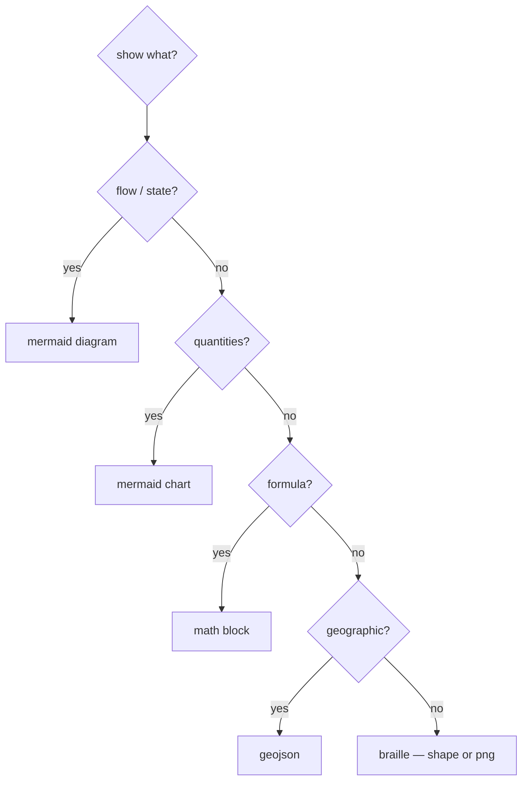

# Graphics — an inline-rendering guide for GitHub

companion to `HAND.md` and `papers/VOICE.md`. HAND governs how the code reads, VOICE how the papers sound; this governs how a **PR, issue, or repo `.md` draws** — pictures that render on github.com from text alone.

it exists because the reflex is to drag in a screenshot. a screenshot drifts the moment the code moves and can't be reviewed as a diff. a diagram written *in text*, beside the change, can't drift — it versions with the thing it explains. so: prefer the mark you can type.

## the one rule

**if it isn't a fence or `$math$`, it doesn't render.** github runs every markdown surface through a sanitizer. know the line and you stop guessing.

## what renders inline — verified on github.com

- **`​```mermaid`** — diagrams *and* charts. flow, sequence, state, er, class — and `pie`, `xychart-beta`, `sankey-beta`, `quadrantChart` for data. `classDef` colors nodes (the ac chartreuse-on-black look stays in text).
- **`$…$` / `​```math`** — equations. `\color{…}{…}` and `\bbox[bg]{…}` tint *real content*. that's the whole of what math draws — see the dead end below.
- **`​```geojson` / `​```topojson`** — an interactive leaflet map.
- **braille / block art in a plain `​```` ` fence** — the only way to draw *arbitrary* art inline. low-res, but anything.
- **prose primitives** — tables, task lists, `<details>`, `> [!NOTE]` alerts, footnotes.

## what does not render — and why

| you reach for | what happens | because |
|---|---|---|
| inline `<svg>…</svg>` | stripped | sanitizer |
| `data:` uri in `` | stripped | sanitizer |
| `<script>` / `<style>` / iframe / raw css | stripped | sanitizer |
| math `\rule{w}{h}` pixel art | **"unable to render"** | `\rule` is a *text-mode* tex command; mathjax implements only math-mode macros |
| math `\colorbox{…}{…}` grid | broken | broken on github since may 2023, not restored |
| `\begin{array}{@{}c@{}…}` + `\\[-Npt]` | **"unable to render"** | the `@{}` column spec and negative row gaps aren't supported |

**the trap:** every `\textcolor{red}{\rule{…}}` "colored square" example on the web is a *native-latex → png* tool (readme2tex and kin). those commit an image. they do not work in github's mathjax. don't chase them — i did, it's a dead end.

## draw anything inline: braille

`\rule` is gone, so arbitrary art comes down to **unicode braille** (U+2800–28FF). each glyph is a 2×4 dot grid, so a generated field of glyphs is a 1-bit raster that renders anywhere monospace. `toolchain/art-to-braille.mjs` does it from a shape or from any png:

```
node toolchain/art-to-braille.mjs smiley
node toolchain/art-to-braille.mjs flower
node toolchain/art-to-braille.mjs image pic.png 50 [--invert]
```

it shells out to `sips` to normalize/resize, decodes the png with node's built-in `zlib` (no image library), thresholds luminance, packs the dots. a smiley:

```
⠀⠀⠀⠀⠀⠀⠀⠀⠀⠀⠀⠀⠀⠀⠀⠀⠀⠀⢀⣀⣀⣀⠀⠀⠀⠀⠀⠀⠀⠀⠀⠀⠀⠀⠀⠀⠀⠀⠀⠀
⠀⠀⠀⠀⠀⠀⠀⠀⠀⠀⠀⣀⣤⣴⣶⣾⣿⣿⠿⠿⠿⠿⢿⣿⣿⣶⣶⣤⣄⡀⠀⠀⠀⠀⠀⠀⠀⠀⠀⠀
⠀⠀⠀⠀⠀⠀⠀⢀⣠⣶⣿⡿⠟⠋⠉⠁⠀⠀⠀⠀⠀⠀⠀⠀⠀⠉⠉⠛⠿⣿⣷⣦⣀⠀⠀⠀⠀⠀⠀⠀
⠀⠀⠀⠀⠀⢀⣴⣿⡿⠛⠁⠀⠀⠀⠀⠀⠀⠀⠀⠀⠀⠀⠀⠀⠀⠀⠀⠀⠀⠀⠙⠻⣿⣷⣄⠀⠀⠀⠀⠀
⠀⠀⠀⠀⣰⣿⡿⠋⠀⠀⠀⠀⠀⠀⠀⠀⠀⠀⠀⠀⠀⠀⠀⠀⠀⠀⠀⠀⠀⠀⠀⠀⠈⠻⣿⣷⡀⠀⠀⠀
⠀⠀⠀⣼⣿⡟⠁⠀⠀⠀⠀⢰⣿⣿⣷⠀⠀⠀⠀⠀⠀⠀⠀⠀⠀⢰⣿⣿⣷⠀⠀⠀⠀⠀⠙⣿⣿⡄⠀⠀
⠀⠀⢰⣿⣿⠁⠀⠀⠀⠀⠀⠈⠛⠛⠋⠀⠀⠀⠀⠀⠀⠀⠀⠀⠀⠈⠛⠛⠋⠀⠀⠀⠀⠀⠀⢹⣿⣷⠀⠀
⠀⠀⣿⣿⡇⠀⠀⠀⠀⠀⠀⠀⠀⠀⠀⠀⠀⠀⠀⠀⠀⠀⠀⠀⠀⠀⠀⠀⠀⠀⠀⠀⠀⠀⠀⠀⣿⣿⡇⠀
⠀⠀⣿⣿⡇⠀⠀⠀⠀⠀⠀⠀⠀⠀⠀⠀⠀⠀⠀⠀⠀⠀⠀⠀⠀⠀⠀⠀⠀⠀⠀⠀⠀⠀⠀⠀⣿⣿⡇⠀
⠀⠀⢹⣿⣷⠀⠀⠀⠀⠀⢿⣿⣇⠀⠀⠀⠀⠀⠀⠀⠀⠀⠀⠀⠀⠀⠀⢀⣿⣿⠇⠀⠀⠀⠀⢰⣿⣿⠁⠀
⠀⠀⠀⢿⣿⣇⠀⠀⠀⠀⠘⢿⣿⣆⠀⠀⠀⠀⠀⠀⠀⠀⠀⠀⠀⠀⢀⣾⣿⠟⠀⠀⠀⠀⢀⣿⣿⠇⠀⠀
⠀⠀⠀⠈⢻⣿⣧⡀⠀⠀⠀⠈⠻⣿⣷⣦⣄⡀⠀⠀⠀⠀⠀⣀⣤⣶⣿⡿⠋⠀⠀⠀⠀⣠⣿⣿⠋⠀⠀⠀
⠀⠀⠀⠀⠀⠙⢿⣿⣦⣀⠀⠀⠀⠀⠉⠛⠿⢿⣿⣿⣿⣿⣿⠿⠟⠋⠁⠀⠀⠀⢀⣠⣾⣿⠟⠁⠀⠀⠀⠀
⠀⠀⠀⠀⠀⠀⠀⠙⠻⣿⣷⣦⣄⡀⠀⠀⠀⠀⠀⠀⠀⠀⠀⠀⠀⠀⠀⣀⣤⣶⣿⡿⠛⠁⠀⠀⠀⠀⠀⠀
⠀⠀⠀⠀⠀⠀⠀⠀⠀⠀⠉⠛⠿⢿⣿⣷⣶⣶⣤⣤⣤⣤⣴⣶⣶⣿⣿⠿⠟⠋⠁⠀⠀⠀⠀⠀⠀⠀⠀⠀
⠀⠀⠀⠀⠀⠀⠀⠀⠀⠀⠀⠀⠀⠀⠀⠈⠉⠉⠙⠛⠛⠛⠉⠉⠉⠀⠀⠀⠀⠀⠀⠀⠀⠀⠀⠀⠀⠀⠀⠀
```

limits: low resolution, 1-bit (no grayscale or color), and it wants a monospace font with braille coverage. right for icons, logos, mascots, diagram-art — wrong for photos. for a photo, you've left inline-only: commit a code-generated svg/png and reference it by path.

## picking a method



label nodes with the real names — `disk.mjs`, `session-server`, not "service a". a diagram that names the code is navigable; boxes of abstractions are decoration. (same instinct as HAND: knowability first.)

## the papers caveat

none of this reaches the `papers/` xelatex pdfs — mermaid and mathjax are a github.com feature. in a paper the equivalents are native and better: tikz for diagrams, real latex math, `pgfplots` for charts, `\includegraphics` for raster. this guide is for the github surface — prs, rfcs, issues, readmes.
