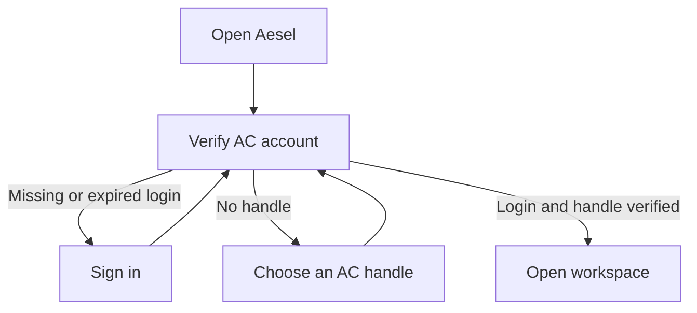

# Aesel: drafts, identity, and appearance

Electron Aesel was retired on September 23, 2026. References below describe
historical parity work; use [README.md](README.md) for current entry points.

See [ROADMAP.md](ROADMAP.md) for the remaining integrations, feature contracts,
dependencies, and acceptance gates.

Aesel requires a verified Aesthetic Computer login and an @handle before the
workspace is available. This applies to the native GUI, TUI, pro/private mode,
and every provider. Signed-out, expired, unverified and handleless accounts stay
in account setup; none is an alternate workspace mode.

## Sign-in

Use the existing native system authentication flow on Mac and trusted sign-in
view on iPhone. Keep native credentials in Keychain. TUI onboarding uses the
shared AC login and `/handle NAME` flow. Cancel or failure stays in account setup.
A successful login without a handle does not unlock Aesel.

Retain saved notebooks and unsent text through logout or verification failure,
but do not expose a functioning anonymous workspace. Retry must verify the
account; a cached handle or offline token is not sufficient. Recheck identity
before generation, publication, or resuming/approving a host operation. Signing
in never automatically sends a prompt.

## Appearance and interaction

Follow the system appearance, including changes while the app is open. There
is no appearance setting or saved override in Aesel. Light uses the
prompt curtain's pale paper and purple ink; Dark uses its purple background and
light ink. Activity changes tint and accent without switching appearance.

System appearance reaches native controls, notebook HTML, and embedded web views.
An artwork remains responsible for its own colors; never apply a color filter
to make a generated piece match the shell. Keep notebook text readable in both
modes, including errors, code, links, and the user's messages.

Enabled buttons and links show a pointing hand on macOS. Disabled controls use
the normal cursor and a dimmed appearance. Text entry retains its insertion
cursor. Use real buttons for actions, preserve keyboard activation and focus,
and give icon buttons accessible names. Hover feedback supplements touch and
keyboard operation.

## Provider and model controls

Keep two dropdowns, Provider followed by Model. The provider options are **AC,
Claude, Codex**, in that order, with their existing desktop images to the left.
AC uses the rotating pal image with the bundled AC mark as a loading/offline
fallback. Claude and Codex use their bundled marks. Braincells describe AC's
balance; they are not the provider's name or image.

| Provider | Model chooser | Identity and execution |
| --- | --- | --- |
| AC | Automatic; no manual model selection while AC manages routing | AC account and braincells; hosted generation |
| Claude | Existing CLI model families; retain the resolved running model | User's Claude CLI login on the connected Mac |
| Codex | Live catalog from the installed CLI, including CLI default | User's Codex CLI login on the connected Mac |

Selecting a provider must select a real execution backend. Preserve the draft
and transcript, remember the model per provider, reset incompatible model
settings, and apply changes to the next explicit Send. Disable switching during
a turn or upload. If a provider disconnects, retain the selection and offer
reconnect; never silently switch providers or spend AC braincells instead.

AC identity and provider identity remain separate credentials, both required
when using Claude or Codex. Vendor login does not replace AC account setup.
There is no guest AI or anonymous local-work mode. The Mac helper supplies CLI
providers; phone-to-Mac pairing remains separate work.

## Validation

Check both appearances with a fresh notebook, a reply containing code and
errors, the settings sheet, and the sign-in curtain. Check live updates by changing
the OS appearance. Account setup must preserve existing drafts on cancel, failure,
and success; no generation or publication should start merely by signing in.
The corner preview must remain usable at narrow widths and during generation.

The shared shell still has separate work ahead for Electron's terminal and
local-media backends. Those ports are independent of identity and appearance.
