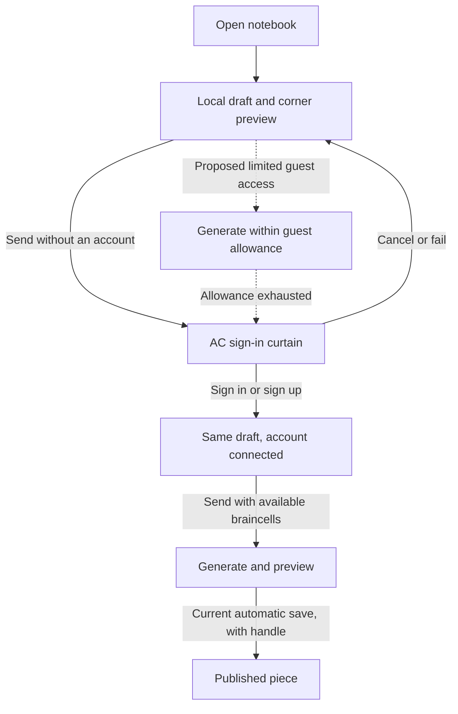

# Aesel: drafts, identity, and appearance

See [ROADMAP.md](ROADMAP.md) for the remaining integrations, feature contracts,
dependencies, and acceptance gates.

The notebook opens before sign-in. Keep the live web preview in the upper-right
corner through writing, generation, and account changes. Expanding it must not
replace or discard the notebook.

## Capability model

| Capability | Current shared native shell | Proposed guest experience |
| --- | --- | --- |
| Start and retain a local piece thread | No account required | Same |
| Type a request | Available before sign-in; retained while the sign-in sheet is open or cancelled | Persist unsent text per thread across relaunches |
| Preview existing local source | Corner web preview; runtime currently needs network access | Same; offline runtime is separate work |
| Generate or revise through hosted AI | AC account and available braincells required | Small server-enforced guest allowance |
| Publish | Authenticated account with a handle; generated saves currently auto-publish | Guest work stays local; account required to publish |
| Continue after sign-in | Existing draft stays in place; Send remains explicit | Transfer guest work without replaying requests or spending automatically |

“No account” means a local workspace today. It does not yet mean anonymous AI,
a full local source editor, offline operation, or guaranteed anonymity from the
services loaded by the web preview.

## Sign-in

Use the real `prompt.mjs` curtain in the embedded AC web view, including its
Login and Sign Up actions, instead of a separate imitation. The sheet supplies
close, loading, retry, and error states. Closing or failing sign-in returns to
the same draft. Successful sign-in connects the account; it does not send the
pending request. Accept credentials only through the existing trusted AC
callback and retain the native token in Keychain.

The live curtain is loaded from production, so its rendered layout can change
independently of an installed native build.

## Appearance and interaction

Follow the system appearance, including changes while the app is open. There
is no appearance setting or saved override in Aesel. Light uses the
prompt curtain's pale paper and purple ink; Dark uses its purple background and
light ink. Activity changes tint and accent without switching appearance.

System appearance reaches native controls, notebook HTML, and embedded web views.
An artwork remains responsible for its own colors; never apply a color filter
to make a generated piece match the shell. Keep notebook text readable in both
modes, including errors, code, links, and the user's messages.

Enabled buttons and links show a pointing hand on macOS. Disabled controls use
the normal cursor and a dimmed appearance. Text entry retains its insertion
cursor. Use real buttons for actions, preserve keyboard activation and focus,
and give icon buttons accessible names. Hover feedback supplements touch and
keyboard operation.

## Provider and model controls

Keep two dropdowns, Provider followed by Model. The provider options are **AC,
Claude, Codex**, in that order, with their existing desktop images to the left.
AC uses the rotating pal image with the bundled AC mark as a loading/offline
fallback. Claude and Codex use their bundled marks. Braincells describe AC's
balance; they are not the provider's name or image.

| Provider | Model chooser | Identity and execution |
| --- | --- | --- |
| AC | Automatic; no manual model selection while AC manages routing | AC account and braincells; hosted generation |
| Claude | Existing CLI model families; retain the resolved running model | User's Claude CLI login on the connected Mac |
| Codex | Live catalog from the installed CLI, including CLI default | User's Codex CLI login on the connected Mac |

Selecting a provider must select a real execution backend. Preserve the draft
and transcript, remember the model per provider, reset incompatible model
settings, and apply changes to the next explicit Send. Disable switching during
a turn or upload. If a provider disconnects, retain the selection and offer
reconnect; never silently switch providers or spend AC braincells instead.

Keep AC identity separate from provider identity. In the target shared shell,
a connected Claude or Codex account can generate local work without an AC
account; AC sign-in is needed when publishing to AC. That is account-free use
of Aesel/AC, not anonymous use of the inference provider. Hosted AC generation
continues to require AC identity unless the proposed guest allowance is enabled.
The current native Send gate applies to AC only because that is its sole engine;
replace it with provider-specific readiness when the CLI bridge lands.

Current port boundary: Electron already implements all three providers. The
native shell runs AC only. Its menu shows the existing provider identities but
disables Claude and Codex until a native execution bridge exists. AC's model row
shows Automatic. A working Claude/Codex model chooser depends on that bridge
and must read its catalog rather than pretend an unavailable model is active.
Phone access also needs a decision between a paired Mac connection and keeping
CLI providers Mac-only; no phone-to-Mac transport is implemented here.

## Proposed guest AI contract

This is a server feature to implement, not a client-side authentication bypass.
Issue a short-lived, narrowly scoped guest credential. Enforce a small request
and cost budget on the server, including concurrent requests, and explain the
remaining allowance before generation. Choose the actual allowance and expiry
from inference costs before enabling it. Do not rely on a resettable local flag
to limit usage.

Guest credentials cannot publish, buy credits, access account history, or claim
a handle. On exhaustion, keep the source, transcript, preview, and unsent text;
offer sign-in in context. On successful sign-in, associate only the work the
user chooses to retain. Never replay a generation request automatically.

Before shipping guest access: implement issuance and budget accounting, test
expiry and simultaneous requests, define retention and deletion, and explain
what leaves the device. Publishing consent also needs an explicit product
decision: current account sessions auto-publish generated saves; a future
private-draft mode must change that behavior deliberately.

## Validation

Check both appearances with a fresh notebook, a reply containing code and
errors, the settings sheet, and the sign-in curtain. Check live updates by changing
the OS appearance. A signed-out Send must preserve text on cancel, failure,
and success; no generation or publication should start merely by signing in.
The corner preview must remain usable at narrow widths and during generation.

The shared shell still has separate work ahead for Electron's terminal and
local-media backends. Those ports are independent of identity and appearance.
