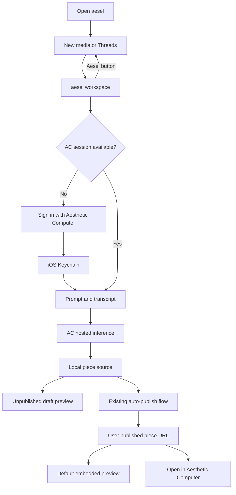

# aesel on Mac and iPhone

Electron Aesel was retired on September 23, 2026. References below describe
historical parity work; use [README.md](README.md) for current entry points.

The current shared-shell contracts and remaining work are in
[EXPERIENCE.md](EXPERIENCE.md) and [ROADMAP.md](ROADMAP.md). They supersede the
older launch, appearance, preview, and prototype identity assumptions below.
The native development Mac target uses `computer.aesthetic.aesel.native`;
the established product/iOS identity remains `computer.aesthetic.easel`.

The iPhone app should feel like the same workspace: lowercase `aesel`, the same
pixel font and donkey, purple scene, account label, transcript, composer, and
live artwork preview. The layout adapts to touch, the keyboard, and safe areas.

## Identity and release

| Item | Contract |
| --- | --- |
| Visible name | `aesel` in app titles, menus, errors and icon label; `Aesel` in the corner wordmark as requested |
| Code names | `Aesel…` types and `aesel…` UI APIs; old protocol/storage names remain compatible where needed |
| App Store record | Existing app `6812823093` |
| Mac and iOS bundle ID | `computer.aesthetic.easel`; retain this registered identity despite the display-name change |
| Mac review | Explain the temporary loopback OAuth listener; `network.server` is required by current login |
| iPhone icon | Donkey artwork from the desktop, supplied as an iOS AppIcon asset catalog |
| Universal purchase | Add iOS to the same app record; separate builds, metadata, screenshots, and platform reviews |

Both platforms can be submitted in the same release window. Apple can approve
them separately. “Universal purchase” does not mean a single executable or a
guaranteed simultaneous approval. Use manual release if coordinated availability
is needed.

## Authentication

### Working independently

The phone must sign in to its own AC account. A laptop's `~/.ac-token` is not a
release authentication mechanism. The implemented phone flow uses the
existing AC web sign-in inside an app-owned WebKit view, extracts the resulting
session only from the trusted AC main-frame origin, and stores the app's bearer
credential in Keychain. Cancellation, expiration, logout, and retry must return
to account setup. Authentication scripts and tokens must never be
printed in logs or placed in URLs.

A retained web session can make a later sign-in easier, but an expired access
token is not a valid saved session. Verify expiration/re-authentication on a
real device before release.

### Integration with the Aesthetic Computer iOS app

The existing AC iOS app is a WebKit client. Its AC cookies/local storage stay
inside its own app container. aesel cannot simply read them, and matching web
origins do not make two apps' WebKit stores shared.

The planned durable integration is a shared native account component:

1. Both apps adopt the same native sign-in contract (prefer browser-based PKCE
   through `ASWebAuthenticationSession`, with registered callbacks).
2. Enable a common Keychain access group in both signed app targets and their
   provisioning profiles. The two apps keep distinct bundle IDs; only aesel's
   Mac/iOS pair share an App Store identity.
3. Store session material under an explicit versioned service/account key.
   Validate issuer, audience and expiration; coordinate refresh ownership if a
   rotating refresh token is shared so two apps cannot race its rotation.
4. aesel offers “Continue as @handle” when a usable shared account exists.
   Fresh sign-in remains available when the AC app is absent.
5. Bridge the native account into each trusted first-party renderer; never
   expose refresh tokens to generated pieces or arbitrary navigation.
6. Define local sign-out versus “sign out of AC apps” explicitly. Account
   changes must clear the previous account's active inference context.

This shared-account integration requires an update to **both** iOS apps. It is
not provided merely by adding an entitlement to aesel. Universal purchase also
does not share credentials with the separate Aesthetic Computer app.

For opening a piece in AC, use its public HTTPS URL first. Universal Links can
later route those links into the AC app after configuring associated domains
and the site's association file. Never carry bearer tokens in those links.

## Preview and publishing

After sign-in, the default preview is the user’s current published piece URL,
not a generic `/blank` route. `/blank` is the AC Blank Laptop product page, not
an empty drawing surface.

An unpublished draft should render from local source inside the embedded AC runtime before
it has a public URL. Show source/load/runtime failures in the preview instead
of leaving an unexplained black rectangle. Reload when the source revision
changes, and preserve the current draft during login, keyboard changes, or
navigation.

The phone currently retains its existing automatic publication on source writes.
The public URL is a separate result: expose Open/Share/QR only when publication
has returned a valid URL. A draft route or stale revision must not masquerade
as a working public link. An external open uses the HTTPS AC URL, without
private session data.

## Required account

The GUI and TUI require a verified AC login and an @handle before workspace use,
including Claude/Codex and pro/private sessions. There is no anonymous mode.
Saved notebooks survive logout, but remain behind account setup until verified.

## Implemented in this change

- Native phone scene reuses the desktop font and donkey sprite sheet, with an
  iOS icon asset catalog.
- The shared JavaScript session is bundled; normal launches do not require a
  laptop server or its token.
- Phone AC sign-in uses a dedicated trusted WebKit login view and Keychain.
- Draft source reaches the embedded AC preview independently of publication.
- Shared credentials with the separate AC iOS app remain planned, not enabled.

## Shipping gates

- Real iPhone: sign in, cancel sign-in, sign out, and sign back in with the
  intended account; verify token expiration/re-authentication.
- Generate a piece and see its pixels on-device, then edit it and see the next
  revision. Exercise preview errors and recovery.
- Verify successful publication, open the resulting URL outside aesel, and confirm it
  renders the same revision.
- Relaunch and recover the local draft, transcript, and valid account state.
- Use the app without the development Mac/server; bundle the shared session
  runtime and require only production AC services for network work.
- Inspect the icon on the home screen and UI with the keyboard both open and
  closed. Keep pixel art crisp and primary controls comfortably tappable.
- Verify the phone presents the same required transcript-sharing disclosure
  and account-bound acceptance as the desktop before inference.
- Complete privacy/review metadata, screenshots, and platform-specific review
  instructions before the iOS submission.

## Sources

- [Add platforms and universal purchase](https://developer.apple.com/help/app-store-connect/create-an-app-record/add-platforms)
- [App Review submissions](https://developer.apple.com/help/app-store-connect/manage-submissions-to-app-review/overview-of-submitting-for-review)
- [Shared Keychain access](https://developer.apple.com/documentation/security/sharing-access-to-keychain-items-among-a-collection-of-apps)
- Existing AC iOS client: `apple/aesthetic.computer/ContentView.swift`
- aesel iOS host: `apple/aesel/Sources/SessionHost.swift`
- Mac sign-in: `easel/src/ac-session.mjs` in `/Users/jas/ac-easel-media`

## Home, identity and model visibility

The top-left Aesel button returns to the desktop-style New media / Threads chooser
without replacing the live preview. History persists source, publication state,
transcript and agent conversation separately from account credentials. Piece is
the available mobile engine; Picture, Sound, Paper and Game Boy remain visibly
unavailable until their desktop toolchains have mobile or hosted implementations.
The account handle uses AC's saved per-character colors and alphabet palette.

The app label remains aesel; the user requested capital A for the corner wordmark.
See [model research](MODEL-RESEARCH.md) for current remote routing, user-owned
Claude/Codex integration possibilities, model costs and the proposed evaluation.
