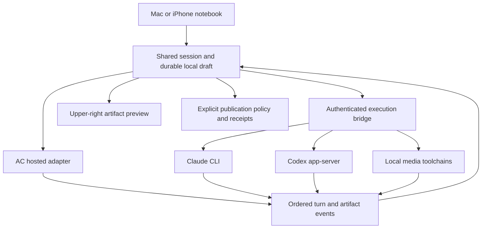

# Aesel integration and feature plan

One workspace across Mac and iPhone: a notebook, a persistent upper-right web
preview, and the same pieces, threads, providers, and artifacts. Share the
session and tool logic; adapt windowing, files, input, and execution to the host.
The shared shell does not require rewriting the JavaScript agent in Swift.

This is the remaining implementation plan, dated September 21, 2026. “Native”
means the shared SwiftUI Mac/iOS targets. “Desktop” means the existing Electron
and CLI implementation. A capability present in desktop is not automatically
available in native. [EXPERIENCE.md](EXPERIENCE.md) governs appearance, the AC
curtain, guest work, and provider controls.

## Inventory

| Integration or feature | Present now | Remaining native work |
| --- | --- | --- |
| Shared shell | Mac/iOS targets, bundled JS session, rich notebook | Complete desktop parity; measure startup, memory, and responsiveness |
| Appearance and controls | System light/dark, button pointers, fitted title | Keyboard/VoiceOver, touch targets, reduced motion, narrow-window acceptance |
| Corner web preview | Starter, local source, public piece, expand/return, retry | Preserve one runtime through expansion, input focus, audio controls, revision-aware readiness |
| Providers and models | AC execution; all three identities in the menu | Native Claude/Codex execution and their real model catalogs |
| AC account | Trusted web curtain, native Keychain, sign-out | Expiration/refresh recovery and optional shared account component with AC iOS |
| Guest work | Local threads and draft preview | Persist unsent text; optional capped hosted guest AI |
| Braincells | Balance display and StoreKit client | Purchase/restore/receipt/device acceptance; native Mac distribution decision |
| Publishing | Piece saves auto-publish with a handle | Visible publication controls, exact-revision receipts, conflict and retry handling |
| Threads | Local source, transcript, and agent conversation | Provider handoff, durable composer, export/import, migration and concurrent writers |
| Source and revisions | Desktop source tools and revision storage | Native editing, version history, rollback, source/output identity |
| Picture | Desktop layer/proposal/render/publish toolkit | Native renderer and files, proposal acceptance, export, painting publication |
| Sound | Desktop deterministic renderer and playback | Native render/playback, waveform, clock synchronization, interruption handling |
| Paper | Desktop LaTeX/tooling and visual QA | Build execution, PDF viewer, source bundle export, QA state |
| Game Boy | Desktop GBDK build and WasmBoy preview | Build execution, native-hosted emulator, touch/controller input, ROM export |
| Files and workspaces | Desktop projects; native app-local threads | Mac file grants, iOS document import/export, portable artifact packages |
| Multiple windows and project apps | Desktop Studio and project-app prototypes | Independent native sessions/windows; preserve project identity and restart state |
| Phone-to-Mac connection | No shared-shell transport | Pairing, capabilities, reconnect, job ownership, revocation |
| MCP and host tooling | Existing desktop AC tools, Slab/prox, frame/puppet integrations | Native action/state bridge and explicit capability boundaries |
| Diagnostics and recovery | Session errors and preview retry | Structured redacted diagnostics, crash recovery, bounded reconnect |
| Distribution | Existing Electron routes; native development app | Signed native release path, migration, physical-device acceptance, store review |

The native Claude and Codex rows stay disabled until connected to working
backends. AC's model remains Automatic. Keep the provider's image to the left,
then its name, with a separate model chooser below. Do not substitute Braincells
for the AC provider identity or add an appearance preference.

## Execution and provider integration

Reuse the adapters in [`easel/src`](../../easel/src/): `ac-server.mjs`,
`claude-server.mjs`, `app-server.mjs`, `backends.mjs`, `provider-picker.mjs`,
and `provider-preferences.mjs`. WebKit cannot replace a subprocess or filesystem
with a browser shim. A native helper or paired host must provide those services.
Keep provider credentials on the machine that executes the provider.

Define a versioned bridge with capability discovery, provider readiness, model
catalogs, thread start/resume, turn start/interrupt, tool progress, approval
requests, artifact revisions, and final outcomes. Every event needs a session
ID, turn ID, sequence, and timestamp; every submitted operation needs a unique
ID. Reconnection resumes an operation or reports its status, never blindly
repeats a paid request. A dropped stream is not evidence that generation stopped.

Keep the transcript and selected artifact when switching providers. Transfer
the supported conversation and source, not a promise of transferring private
vendor reasoning state. Remember model choice per provider. Reject unavailable
models visibly; do not silently change providers. Tool approval has an explicit
request ID and scope; expired approvals cannot authorize a later operation.

For the native Mac helper, first choose and prove a distribution-compatible
process and file-access design. The current native target is sandboxed and has
network-client access; spawning arbitrary installed CLIs is not already solved
by sharing SwiftUI code. Do not remove the sandbox as an incidental UI fix.

Completion: real Claude and Codex turns edit a piece, stream to the notebook,
update the corner preview, stop correctly, survive reconnect, and use the
selected model without consuming AC braincells. A missing CLI or expired vendor
login keeps the local draft usable and offers the appropriate setup action.

## Phone pairing and host lifecycle

Recommended sequence: finish local Mac execution first, then expose the same
capabilities to an explicitly paired phone. Whether phone pairing belongs in
the first release remains open; the provider menu must describe actual availability.

Pair with a short-lived challenge confirmed on the host. Use authenticated,
encrypted transport and a revocable device credential. Publish only capabilities
the host has granted; directory grants and provider access are separate. Do not
create a public unauthenticated listener or transfer CLI login files to the phone.

The host owns running jobs. Backgrounding or disconnecting the phone preserves
the job ID and last observed event. Reconnect reports completion, failure, or
continued work. Cancellation is acknowledged by the host. Handle sleeping Macs,
network changes, revoked pairing, expired credentials, and an absent display.
Lid-closed/headless execution must not depend on a visible browser or WindowServer
screenshot; test compute and preview capture as separate capabilities.

Completion: pair, generate, disconnect, reconnect, cancel, and revoke on a real
iPhone without duplicate turns or cross-workspace access. No account token or
private host address appears in shared URLs or exported diagnostics.

## Accounts, consent, billing, and publication

Treat AC login, vendor login, pairing, and publication ownership as separate
identities. A Claude/Codex user can make local work without an AC account once
the bridge exists. Publishing to AC requires the intended AC account and handle.
Hosted AC generation continues to require available braincells unless a guest
allowance is deliberately implemented.

Retain the real AC curtain and preserve draft/composer state on cancel, failure,
and success. Extend token-expiration handling without automatically resending a
prompt. Shared sign-in with the separate AC iOS app needs changes in both apps:
registered callbacks, compatible signed Keychain access, coordinated refresh,
and defined local versus shared sign-out. See [INTEGRATION.md](INTEGRATION.md).

Audit existing transcript-sharing behavior before claiming local-only or private
use. Desktop has required disclosure/acceptance logic in
[`required-sharing.mjs`](../../easel/src/required-sharing.mjs); the native flow
must either enforce the same account-bound contract or adopt an explicitly
revised policy. Source publication, transcript sharing, preview runtime requests,
and inference traffic are separate disclosures. Guest access must not inherit
an account's consent silently.

Keep daily and purchased balances distinct. Purchases need verified receipts,
idempotent crediting, pending/cancelled/refunded handling, restore behavior, and
foreground refresh. Test the real StoreKit/backend round trip before enabling
a purchase button in a release. Do not infer entitlement from a successful UI
or assume a vendor subscription pays for AC inference.

Piece generation currently auto-publishes saves. Preserve that behavior until a
deliberate policy change, but make it understandable before generation. Add a
working publication control and make private drafts an explicit supported state
before describing them as private. Bind publish outcomes to the source revision
and account; keep a newer local edit distinct from the last public version.
Retry an unresolved upload by resolving its receipt, not by assuming failure.

Completion: failed login, expired credentials, account switching, exhausted
balance, cancelled purchase, delayed crediting, lost upload response, and a new
edit during publication all preserve local work and show the correct owner and
revision. Share/Open/QR appear only for a verified public result.

## Notebook, preview, source, and history

Persist unsent text per thread, alongside source and transcript, with atomic
writes and a recoverable previous checkpoint. Make app restart, interruption,
thread switching, and account changes independent of losing a draft. Keep
provider state out of credentials and preserve publication ownership.

The corner stays upper-right. Expanding should reuse the same running preview
where possible so simulation/audio state and keyboard focus survive. Define
touch and keyboard equivalents for desktop hover, fullscreen, hide/show,
reload, text selection, copy/paste, and font sizing. A canvas must not consume
typing intended for the composer. Theme the shell from the OS while leaving
artwork colors untouched.

Port source editing and revision tools from `revisions.mjs`, `artifacts.mjs`,
`notebook-bindings.mjs`, and the desktop version UI. Distinguish draft source,
accepted revision, rendered output, published revision, and app build version.
Rollback restores recorded source, assets, and output without rerunning paid
generation. Preserve the last good preview while a newer revision fails.

Add preview volume/mute and user-controlled Sound playback. Resolve revision
readiness from the runtime and displayed bytes, not merely an HTTP load event.
Bundle or cache the AC runtime before promising offline preview; today's local
source still loads a network runtime. Define cache invalidation and recovery
before enabling an offline mode.

Completion: recover unsent text after restart; compare the preview and public
result to the correct revision; switch threads during interrupted work; resize
to the minimum window and use the phone keyboard without clipping the title,
composer, or preview controls. Check VoiceOver and reduced motion on-device.

## Media and files

| Lane | Integration contract | Acceptance evidence |
| --- | --- | --- |
| Picture | Reuse accepted layers and pending proposals. Native import/export and renderer must preserve bytes and provenance. Paid image jobs require their existing authorization/receipt contract. Publish only accepted PNG output through AC's painting pipeline. | Accept/discard, reopen, rollback, export; resolve uncertain publication without duplicating the painting. |
| Sound | Reuse score, deterministic rendering, WAV, analysis, and provenance. Port playback/waveform and shared-clock behavior; handle phone audio interruptions. | Matching render hash, explicit play/stop, no autoplay after refresh/rollback, synchronized loop test. |
| Paper | Run a supported TeX toolchain on an available host; show source and PDF. Preserve bibliography, consulted sources, embedded source bundle, and visual QA state. | Build, inspect rendered pages, record QA against that exact PDF hash, export matching sources; a compile alone never marks it ready. |
| Game Boy | Compile with the existing GBDK toolchain, preview the resulting ROM with the existing emulator, and adapt joypad/gamepad input. | Build and play a real ROM, export exact bytes, show when source is newer than the last successful build. |

Use the contracts in [`easel/media`](../../easel/media/) rather than introducing
new artifact formats. Optional dependencies must have capability checks and
useful errors. Keep unsupported lanes unavailable until their outputs are real.
Sound, Paper, and Game Boy need an explicit publication implementation before
acquiring a public sharing URL; local export remains a separate action.

Mac workspaces require user-granted directory access; iPhone needs document
picker/share-sheet import and export. Package source, accepted outputs,
manifest, revisions, and provenance together. Exclude credentials and transient
signed URLs. Validate imported paths and sizes; coordinate concurrent writers
instead of overwriting another window's work. Migration should retain a backup
and be repeatable without duplicating threads.

## Windows, project apps, automation, and diagnostics

Carry over desktop Studio behavior: each native window has its own session,
artifact, provider, and preview; close affects only that window; app restart
checkpoints all windows. Preserve project-app bundle identity and source when
porting the existing project-app prototype. Slab/prox status is optional host
integration, not a prerequisite for a functioning app.

Expose a native state/action adapter so MCP, frame, and puppet can inspect the
same controls as a person. Prefer stable action IDs and explicit enabled state
over fragile coordinates. Bind every action to a specific app instance and
session, reject stale requests, and separate read-only state/capture from
generation, purchases, publishing, and account changes. No arbitrary injected
JavaScript or implicit approval through an automation message. Native automation
work exists separately in the working copy; it is not a release claim here.

Diagnostics should report build identity, capabilities, event order, revision,
and bounded error metadata. Redact credentials, prompt/source content, and
private filesystem/host details by default. Diagnostic export is explicit;
do not add automatic analytics as a side effect of this port. Test frozen web
content, helper exit, disk-full writes, network loss, and app restart with
recoverable checkpoints.

## Delivery order

| Milestone | Work | Gate |
| --- | --- | --- |
| 1. Complete the notebook | Composer persistence, focus/accessibility, preview lifetime/audio, source/revision identity, reliable auth recovery | Real Mac and iPhone creation/recovery walkthrough; system appearance follows live OS changes |
| 2. Restore provider parity | Native execution helper, Claude/Codex login/readiness, actual model dropdowns, approvals/interruption and handoff | A real turn and stop/reconnect test for each provider; no silent fallback |
| 3. Connect devices | Pairing and background/reconnect semantics, if included in release scope | Physical-phone job lifecycle and revocation tests |
| 4. Bring over artifacts | Portable files, revision rollback, Picture/Sound first; Paper/Game Boy when their toolchains are connected | Output-specific evidence in the media table |
| 5. Ship the shared app | Consent/billing audit, multiwindow/migration, signed packaging, diagnostics, release metadata | Verified package/device installation, upgrade recovery, release-channel smoke tests |

Guest hosted AI, shared AC-app credentials, offline runtime, and project-app
distribution can follow these milestones. Their costs, pairing scope,
publication defaults, and distribution method are product decisions, not
unimplemented settings to expose as if they worked.

The development Mac app keeps `computer.aesthetic.aesel.native` separate from
the established `computer.aesthetic.easel` product. Do not silently replace the
installed Electron app or assume development Keychain data migrates to a signed
release. A source push or Lith deployment updates neither an installed binary
nor App Store review status. Native app packaging, a public binary/update feed,
and Apple submission are distinct delivery steps, each requiring its own
artifact and verification.
