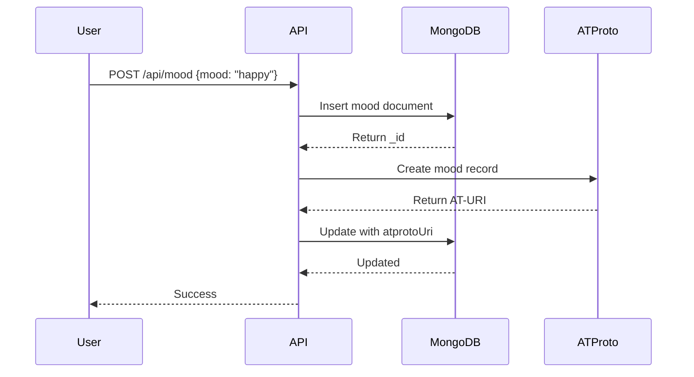

# Moods ATProto Integration Plan

**Date:** October 14, 2025  
**Goal:** Sync AC moods to ATProto using custom lexicon + backfill existing moods

---

## 📋 Executive Summary

Integrate Aesthetic Computer's moods system with ATProto by:
1. Creating `computer.aesthetic.mood` lexicon
2. Dual-writing new moods to MongoDB + ATProto
3. Backfilling historical moods to ATProto
4. Adding ATProto URI references to MongoDB
5. Ensuring deletion syncs (delete-erase-and-forget-me)

---

## 🎯 Current State Analysis

### MongoDB Schema (moods collection)
```javascript
{
  _id: ObjectId("..."),
  user: "auth0|123...",        // User sub
  mood: "feeling good today",  // Text content
  when: ISODate("..."),        // Timestamp
  deleted: false               // Soft delete flag
}
```

### Indexes
- `user: 1` - Find moods by user
- `when: 1` - Sort chronologically

### Current Behavior
- ✅ POST `/api/mood` - Create mood
- ✅ GET `/api/mood/all` - List all moods (with handle filtering)
- ✅ GET `/api/mood/@handle` - Get user's latest mood
- ✅ POST `/api/mood` with `{nuke: true}` - Soft delete all moods
- ✅ Firebase push notifications on mood change
- ✅ Profanity filtering

---

## 🦋 ATProto Lexicon Design

### computer.aesthetic.mood

```javascript
{
  lexicon: 1,
  id: 'computer.aesthetic.mood',
  defs: {
    main: {
      type: 'record',
      description: 'A mood/emotion entry from Aesthetic Computer',
      key: 'tid',  // Time-based ID
      record: {
        type: 'object',
        required: ['text', 'createdAt'],
        properties: {
          text: {
            type: 'string',
            maxLength: 280,  // Keep it tweet-sized
            description: 'The mood text'
          },
          intensity: {
            type: 'integer',
            minimum: 1,
            maximum: 10,
            description: 'Optional mood intensity (1-10)'
          },
          createdAt: {
            type: 'string',
            format: 'datetime',
            description: 'When the mood was felt'
          },
          context: {
            type: 'string',
            maxLength: 1000,
            description: 'Additional context or notes'
          },
          isPrivate: {
            type: 'boolean',
            default: false,
            description: 'Private moods not federated to firehose'
          },
          mongoId: {
            type: 'string',
            description: 'Reference to MongoDB _id for sync'
          }
        }
      }
    }
  }
}
```

**Key Design Decisions:**
- ✅ Use `tid` (timestamp ID) for chronological ordering
- ✅ Include `mongoId` for bidirectional sync
- ✅ Support `isPrivate` flag for non-federated moods
- ✅ Optional `intensity` for future mood analytics
- ✅ 280 char limit aligns with social media conventions

---

## 🔄 Integration Architecture

### Strategy: Dual Write with MongoDB Primary



### MongoDB Schema Update

```javascript
{
  _id: ObjectId("..."),
  user: "auth0|123...",
  mood: "feeling good today",
  when: ISODate("..."),
  deleted: false,
  atproto: {                           // NEW!
    uri: "at://did:plc:abc.../computer.aesthetic.mood/3k...",
    cid: "bafyrei...",                 // Content ID
    created: ISODate("..."),
    synced: true                       // Sync status
  }
}
```

---

## 🛠️ Implementation Plan

### Phase 1: Lexicon Creation & Testing (Week 1)

**Tasks:**
- [ ] Create lexicon file `/at/lexicons/computer/aesthetic/mood.json`
- [ ] Deploy lexicon to PDS
- [ ] Test lexicon with manual record creation
- [ ] Verify record appears in ATProto firehose

**Script:** `create-mood-lexicon.mjs`
```bash
cd /workspaces/aesthetic-computer/at/scripts
node create-mood-lexicon.mjs --deploy
```

**Acceptance Criteria:**
- ✅ Lexicon validates with `@atproto/lexicon`
- ✅ Can create test mood record via PDS admin API
- ✅ Record queryable via `com.atproto.repo.listRecords`

---

### Phase 2: Backend Integration (Week 1-2)

#### 2.1: Create ATProto Mood Helper

**File:** `/system/backend/mood-atproto.mjs`

```javascript
import { AtpAgent } from '@atproto/api';
import { shell } from './shell.mjs';

const PDS_URL = process.env.PDS_URL || 'https://at.aesthetic.computer';

/**
 * Create mood record on ATProto
 * @param {Object} database - MongoDB connection
 * @param {string} userSub - User sub (auth0|...)
 * @param {string} moodText - Mood content
 * @param {Date} timestamp - When mood was created
 * @returns {Object} {success, uri, cid, error}
 */
export async function createAtprotoMood(database, userSub, moodText, timestamp) {
  try {
    // 1. Get user's ATProto credentials
    const users = database.db.collection('users');
    const user = await users.findOne({ _id: userSub });
    
    if (!user?.atproto?.did || !user?.atproto?.password) {
      return { success: false, reason: 'No ATProto account' };
    }
    
    // 2. Login to PDS
    const agent = new AtpAgent({ service: PDS_URL });
    await agent.login({
      identifier: user.atproto.did,
      password: user.atproto.password
    });
    
    // 3. Create mood record
    const record = {
      $type: 'computer.aesthetic.mood',
      text: moodText,
      createdAt: timestamp.toISOString(),
      isPrivate: false,  // Default to public, can add logic later
    };
    
    const result = await agent.com.atproto.repo.createRecord({
      repo: user.atproto.did,
      collection: 'computer.aesthetic.mood',
      record
    });
    
    shell.log('🦋 Created ATProto mood:', result.uri);
    
    return {
      success: true,
      uri: result.uri,
      cid: result.cid
    };
    
  } catch (error) {
    shell.error('🦋 ATProto mood creation failed:', error.message);
    return { success: false, error: error.message };
  }
}

/**
 * Delete mood record from ATProto
 * @param {Object} database - MongoDB connection
 * @param {string} userSub - User sub
 * @param {string} atprotoUri - AT-URI of mood to delete
 * @returns {Object} {success, error}
 */
export async function deleteAtprotoMood(database, userSub, atprotoUri) {
  try {
    const users = database.db.collection('users');
    const user = await users.findOne({ _id: userSub });
    
    if (!user?.atproto?.did || !user?.atproto?.password) {
      return { success: false, reason: 'No ATProto account' };
    }
    
    const agent = new AtpAgent({ service: PDS_URL });
    await agent.login({
      identifier: user.atproto.did,
      password: user.atproto.password
    });
    
    // Parse URI: at://did:plc:abc.../computer.aesthetic.mood/3k...
    const uriParts = atprotoUri.replace('at://', '').split('/');
    const rkey = uriParts[uriParts.length - 1];
    
    await agent.com.atproto.repo.deleteRecord({
      repo: user.atproto.did,
      collection: 'computer.aesthetic.mood',
      rkey
    });
    
    shell.log('🦋 Deleted ATProto mood:', atprotoUri);
    return { success: true };
    
  } catch (error) {
    shell.error('🦋 ATProto mood deletion failed:', error.message);
    return { success: false, error: error.message };
  }
}

/**
 * Delete all moods for a user from ATProto
 * @param {Object} database - MongoDB connection
 * @param {string} userSub - User sub
 * @returns {Object} {success, deleted, error}
 */
export async function deleteAllAtprotoMoods(database, userSub) {
  try {
    const users = database.db.collection('users');
    const user = await users.findOne({ _id: userSub });
    
    if (!user?.atproto?.did || !user?.atproto?.password) {
      return { success: false, reason: 'No ATProto account' };
    }
    
    const agent = new AtpAgent({ service: PDS_URL });
    await agent.login({
      identifier: user.atproto.did,
      password: user.atproto.password
    });
    
    // List all mood records
    const records = await agent.com.atproto.repo.listRecords({
      repo: user.atproto.did,
      collection: 'computer.aesthetic.mood',
      limit: 100  // Paginate if needed
    });
    
    let deleted = 0;
    for (const record of records.data.records) {
      await agent.com.atproto.repo.deleteRecord({
        repo: user.atproto.did,
        collection: 'computer.aesthetic.mood',
        rkey: record.uri.split('/').pop()
      });
      deleted++;
    }
    
    shell.log(`🦋 Deleted ${deleted} ATProto moods`);
    return { success: true, deleted };
    
  } catch (error) {
    shell.error('🦋 ATProto mood batch deletion failed:', error.message);
    return { success: false, error: error.message };
  }
}
```

#### 2.2: Update mood.mjs Function

**File:** `/system/netlify/functions/mood.mjs`

**Changes:**
```javascript
// Add import at top
import { createAtprotoMood } from "../../backend/mood-atproto.mjs";

// In POST handler, after MongoDB insert:
if (!lastMood || lastMood.mood !== mood) {
  const moodDoc = {
    user: user.sub,
    mood,
    when: new Date(),
  };
  
  const insertResult = await collection.insertOne(moodDoc);
  const moodId = insertResult.insertedId;
  
  // 🦋 Sync to ATProto (async, don't block)
  createAtprotoMood(database, user.sub, mood, moodDoc.when)
    .then(result => {
      if (result.success) {
        // Update MongoDB with ATProto URI
        collection.updateOne(
          { _id: moodId },
          { 
            $set: { 
              atproto: {
                uri: result.uri,
                cid: result.cid,
                created: new Date(),
                synced: true
              }
            } 
          }
        );
        shell.log('🦋 Mood synced to ATProto:', result.uri);
      } else {
        shell.log('🦋 ATProto sync skipped:', result.reason || result.error);
      }
    })
    .catch(err => {
      shell.error('🦋 ATProto sync error:', err);
    });
  
  // Continue with Firebase notifications...
}
```

**Tasks:**
- [ ] Create `mood-atproto.mjs` helper
- [ ] Update `mood.mjs` to dual-write
- [ ] Test with new mood creation
- [ ] Verify MongoDB record has `atproto` field
- [ ] Verify ATProto record exists via PDS query

---

### Phase 3: Deletion Sync (Week 2)

#### 3.1: Update delete-erase-and-forget-me.mjs

**File:** `/system/netlify/functions/delete-erase-and-forget-me.mjs`

**Add after line 103 (after deleting MongoDB moods):**

```javascript
// Delete moods from ATProto
import { deleteAllAtprotoMoods } from "../../backend/mood-atproto.mjs";

// ... existing code ...

await database.db.collection("moods").deleteMany({ user: sub });
console.log("🧠 Deleted moods from MongoDB.");

// 🦋 Delete moods from ATProto
const atprotoResult = await deleteAllAtprotoMoods(database, sub);
if (atprotoResult.success) {
  console.log(`🦋 Deleted ${atprotoResult.deleted} moods from ATProto.`);
} else {
  console.log("🦋 ATProto mood deletion skipped:", atprotoResult.reason);
}
```

**Tasks:**
- [ ] Update delete-erase-and-forget-me.mjs
- [ ] Test account deletion
- [ ] Verify MongoDB moods deleted
- [ ] Verify ATProto moods deleted
- [ ] Check PDS via `listRecords` to confirm deletion

---

### Phase 4: Backfill Historical Moods (Week 2-3)

#### 4.1: Create Migration Script

**File:** `/at/scripts/migrate-moods-to-atproto.mjs`

```javascript
#!/usr/bin/env node
// migrate-moods-to-atproto.mjs
// Backfill existing moods from MongoDB to ATProto

import { connect } from '../../system/backend/database.mjs';
import { createAtprotoMood } from '../../system/backend/mood-atproto.mjs';
import { config } from 'dotenv';

config();

async function migrateUserMoods(database, userSub, dryRun = true) {
  console.log(`\n📋 Migrating moods for: ${userSub}`);
  
  const moods = database.db.collection('moods');
  
  // Find moods without ATProto URI
  const userMoods = await moods.find({
    user: userSub,
    deleted: { $ne: true },
    'atproto.uri': { $exists: false }
  }).sort({ when: 1 }).toArray();
  
  console.log(`   Found ${userMoods.length} moods to migrate`);
  
  if (userMoods.length === 0) {
    return { migrated: 0, failed: 0 };
  }
  
  let migrated = 0;
  let failed = 0;
  
  for (const mood of userMoods) {
    if (dryRun) {
      console.log(`   [DRY RUN] Would migrate: "${mood.mood.substring(0, 50)}..." (${mood.when})`);
      migrated++;
    } else {
      const result = await createAtprotoMood(
        database,
        userSub,
        mood.mood,
        mood.when
      );
      
      if (result.success) {
        await moods.updateOne(
          { _id: mood._id },
          { 
            $set: { 
              atproto: {
                uri: result.uri,
                cid: result.cid,
                created: new Date(),
                synced: true
              }
            } 
          }
        );
        console.log(`   ✅ Migrated: ${result.uri}`);
        migrated++;
      } else {
        console.log(`   ❌ Failed: ${result.reason || result.error}`);
        failed++;
      }
      
      // Rate limit: wait 100ms between creates
      await new Promise(resolve => setTimeout(resolve, 100));
    }
  }
  
  return { migrated, failed };
}

async function main() {
  const args = process.argv.slice(2);
  const dryRun = !args.includes('--execute');
  const userFilter = args.find(arg => arg.startsWith('@')) || args.find(arg => arg.startsWith('auth0|'));
  
  if (dryRun) {
    console.log('\n⚠️  DRY RUN MODE - No changes will be made');
    console.log('   Add --execute flag to actually migrate\n');
  }
  
  console.log('🔌 Connecting to MongoDB...\n');
  const database = await connect();
  
  try {
    const users = database.db.collection('users');
    const moods = database.db.collection('moods');
    
    // Get stats
    const totalMoods = await moods.countDocuments({ deleted: { $ne: true } });
    const moodsWithAtproto = await moods.countDocuments({ 'atproto.uri': { $exists: true } });
    const moodsToMigrate = totalMoods - moodsWithAtproto;
    
    console.log('📊 Migration Status:\n');
    console.log(`   Total moods: ${totalMoods}`);
    console.log(`   Already migrated: ${moodsWithAtproto}`);
    console.log(`   Need migration: ${moodsToMigrate}\n`);
    
    if (moodsToMigrate === 0) {
      console.log('✨ All moods already migrated!\n');
      await database.disconnect();
      return;
    }
    
    let totalMigrated = 0;
    let totalFailed = 0;
    
    if (userFilter) {
      // Migrate single user
      const sub = userFilter.startsWith('@') 
        ? (await users.findOne({ 'atproto.handle': userFilter.slice(1) + '.at.aesthetic.computer' }))?._id
        : userFilter;
        
      if (!sub) {
        console.log(`❌ User not found: ${userFilter}\n`);
        await database.disconnect();
        return;
      }
      
      const result = await migrateUserMoods(database, sub, dryRun);
      totalMigrated = result.migrated;
      totalFailed = result.failed;
      
    } else {
      // Migrate all users with ATProto accounts
      const usersWithAtproto = await users.find({ 
        'atproto.did': { $exists: true } 
      }).toArray();
      
      console.log(`👥 Found ${usersWithAtproto.length} users with ATProto accounts\n`);
      
      for (const user of usersWithAtproto) {
        const result = await migrateUserMoods(database, user._id, dryRun);
        totalMigrated += result.migrated;
        totalFailed += result.failed;
      }
    }
    
    console.log('\n' + '='.repeat(80));
    console.log('📊 Migration Summary:\n');
    console.log(`   Migrated: ${totalMigrated}`);
    console.log(`   Failed: ${totalFailed}`);
    console.log('='.repeat(80) + '\n');
    
  } finally {
    await database.disconnect();
  }
}

main().catch(console.error);
```

**Usage:**
```bash
# Dry run - see what would be migrated
node scripts/migrate-moods-to-atproto.mjs

# Migrate specific user
node scripts/migrate-moods-to-atproto.mjs @jeffrey --execute

# Migrate all users
node scripts/migrate-moods-to-atproto.mjs --execute
```

**Tasks:**
- [ ] Create migration script
- [ ] Test with single user (dry run)
- [ ] Test with single user (execute)
- [ ] Run for all users with ATProto accounts
- [ ] Monitor for errors/rate limits
- [ ] Verify random sample of migrated moods

---

### Phase 5: Testing & Verification (Week 3)

#### 5.1: Create Audit Script

**File:** `/at/scripts/audit-mood-atproto-sync.mjs`

```javascript
#!/usr/bin/env node
// audit-mood-atproto-sync.mjs
// Verify moods are properly synced between MongoDB and ATProto

import { connect } from '../../system/backend/database.mjs';
import { AtpAgent } from '@atproto/api';
import { config } from 'dotenv';

config();

const PDS_URL = process.env.PDS_URL || 'https://at.aesthetic.computer';

async function auditUser(database, userSub) {
  const users = database.db.collection('users');
  const moods = database.db.collection('moods');
  
  const user = await users.findOne({ _id: userSub });
  if (!user) {
    console.log(`❌ User not found: ${userSub}`);
    return null;
  }
  
  console.log(`\n👤 User: ${userSub}`);
  console.log(`   Handle: ${user.atproto?.handle || 'N/A'}`);
  console.log(`   DID: ${user.atproto?.did || 'N/A'}`);
  
  // MongoDB stats
  const totalMoods = await moods.countDocuments({ 
    user: userSub, 
    deleted: { $ne: true } 
  });
  const moodsWithAtproto = await moods.countDocuments({ 
    user: userSub,
    deleted: { $ne: true },
    'atproto.uri': { $exists: true } 
  });
  
  console.log(`\n   MongoDB Moods:`);
  console.log(`      Total: ${totalMoods}`);
  console.log(`      With ATProto URI: ${moodsWithAtproto}`);
  console.log(`      Missing ATProto: ${totalMoods - moodsWithAtproto}`);
  
  // ATProto stats
  if (user.atproto?.did && user.atproto?.password) {
    try {
      const agent = new AtpAgent({ service: PDS_URL });
      await agent.login({
        identifier: user.atproto.did,
        password: user.atproto.password
      });
      
      const records = await agent.com.atproto.repo.listRecords({
        repo: user.atproto.did,
        collection: 'computer.aesthetic.mood',
        limit: 100
      });
      
      console.log(`\n   ATProto PDS:`);
      console.log(`      Total records: ${records.data.records.length}`);
      
      if (records.data.records.length !== moodsWithAtproto) {
        console.log(`      ⚠️  MISMATCH! MongoDB: ${moodsWithAtproto}, ATProto: ${records.data.records.length}`);
      } else {
        console.log(`      ✅ Counts match!`);
      }
      
      // Sample check
      if (records.data.records.length > 0) {
        const sample = records.data.records[0];
        console.log(`\n   Sample Record:`);
        console.log(`      URI: ${sample.uri}`);
        console.log(`      Text: ${sample.value.text?.substring(0, 50)}...`);
        console.log(`      Created: ${sample.value.createdAt}`);
      }
      
    } catch (error) {
      console.log(`\n   ATProto PDS:`);
      console.log(`      ❌ Error: ${error.message}`);
    }
  } else {
    console.log(`\n   ATProto PDS:`);
    console.log(`      ℹ️  No ATProto account`);
  }
  
  return {
    userSub,
    totalMoods,
    moodsWithAtproto,
    moodsMissing: totalMoods - moodsWithAtproto
  };
}

async function main() {
  const args = process.argv.slice(2);
  const userFilter = args.find(arg => arg.startsWith('@') || arg.startsWith('auth0|'));
  const limit = parseInt(args.find(arg => /^\d+$/.test(arg))) || 10;
  
  console.log('\n🔍 Auditing Mood ATProto Sync\n');
  console.log('='.repeat(80));
  
  const database = await connect();
  
  try {
    const users = database.db.collection('users');
    const moods = database.db.collection('moods');
    
    let usersToAudit;
    
    if (userFilter) {
      const sub = userFilter.startsWith('@')
        ? (await users.findOne({ 'atproto.handle': userFilter.slice(1) + '.at.aesthetic.computer' }))?._id
        : userFilter;
      
      if (!sub) {
        console.log(`❌ User not found: ${userFilter}\n`);
        return;
      }
      
      usersToAudit = [{ _id: sub }];
    } else {
      usersToAudit = await users.find({ 
        'atproto.did': { $exists: true } 
      }).limit(limit).toArray();
    }
    
    const results = [];
    
    for (const user of usersToAudit) {
      const result = await auditUser(database, user._id);
      if (result) results.push(result);
    }
    
    // Summary
    console.log('\n\n' + '='.repeat(80));
    console.log('📊 Summary\n');
    console.log(`   Users audited: ${results.length}`);
    console.log(`   Total moods: ${results.reduce((sum, r) => sum + r.totalMoods, 0)}`);
    console.log(`   Synced to ATProto: ${results.reduce((sum, r) => sum + r.moodsWithAtproto, 0)}`);
    console.log(`   Missing ATProto: ${results.reduce((sum, r) => sum + r.moodsMissing, 0)}`);
    
    const usersWithMissing = results.filter(r => r.moodsMissing > 0);
    if (usersWithMissing.length > 0) {
      console.log(`\n   ⚠️  ${usersWithMissing.length} users have moods missing ATProto sync:`);
      usersWithMissing.forEach(r => {
        console.log(`      ${r.userSub}: ${r.moodsMissing} missing`);
      });
    } else {
      console.log(`\n   ✅ All moods are synced!`);
    }
    
    console.log('='.repeat(80) + '\n');
    
  } finally {
    await database.disconnect();
  }
}

main().catch(console.error);
```

**Usage:**
```bash
# Audit specific user
node scripts/audit-mood-atproto-sync.mjs @jeffrey

# Audit first 10 users
node scripts/audit-mood-atproto-sync.mjs 10

# Audit first 50 users
node scripts/audit-mood-atproto-sync.mjs 50
```

---

## 📝 Testing Checklist

### Unit Tests
- [ ] Create mood with ATProto account → MongoDB + ATProto
- [ ] Create mood without ATProto account → MongoDB only
- [ ] Create duplicate mood → No duplicate ATProto record
- [ ] Soft delete mood (nuke) → MongoDB only (ATProto keeps history)
- [ ] Hard delete user → MongoDB + ATProto both deleted

### Integration Tests
- [ ] New user signup → Create mood → Verify sync
- [ ] Existing user → Create mood → Verify sync
- [ ] User without ATProto → Create mood → No error
- [ ] Delete account → Verify all moods deleted from both

### Migration Tests
- [ ] Dry run shows correct counts
- [ ] Single user migration successful
- [ ] Batch migration doesn't hit rate limits
- [ ] Audit shows 100% sync after migration

---

## 🚨 Edge Cases & Considerations

### 1. Users Without ATProto Accounts
**Issue:** Not all users have ATProto accounts yet  
**Solution:** Gracefully skip ATProto sync, log reason

### 2. ATProto PDS Downtime
**Issue:** PDS might be unavailable during mood creation  
**Solution:** MongoDB write succeeds, ATProto sync fails gracefully, background job retries

### 3. Rate Limiting
**Issue:** Creating 10,000+ moods might hit PDS rate limits  
**Solution:** Add 100ms delay between creates in migration script

### 4. Soft Delete Behavior
**Issue:** AC uses `deleted: true` flag, but ATProto records are permanent  
**Solution:** Keep ATProto records, mark as deleted in MongoDB only. Consider adding `deleted: true` field to ATProto record schema

### 5. Text Encoding
**Issue:** Moods might contain special characters, emojis  
**Solution:** ATProto handles UTF-8 natively, no changes needed

### 6. Privacy Concerns
**Issue:** All ATProto records are public by default  
**Solution:** Add `isPrivate` flag to lexicon, implement firehose filtering later

---

## 📊 Monitoring & Metrics

### Success Metrics
- % of new moods successfully synced to ATProto
- % of historical moods backfilled
- Average sync latency
- ATProto sync failure rate

### Alerts
- ⚠️ ATProto sync failure rate > 5%
- ⚠️ Sync latency > 2 seconds
- ⚠️ PDS login failures

### Queries
```javascript
// Moods missing ATProto sync
db.moods.countDocuments({
  deleted: { $ne: true },
  'atproto.uri': { $exists: false }
})

// Moods with ATProto sync
db.moods.countDocuments({
  'atproto.uri': { $exists: true }
})

// Recent moods with sync info
db.moods.find({
  deleted: { $ne: true }
}).sort({ when: -1 }).limit(10)
```

---

## 🔄 Rollback Plan

If integration causes issues:

1. **Disable ATProto Sync**
   - Comment out `createAtprotoMood()` call in mood.mjs
   - MongoDB continues working normally

2. **Remove ATProto References**
   ```javascript
   db.moods.updateMany({}, { $unset: { atproto: "" } })
   ```

3. **Delete ATProto Records**
   - Run deletion script for all users
   - Or leave records (no harm, just orphaned)

---

## 📚 Documentation Updates

After implementation:
- [ ] Update `/at/README.md` with moods lexicon
- [ ] Add mood sync to `/at/MANIFEST.md`
- [ ] Update API docs for mood endpoint
- [ ] Add moods to `/at/QUICK-REFERENCE.md`

---

## 🎯 Success Criteria

**Phase 1 Complete:**
- ✅ Lexicon deployed and validated
- ✅ Can create test mood records

**Phase 2 Complete:**
- ✅ New moods dual-write to MongoDB + ATProto
- ✅ MongoDB has `atproto.uri` field
- ✅ No errors in production logs

**Phase 3 Complete:**
- ✅ Account deletion removes ATProto moods
- ✅ Verified via PDS query

**Phase 4 Complete:**
- ✅ Historical moods backfilled
- ✅ Audit shows 100% sync rate

**Phase 5 Complete:**
- ✅ Integration tests passing
- ✅ Monitoring dashboard shows metrics
- ✅ Documentation updated

---

## 🚀 Deployment Order

1. Deploy lexicon to PDS
2. Deploy backend helper (`mood-atproto.mjs`)
3. Deploy updated `mood.mjs` (with feature flag if needed)
4. Test with single user
5. Enable for all users
6. Run migration script (dry run)
7. Run migration script (execute)
8. Deploy updated `delete-erase-and-forget-me.mjs`
9. Monitor for 48 hours
10. Mark as complete ✅

---

## 💡 Future Enhancements

- [ ] Add `intensity` field to mood UI
- [ ] Implement `isPrivate` flag in prompt
- [ ] Create mood analytics dashboard
- [ ] Federate public moods to ATProto network
- [ ] Add mood reactions/comments via ATProto
- [ ] Implement mood search/filtering
- [ ] Add mood export functionality
- [ ] Create mood calendar view

---

**Status:** 📝 READY FOR IMPLEMENTATION  
**Next Step:** Create lexicon file and deploy to PDS
