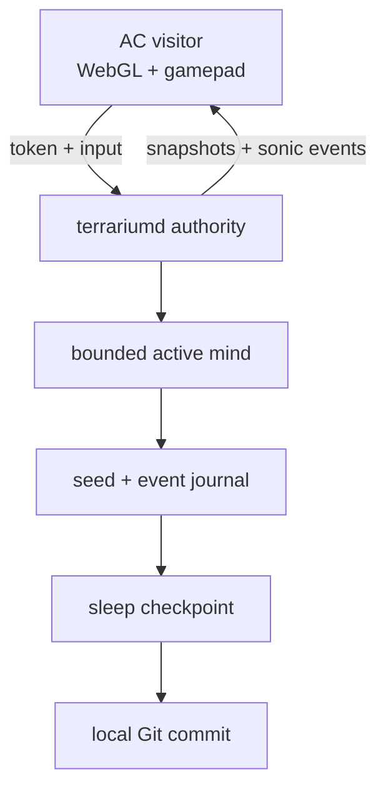

# Intelligent Terrarium — keeper recap

Updated: 2026-07-23 (America/Los_Angeles)

This is the living design and decision log for a persistent, generative 3D
intelligence hosted experimentally on `jastow` (`jas-nzxt`). Nothing here is a
production deployment. The working branch is `agent/intelligent-terrarium` in
the sparse worktree `/Users/jas/aesthetic-computer/.worktrees/intelligent-terrarium`.

## Outcome

Build the first slice as one bounded, authoritative `terrariumd` process plus
one browser visitor. The authority owns simulation, identity-bound actions,
semantic sound events, and persistence. The browser owns rendering and sound
synthesis, never world truth. Durable growth is replayable text data in a
separate Git repository; model weights, caches, tokens, and derived binaries
never enter autobiographical history.

The mind's bounded subsystems are **organs**: sensory, spatial, drive, memory,
action, voice, and sleep. The **mediorgan** is their externally touchable
membrane. An authenticated visitor can prod a named organ with a bounded text,
gesture, proximity, sound, or media stimulus. The prod receives a causal ID and
spatial origin and is journaled, but it is never a direct state mutation; the
target organ decides whether and how the body responds.



## Discovery

### Aesthetic Computer seams to reuse

- `session-server/world-manager.mjs` is the current generic authoritative 3D
  pattern: fixed simulation, per-client snapshots, WS lifecycle, UDP fast path,
  and browser interpolation. Terrarium should reuse its separation of authority
  and transport, but can begin at 10 Hz simulation / 5 Hz snapshots rather than
  arena's movement-oriented 60 / 30 Hz.
- `disks/arena.mjs`, `lib/3d.mjs`, and the Three.js-backed `Form` API already
  supply WebGL scenes, cameras, geometry, VR/controller plumbing, and remote
  interpolation. The eventual AC piece should stay hidden from `list` until the
  access boundary is reviewed.
- AC pieces can request the logged-in access token with `api.authorize()`.
  `session-server`'s newer `fight:auth` flow validates that token at Auth0 and
  resolves the handle server-side. This is the required model. The current
  `arena:hello {handle}` flow trusts a client string and is not sufficient for
  terrarium admission or authorship.
- AC's synth supports stereo `pan` and per-event volume. No browser 3D panner is
  currently shared with pieces. For the first slice, convert authoritative 3D
  source coordinates to listener-relative equal-power pan and distance rolloff;
  keep the wire event semantic so HRTF/WebAudio panning can replace the renderer
  later without changing the mind or journal.
- `docs/AGENT-MEMORY-LOCAL-FIRST.md` demonstrates encrypted append-only event
  records and checkpoint lineage. Terrarium uses the append/checkpoint ideas,
  but its world autobiography is deliberately human-reviewable Git data rather
  than opaque agent transcripts.

### `jastow` read-only inventory

Observed 2026-07-23 around 11:36 PDT:

- Fedora 43, Linux 7.1.4, 12 CPU threads, 15 GiB RAM, 8 GiB swap.
- 1.9 GiB RAM used, 13 GiB available, zero swap use, and zero current CPU,
  memory, or I/O PSI pressure. Root/home had about 912 GiB free.
- RTX 3070, NVIDIA driver 580.173.02. At the sample it was 100% utilized,
  3.33 GiB VRAM used, and 4.51 GiB free. `matador-miner` owned about 3.30 GiB
  VRAM and about two CPU cores. Do not stop or reconfigure it without a keeper
  decision; initial inference must assume the GPU is unavailable.
- Present: `nvidia-smi`, Python 3.14.6, Node 22.21.1, Podman 5.8.4, Docker
  29.6.2.
- Absent from PATH: CUDA `nvcc`, Ollama, llama.cpp CLIs/server, vLLM, Conda,
  and Micromamba. The system Python has no NumPy, PyTorch, Transformers,
  llama-cpp-python, ONNX Runtime, sentence-transformers, or FAISS. No local
  container images, running containers, or common model caches were found.
- `/home/me/aesthetic-computer` is on `main` with unrelated untracked
  `docs/native-fedora.md` and `scripts/fedora-native-setup.sh`; leave both alone.

Neo itself had less than 1 GiB free, so a full second monorepo checkout failed.
The keeper worktree is sparse (root files plus `experiments/`) and consumes only
about 6 MiB. No unrelated dirty files were changed.

## Architecture invariants

1. **One writer:** `terrariumd` is the only writer of world state and journal
   sequence numbers. Clients submit intentions, never mutations.
2. **Identity is verified:** admission is `token -> Auth0 userinfo -> account
   sub -> current AC handle`. Client-provided handles are display hints only.
   Tokens, email, IP addresses, and Auth0 payloads are never journaled.
3. **Deterministic core:** a versioned seed and PRNG cursor plus ordered events
   reproduce a checkpoint hash. Wall-clock time is converted at the boundary
   into explicit events; core simulation never reads it implicitly.
4. **Bounded mind:** every queue, visitor set, spatial index, recall set, prompt,
   and context window has a fixed maximum. The whole process group runs under a
   cgroup hard limit, not a hopeful dashboard threshold.
5. **Semantic sound:** the authority emits compact events such as
   `{id, tick, kind, source:[x,y,z], voice, pitch, intensity, radius, duration,
   cause}`. Clients deduplicate by `id` and render locally. No live audio stream
   is part of world truth.
6. **Proddable organs, authoritative body:** every outside prod crosses the
   mediorgan, which resolves identity, enforces modality/size/rate bounds, and
   records causality before routing. Organs can ignore or transform prods.
7. **Git is sleep, not the hot database:** append journal segments during wake;
   on sleep, fsync and close the segment, write an atomic checkpoint and
   autobiographical summary, verify replay, then commit only if content changed.
   No automatic push.
8. **Crash safety:** the last valid commit plus any fully written, checksummed
   journal records is sufficient for recovery. A partially written tail is
   quarantined, never guessed through.

### Durable state repository on `jastow`

Proposed location, to create only after a keeper decision:
`/home/me/intelligent-terrarium-state`. Keep it separate from
`/home/me/aesthetic-computer` so autonomous sleep commits cannot trigger AC
hooks, mingle with application history, or stage unrelated work.

```text
seed.json                         identity, schema, PRNG seed
journal/2026-07-23/000001.ndjson ordered, checksummed facts and actions
checkpoints/latest.json          compact replay acceleration
autobiography/2026-07-23.md      bounded human-readable sleep reflection
visitors/handles.json            consent/access facts, no tokens or PII
manifest.json                    schema versions and state hash
```

Journal segments are canonical; checkpoints and prose are derived and verified
before commit. Commit messages use sequence bounds and state hash, for example
`sleep: events 000001-000184 state 7e2c9a1b`. The Git author is the terrarium
service identity, not a visiting handle.

## Resident-memory profiles

The limits apply to the complete `terrariumd` process group, including any
inference child. GPU VRAM is reported separately and is never treated as a way
to evade the RAM cap.

| Budget | Hard controls | Active mind | Expected steady RSS |
|---|---|---|---|
| **1 GB** | `MemoryHigh=900M`, `MemoryMax=1024M`; Node old-space 256 MiB; bounded 4 MiB journal buffer; stop cleanly on allocation pressure | Deterministic recurrent drives, salience/novelty scoring, bounded episodic recall, spatial relation graph, and generative behavior policy. No resident language model. | 300–600 MiB; acceptance requires `<900 MiB` peak over the demo |
| **2 GB** | `MemoryHigh=1800M`, `MemoryMax=2048M`; same core bounds; inference has explicit model/context caps and one request at a time | 1 GB mind plus an optional approved user-space llama.cpp runner using a roughly 0.5–1B Q4 model, at most 2k context, quantized/bounded KV cache, and no unbounded embedding index | 1.2–1.8 GiB; acceptance requires `<1.8 GiB` peak |

The 1 GB profile is the product floor and remains intelligent without an LLM:
it perceives events, maintains drives and relationships, recalls salient
episodes, chooses behaviors, composes semantic sounds, and learns bounded
weights that become autobiography. The 2 GB model is a slow reflection/wording
organ, never the simulation authority. Given current GPU saturation, it should
run CPU-only at low priority first. Acquiring/building llama.cpp or model weights
is an explicit later decision because no suitable runtime is installed.

Measure `memory.current`, `memory.peak`, `/proc/<pid>/smaps_rollup`, event-loop
lag, journal backlog, and inference queue depth. Reject startup when a requested
profile cannot establish its hard cgroup limit.

## Staged prototype

### Stage 0 — deterministic headless kernel

Work only under this sparse `experiments/intelligent-terrarium/` tree. Implement
a dependency-light Node kernel with seeded PRNG, bounded state, event schema,
NDJSON journal, replay hash, and scripted visitors. Tests prove identical seed +
events produces the same state and sonic events.

### Stage 1 — sleep/wake Git cycle

Use a temporary test repository first. Exercise clean sleep, no-op sleep,
restart/replay, invalid tail, and process death between checkpoint creation and
commit. Git operations use explicit allowlisted paths; never `git add -A`.

### Stage 2 — loopback browser visitor

Serve snapshots and sonic events on `127.0.0.1` only, by an ephemeral manual
process. Render a small Three.js terrarium, listener-relative stereo audio,
keyboard, and standard Gamepad API input. Use an SSH local forward for neo-side
testing; no LAN/public listener or persistent service.

### Stage 3 — real AC identity and hidden piece

Add a development-only AC piece and a token-first handshake modeled on
`fight:auth`. Resolve the current handle server-side, bind actions to the
verified account, rate-limit intentions, and reject replayed/expired sessions.
This stage touches served paths and therefore requires a keeper decision before
any commit, push, or deploy.

### Stage 4 — 2 GB reflection experiment

After an explicit tooling/model decision, benchmark one small quantized model
CPU-only under the 2 GB cgroup. Feed it a bounded selected-memory digest, accept
only schema-validated proposals, and journal both proposal and deterministic
authority decision. Fall back to the 1 GB policy on timeout, malformed output,
or pressure.

### Stage 5 — visitable service / Xbox gate

Only after threat review and explicit deployment approval: choose the durable
gateway, TLS origin, service supervision, backup/restore, handle access policy,
and miner/GPU coexistence. Validate Edge/Xbox controller navigation and WebAudio
unlock behavior. No inbound service or production session-server change happens
before this gate.

## First demo acceptance criteria

The first thin slice is accepted only when all of these pass:

1. A fresh seed produces a visible evolving terrarium for 15 minutes under the
   **1 GB** hard profile with `memory.peak < 900 MiB`, no swap growth, no
   unbounded queue growth, and no effect on the existing miner process.
2. Two local browser visitors see the same authoritative entity positions and
   event sequence. Keyboard and an Xbox-compatible controller can move a
   visitor camera; neither client can set world state directly.
3. A server event at the listener's left/right and near/far positions is heard
   on the correct side with monotonic distance attenuation, and the same event
   ID never sounds twice after a reconnect.
4. The authenticated development path accepts a real logged-in AC handle,
   rejects a missing/invalid token, and proves that sending another handle in
   the payload cannot spoof authorship. Logs and Git contain no token or PII.
5. After at least one visitor interaction and one autonomous behavior, `sleep`
   creates exactly one local state-repository commit containing an allowlisted
   journal segment, checkpoint, manifest hash, and short autobiography. It does
   not push.
6. Killing and restarting from that commit yields the identical state hash,
   next event sequence, and next seeded autonomous behavior. A deliberately
   truncated journal tail is detected and quarantined with the last valid state
   preserved.
7. The authority binds only to loopback for the demo. `ss -lntp` confirms no new
   LAN/public listener, and no production or `jastow` AC checkout file changes.

## Keeper decisions still required

- Permission to create `/home/me/intelligent-terrarium-state` and run an
  ephemeral loopback-only process on `jastow`.
- Whether/when to install or build a user-space inference runtime and acquire a
  specific quantized model. No system package installation is assumed.
- The future authenticated gateway and who may visit/interact versus observe.
- Any coordination with `matador-miner`; the default is strict coexistence and
  no GPU use.
- Any served-path commit, push, deployment, persistent service, firewall, DNS,
  or public exposure.

## Next keeper action

Implement Stage 0 locally in this sparse worktree with deterministic replay and
memory-accounting tests only. It needs no remote writes, model installation,
network listener, production path, or deployment.
