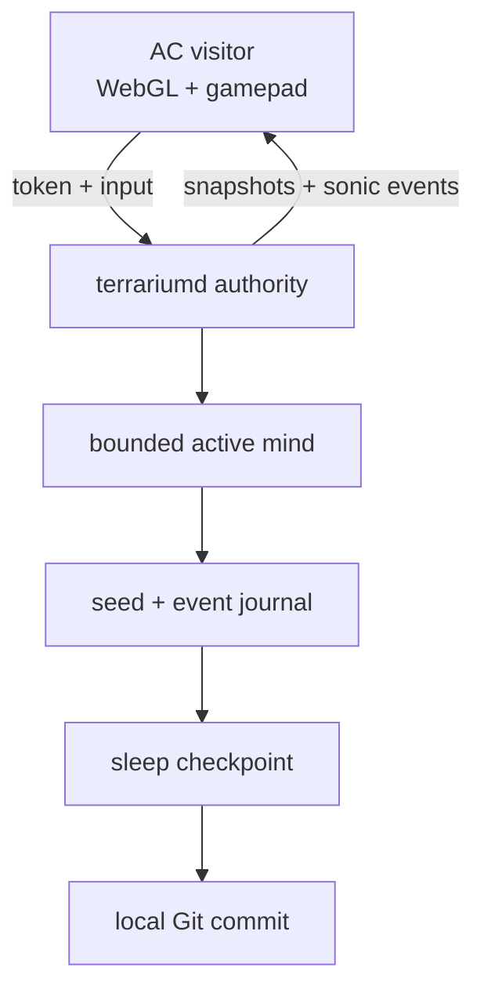

# Intelligent Terrarium — keeper recap

Updated: 2026-07-23 (America/Los_Angeles)

This is the living design and decision log for a persistent, generative 3D
intelligence hosted experimentally on `jastow` (`jas-nzxt`). Nothing here is a
production deployment. The working branch is `agent/intelligent-terrarium` in
the sparse worktree `/Users/jas/aesthetic-computer/.worktrees/intelligent-terrarium`.

## Outcome

Build the first slice as one bounded, authoritative `terrariumd` process plus
one browser visitor. The authority owns simulation, identity-bound actions,
semantic sound events, and persistence. The browser owns rendering and sound
synthesis, never world truth. Durable growth is replayable text data in a
separate Git repository; model weights, caches, tokens, and derived binaries
never enter autobiographical history.

The mind's bounded subsystems are **organs**: sensory, spatial, drive, memory,
action, voice, and sleep. The **mediorgan** is their externally touchable
membrane. An authenticated visitor can prod a named organ with a bounded text,
gesture, proximity, sound, or media stimulus. The prod receives a causal ID and
spatial origin and is journaled, but it is never a direct state mutation; the
target organ decides whether and how the body responds.



## Discovery

### Aesthetic Computer seams to reuse

- `session-server/world-manager.mjs` is the current generic authoritative 3D
  pattern: fixed simulation, per-client snapshots, WS lifecycle, UDP fast path,
  and browser interpolation. Terrarium should reuse its separation of authority
  and transport, but can begin at 10 Hz simulation / 5 Hz snapshots rather than
  arena's movement-oriented 60 / 30 Hz.
- `disks/arena.mjs`, `lib/3d.mjs`, and the Three.js-backed `Form` API already
  supply WebGL scenes, cameras, geometry, VR/controller plumbing, and remote
  interpolation. The eventual AC piece should stay hidden from `list` until the
  access boundary is reviewed.
- AC pieces can request the logged-in access token with `api.authorize()`.
  `session-server`'s newer `fight:auth` flow validates that token at Auth0 and
  resolves the handle server-side. This is the required model. The current
  `arena:hello {handle}` flow trusts a client string and is not sufficient for
  terrarium admission or authorship.
- AC's synth supports stereo `pan` and per-event volume. No browser 3D panner is
  currently shared with pieces. For the first slice, convert authoritative 3D
  source coordinates to listener-relative equal-power pan and distance rolloff;
  keep the wire event semantic so HRTF/WebAudio panning can replace the renderer
  later without changing the mind or journal.
- `docs/AGENT-MEMORY-LOCAL-FIRST.md` demonstrates encrypted append-only event
  records and checkpoint lineage. Terrarium uses the append/checkpoint ideas,
  but its world autobiography is deliberately human-reviewable Git data rather
  than opaque agent transcripts.

### `jastow` read-only inventory

Observed 2026-07-23 around 11:36 PDT:

- Fedora 43, Linux 7.1.4, 12 CPU threads, 15 GiB RAM, 8 GiB swap.
- 1.9 GiB RAM used, 13 GiB available, zero swap use, and zero current CPU,
  memory, or I/O PSI pressure. Root/home had about 912 GiB free.
- RTX 3070, NVIDIA driver 580.173.02. At the sample it was 100% utilized,
  3.33 GiB VRAM used, and 4.51 GiB free. `matador-miner` owned about 3.30 GiB
  VRAM and about two CPU cores. Do not stop or reconfigure it without a keeper
  decision; initial inference must assume the GPU is unavailable.
- Present: `nvidia-smi`, Python 3.14.6, Node 22.21.1, Podman 5.8.4, Docker
  29.6.2.
- Absent from PATH: CUDA `nvcc`, Ollama, llama.cpp CLIs/server, vLLM, Conda,
  and Micromamba. The system Python has no NumPy, PyTorch, Transformers,
  llama-cpp-python, ONNX Runtime, sentence-transformers, or FAISS. No local
  container images, running containers, or common model caches were found.
- `/home/me/aesthetic-computer` is on `main` with unrelated untracked
  `docs/native-fedora.md` and `scripts/fedora-native-setup.sh`; leave both alone.

Neo itself had less than 1 GiB free, so a full second monorepo checkout failed.
The keeper worktree is sparse (root files plus `experiments/`) and consumes only
about 6 MiB. No unrelated dirty files were changed.

## Architecture invariants

1. **One writer:** `terrariumd` is the only writer of world state and journal
   sequence numbers. Clients submit intentions, never mutations.
2. **Identity is verified:** admission is `token -> Auth0 userinfo -> account
   sub -> current AC handle`. Client-provided handles are display hints only.
   Tokens, email, IP addresses, and Auth0 payloads are never journaled.
3. **Deterministic core:** a versioned seed and PRNG cursor plus ordered events
   reproduce a checkpoint hash. Wall-clock time is converted at the boundary
   into explicit events; core simulation never reads it implicitly.
4. **Bounded mind:** every queue, visitor set, spatial index, recall set, prompt,
   and context window has a fixed maximum. The whole process group runs under a
   cgroup hard limit, not a hopeful dashboard threshold.
5. **Semantic sound:** the authority emits compact events such as
   `{id, tick, kind, source:[x,y,z], voice, pitch, intensity, radius, duration,
   cause}`. Clients deduplicate by `id` and render locally. No live audio stream
   is part of world truth.
6. **Proddable organs, authoritative body:** every outside prod crosses the
   mediorgan, which resolves identity, enforces modality/size/rate bounds, and
   records causality before routing. Organs can ignore or transform prods.
7. **Git is sleep, not the hot database:** append journal segments during wake;
   on sleep, fsync and close the segment, write an atomic checkpoint and
   autobiographical summary, verify replay, then commit only if content changed.
   No automatic push.
8. **Crash safety:** the last valid commit plus any fully written, checksummed
   journal records is sufficient for recovery. A partially written tail is
   quarantined, never guessed through.

### Durable state repository on `jastow`

Approved and created location: `/home/me/intelligent-terrarium-state`. It is
kept separate from
`/home/me/aesthetic-computer` so autonomous sleep commits cannot trigger AC
hooks, mingle with application history, or stage unrelated work.

```text
seed.json                         identity, schema, PRNG seed
journal/2026-07-23/000001.ndjson ordered, checksummed facts and actions
checkpoints/latest.json          compact replay acceleration
autobiography/2026-07-23.md      bounded human-readable sleep reflection
visitors/handles.json            consent/access facts, no tokens or PII
manifest.json                    schema versions and state hash
```

Journal segments are canonical; checkpoints and prose are derived and verified
before commit. Commit messages use sequence bounds and state hash, for example
`sleep: events 000001-000184 state 7e2c9a1b`. The Git author is the terrarium
service identity, not a visiting handle.

## Resident-memory profiles

The limits apply to the complete `terrariumd` process group, including any
inference child. GPU VRAM is reported separately and is never treated as a way
to evade the RAM cap.

| Budget | Hard controls | Active mind | Expected steady RSS |
|---|---|---|---|
| **1 GB** | `MemoryHigh=900M`, `MemoryMax=1024M`; Node old-space 256 MiB; bounded 4 MiB journal buffer; stop cleanly on allocation pressure | Deterministic recurrent drives, salience/novelty scoring, bounded episodic recall, spatial relation graph, and generative behavior policy. No resident language model. | 300–600 MiB; acceptance requires `<900 MiB` peak over the demo |
| **2 GB** | `MemoryHigh=1800M`, `MemoryMax=2048M`; same core bounds; inference has explicit model/context caps and one request at a time | 1 GB mind plus the approved CPU-only Qwen3 0.6B Q8_0 reflection organ, at most 2k context, quantized/bounded KV cache, and no unbounded embedding index | Measured smaps RSS is about 807 MiB; acceptance requires `<1.8 GiB` peak |

The 1 GB profile is the product floor and remains intelligent without an LLM:
it perceives events, maintains drives and relationships, recalls salient
episodes, chooses behaviors, composes semantic sounds, and learns bounded
weights that become autobiography. The 2 GB model is a slow reflection/wording
organ, never the simulation authority. Its approved runner is CPU-only and low
priority, so the existing GPU miner remains independent.

Measure `memory.current`, `memory.peak`, `/proc/<pid>/smaps_rollup`, event-loop
lag, journal backlog, and inference queue depth. Reject startup when a requested
profile cannot establish its hard cgroup limit.

## Staged prototype

### Stage 0 — deterministic headless kernel

Work only under this sparse `experiments/intelligent-terrarium/` tree. Implement
a dependency-light Node kernel with seeded PRNG, bounded state, event schema,
NDJSON journal, replay hash, and scripted visitors. Tests prove identical seed +
events produces the same state and sonic events.

### Stage 1 — sleep/wake Git cycle

Use a temporary test repository first. Exercise clean sleep, no-op sleep,
restart/replay, invalid tail, and process death between checkpoint creation and
commit. Git operations use explicit allowlisted paths; never `git add -A`.

### Stage 2 — loopback browser visitor

Serve snapshots and sonic events on `127.0.0.1` only, by an ephemeral manual
process. Render a small WebGL2 terrarium, listener-relative stereo audio,
keyboard, and standard Gamepad API input. Use an SSH local forward for neo-side
testing; no LAN/public listener or persistent service.

### Stage 3 — real AC identity and hidden piece

Implemented on the isolated branch after an explicit keeper decision. The
hidden `terrarium-dev` piece calls AC's `authorize()` and sends the bearer token
only to the fixed loopback authority. The server follows the existing AC seam:
Auth0 `/userinfo` verifies the token, then `/handle/<encoded-sub>` resolves the
public handle. Only that server-resolved handle authors a prod. The payload has
no authorship field, unknown spoofed identity fields are discarded, and audit
records contain outcome/status but no token, subject, email, or handle.

Real identity is opt-in at process start with `TERRARIUM_AC_AUTH=1`; the earlier
development capability remains available. CORS permits the same authority
origin and the two local AC development origins only. The process still
refuses every non-loopback bind. The piece deliberately omits `meta()` so it is
reachable as `terrarium-dev[:port]` without appearing in list/autocomplete.

### Stage 4 — 2 GB reflection experiment

Implemented after explicit approval. A pinned user-space llama.cpp and official
Qwen3 0.6B Q8_0 run CPU-only under the 2 GB cgroup. The organ receives a bounded,
secret-free selected-memory digest and may submit one strict proposal. The
deterministic authority independently accepts or rejects it and journals the
decision. Timeout, malformed output, disabled inference, or pressure always
falls back to the 1 GB policy.

### Stage 5 — visitable service / Xbox gate

Only after threat review and explicit deployment approval: choose the durable
gateway, TLS origin, service supervision, backup/restore, handle access policy,
and miner/GPU coexistence. Validate Edge/Xbox controller navigation and WebAudio
unlock behavior. No inbound service or production session-server change happens
before this gate.

## First demo acceptance criteria

The first thin slice is accepted only when all of these pass:

1. A fresh seed produces a visible evolving terrarium for 15 minutes under the
   **1 GB** hard profile with `memory.peak < 900 MiB`, no swap growth, no
   unbounded queue growth, and no effect on the existing miner process.
2. Two local browser visitors see the same authoritative entity positions and
   event sequence. Keyboard and an Xbox-compatible controller can move a
   visitor camera; neither client can set world state directly.
3. A server event at the listener's left/right and near/far positions is heard
   on the correct side with monotonic distance attenuation, and the same event
   ID never sounds twice after a reconnect.
4. The authenticated development path accepts a real logged-in AC handle,
   rejects a missing/invalid token, and proves that sending another handle in
   the payload cannot spoof authorship. Logs and Git contain no token or PII.
5. After at least one visitor interaction and one autonomous behavior, `sleep`
   creates exactly one local state-repository commit containing an allowlisted
   journal segment, checkpoint, manifest hash, and short autobiography. It does
   not push.
6. Killing and restarting from that commit yields the identical state hash,
   next event sequence, and next seeded autonomous behavior. A deliberately
   truncated journal tail is detected and quarantined with the last valid state
   preserved.
7. The authority binds only to loopback for the demo. `ss -lntp` confirms no new
   LAN/public listener, and no production or `jastow` AC checkout file changes.

## Keeper decisions still required

- The future authenticated gateway and who may visit/interact versus observe.
- Any coordination with `matador-miner`; the default is strict coexistence and
  no GPU use.
- Any served-path commit, push, deployment, persistent service, firewall, DNS,
  or public exposure.

## Next keeper action

Hold after Stage 4. The local fullscreen score may remain as a display-only
rehearsal, but its QR is deliberately marked as a non-live Stage 5 preview.
A real logged-in-token exercise, WebAudio-device check, physical Xbox-controller
check, and any reachable authenticated gateway still require keeper decisions.
No push, deployment, persistent authority service, or public listener is
authorized.

## 2026-07-23 implementation evidence

Keeper approval arrived through the private `alex` Loopboy inbox for Stages
0–1, an isolated branch commit, creation of the state repository, and an
ephemeral loopback-only 1 GB process. Stage 2 was permitted only after 0–1 were
green; that gate passed.

- Stage 0–1 code commit:
  `4a6f2ec654ed3a6f1dd19c22706ea68156a6f404`.
- Stage 2 Mediorgan/visitor commit:
  `d1528bd4bccdb5c560a5b97aa5aa68988fd2ec4a`.
- Local and Fedora suites: 12/12 Node tests pass. Coverage includes seeded
  determinism, bounded memory, journal replay/tamper detection, truncated-tail
  quarantine, allowlisted/no-op sleep commits, loopback refusal, capability
  exclusion from journals, concurrent prod serialization, stereo geometry, and
  sonic deduplication.
- Stage 0–1 Fedora run: 9,000 ticks, 902 records, state
  `e469e1009e673571d539189621e3ab238ed388881a0a7cd8a11ec564a280fba7`,
  cgroup `MemoryPeak=30277632`, `MemoryHigh=943718400`,
  `MemoryMax=1073741824`, `MemorySwapMax=0`. State commit:
  `27009678b7bf8f9d1ddbe481fd7d9edcef8491d7`.
- Stage 2 Fedora run: exact listener `127.0.0.1:18787`; unauthenticated state
  request returned 401; a `voice` organ prod via `media` returned a causal
  semantic sound. Peak cgroup charge was 26,771,456 bytes under the same hard
  limit. Shutdown removed the listener and committed state as
  `f8b09a1ac95c6db20aeb743434b9cc943c48e9ad`, with replay state
  `7e21bc07cbd52b6291304d524041ee43191f7a11254990f9636a7482b6222c12`.
- The listener-set hash was identical before and after both remote experiments.
  `matador-miner` remained PID 2928 at 3,298 MiB VRAM before, during, and after.
  The tower AC checkout retained only its two pre-existing untracked files.
- No package/model was installed; no branch or state was pushed; no production
  or served path was changed.

The first-demo acceptance list is not yet wholly satisfied. The code exercises
WebGL2, keyboard/Gamepad input, WebAudio stereo rendering, and two-client stream
semantics, but the in-app browser-control bridge was unavailable, so visual and
physical-controller QA remain unchecked. The real AC Auth0/handle path is also
Stage 3, and the 9,000-tick memory run was accelerated rather than a wall-clock
15-minute soak.

### Stage 2 one-writer review

The private keeper review identified the repository append race that would
exist if ticks and outside prods could enter `StateRepository.transact`
concurrently. The authority now has two deliberate layers: the server queue
serializes whole mutations such as a Mediorgan prod, while the repository owns
an intrinsic append queue so no caller can clone the same pre-append head.
Shutdown drains both queues before sleep. The timer callback does not return an
unobserved promise; tick failures terminate in the injected `onTickError`
handler and later ticks continue.

The expanded local suite passes 13/13. Its race case mixes the 1 ms autonomous
tick interval with eight simultaneous authenticated prods, then proves sequence
numbers are contiguous, every `prevHash` names the preceding record, all prods
land exactly once, and a fresh replay has the same final state/head hashes.
An injected tick failure is observed without stopping subsequent ticks. Both
tests also passed 20/20 focused stress repetitions.

Alex's current execution boundary prohibits browser automation and all GUI
control, so the remaining visual, WebAudio-device, and physical Xbox-controller
checks were not attempted. Pure spatial-audio geometry/deduplication tests stay
green; interactive QA remains an explicit acceptance blocker.

### Stage 3 identity evidence

Stage 3 adds the dependency-free `identity.mjs` verifier and the hidden
`system/public/aesthetic.computer/disks/terrarium-dev.mjs` client. The CLI wires
the verifier only when `TERRARIUM_AC_AUTH=1`; it reports the auth mode but never
the bearer value or identity claims. No production/session-server code was
changed.

The complete local suite passes 18/18. Identity cases prove:

- a valid Auth0 response resolves its subject through the server-side AC handle
  endpoint and returns only normalized `@alex`;
- missing, malformed, locally expired JWT-shaped, and Auth0-rejected opaque
  tokens fail with 401-class identity errors;
- a request claiming `@mallory` plus spoofed subject/email/token fields is
  journaled only as the verified `@alex`, and none of the forbidden values
  occur in the journal or structured audit fixture;
- a fixed-clock two-prods-per-second profile accepts exactly two actions and
  returns 429 for the third, with exactly two `organ-prod` records; and
- allowed local CORS preflight succeeds, a foreign origin is rejected, the
  piece contains no `meta()` export, and its endpoint is fixed to loopback.

Both the client and identity modules pass Node syntax checks. No live Auth0
request, real bearer token, GUI/browser action, non-loopback listener, remote
machine access, push, deployment, or live hook was used for this stage. A real
logged-in handle test is therefore still required for first-demo criterion 4.

### Stage 4 reflection and graphic-score evidence

Keeper approval arrived through the private `alex` Loopboy inbox for a strictly
user-space CPU experiment on `jastow`. The final source and display remain in
the isolated worktree/runtime; the durable autobiography remains the separate
state repository. Nothing was pushed or deployed.

- llama.cpp is pinned to official `ggml-org/llama.cpp` commit
  `c0bc8591e8815c63cb01dd3f051a8b0df02501c9`. It was compiled with the
  existing CMake 3.31.11 and GCC 15.2.1: CUDA, Vulkan, SYCL, OpenCL, BLAS,
  curl, UI, tests, and examples are off. This revision couples the CLI to the
  server source target, so `LLAMA_BUILD_SERVER=ON` was needed to produce the
  CLI; no server was launched and no socket was opened. An initial configure
  touched only the ignored user cache before UI was explicitly disabled; no
  system or npm package was installed.
- The official Apache-2.0 `Qwen/Qwen3-0.6B-GGUF` Q8_0 file is 639,446,688
  bytes with SHA-256
  `9465e63a22add5354d9bb4b99e90117043c7124007664907259bd16d043bb031`.
  Exact URL, hashes, build flags, and cache paths are recorded in
  `provenance/stage4.json`; caches are excluded from autobiographical Git.
- The reflection request is capped at 2,048 context tokens, 128 output tokens
  (96 in the measured run), 6,000 prompt characters, 30 seconds, four CPU
  threads, and one request at a time. The selected-memory digest contains only
  hashes, tick/count aggregates, drives, weights, and episode-kind counts.
  Tokens, handles, stimuli, email, paths, and raw memories do not enter the
  prompt or journal.
- The pinned llama.cpp numeric-range grammar path threw in its sampler, so the
  model is not trusted to enforce its own grammar. The runner removes its exact
  echoed prompt, and the application accepts only the strict four-field schema.
  The authority re-evaluates the policy during both append and replay; a model
  cannot authorize `broadcast`, add a field, exceed `±0.25`, or forge a prior
  decision.
- The complete Neo suite passes 26/26. The complete Fedora suite passes 25/25
  under `MemoryMax=2 GiB`, `MemoryHigh=1800 MiB`, `MemorySwapMax=0`,
  `CPUQuota=200%`, and `Nice=15`; its only environment-specific input is the
  path to the hidden AC piece. Coverage includes malformed/timeout/disabled
  fallback, deterministic rejection, prompt-echo separation, one-request
  serialization, secret exclusion, and journal ordering by sequence across
  segment filenames.
- The strict 1 GB policy fallback ran under `MemoryMax=1 GiB`,
  `MemoryHigh=900 MiB`, zero swap, and low priority. It journaled `disabled`
  fallback deterministically; cgroup peak was 31,932,416 bytes and Node RSS was
  78,917,632 bytes. The 1 GB floor still never loads the model.
- The final 2 GB coexistence run completed in 6.71 seconds while
  `matador-miner` remained active at 100% GPU use. Qwen generated at 13.3
  tokens/second after an 88.9 tokens/second prompt pass. `/proc` smaps peak RSS
  was 825,940 KiB (about 807 MiB), below both policy thresholds; cgroup peak was
  227,233,792 bytes because model file pages were already warm and charged
  elsewhere. This is not represented as a cold-cache peak. Swap stayed zero.
- The deterministic authority accepted
  `{action:"attune", target:"sensory", intensity:0.25}` at final sequence 912.
  Sleep created local state commit
  `7b801ff08c998574d23f353934e4204752c61bf4`; fresh replay produced state
  `1e0174be53f69e8497683676e7e6cc9be4c589765fcb9eb5bda22c79b6c94764`
  and head
  `8b660c4aebad3236fa1fe8609d2504e0dedc68f439032aec7fed4270898af12e`.
  Two earlier retries also completed and slept cleanly as sequences 910–911.
- A scan of journal, checkpoints, autobiography, manifest, and visitor facts
  found no bearer/token, email-like identifier, model/cache path, or GGUF name.
  The listening-socket hash was identical before and after inference. The miner
  had independently exited during the earlier build window and later returned;
  no keeper command signalled, stopped, restarted, or reconfigured it. The
  final run proves live coexistence after its return.
- `score.html` is a self-contained 1920×1080 spatial graphic measure: the six
  organs are colored staves, outside prods ripple through the Mediorgan
  membrane, reflection breathes inside the body, and quiet proof marks show the
  journal, replay, resident envelope, and miner boundary. Its QR encodes the
  intended `https://aesthetic.computer/terrarium-dev` route but visibly says the
  client gate is only a preview pending Stage 5. It opens from `file://` in a
  fullscreen Chromium kiosk on the existing `jastow` GNOME session; it opens no
  port and depends on no remote script.
