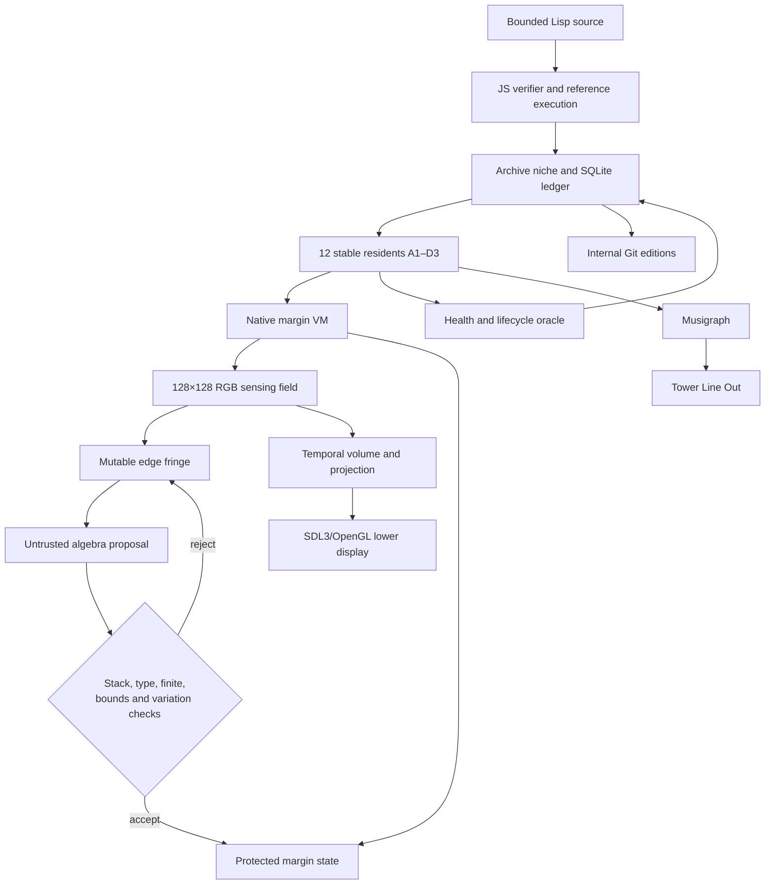

# Piecefarm: report so far

**Aesthetic Computer personal-computing terrarium**

**Work period:** July 23–24, 2026

**Host:** `jas-nzxt` Fedora tower
**Status:** safely shut down and disabled

## Executive summary

Piecefarm began as a question: how much strange, durable intelligence can fit inside a personal computer with bounded memory, remain alive while the machine is plugged in, grow through its own history, and expose itself as something a person can watch, hear, visit, and eventually influence?

The first implementation answered that question too superficially. It looked like a spectral sponge and used generative effects without a sufficiently grounded computational account. That version was stopped. The project was then recast around Aesthetic Computer's existing KidLisp, native raster, paper, platter, musical-time, graph, and piece ideas without treating their visual output as a direct style source.

The resulting system is a running population of small verified Lisp programs. Each inhabits a 128×128 RGB field surrounded by a typed 16-pixel logical margin. The RGB field is media and sensed matter. The margin holds instructions, signatures, protected state, camera mathematics, sprite sheets, verified function bodies, and a mutable fringe where untrusted proposals can form. Twelve organisms appear at stable A1–D3 addresses on the lower display. A large scoreboard occupies the upper display. Their memory is also sonified through the tower's Line Out.

By shutdown, the farm had evaluated 57,398 candidates, accepted 10,768, retained 56 archive cells, written 62 internal Git editions, accumulated seven bounded OpenAI visual reviews, and recorded 109 lifecycle interventions. The final native display held 143.6 FPS while the service used roughly 195 MB of RAM.

The most important result is architectural rather than visual: parts of the machine's behavior stopped being hardwired effects and became verified programs stored in the organisms' own memory. The system is not yet self-hosting, but it now has a credible path toward it.

## The initial proposition

The project combined several related ideas:

- A personal computer as a continuously growing, inspectable terrarium rather than a collection of inert applications.
- Small memory-bounded intelligences that can live on 1–2 GB machines.
- Git history as sediment, ancestry, and durable memory.
- KidLisp-like program search as computational soup.
- A machine that can be visited through native, web, Xbox, Prox, or Loopboy clients without giving those clients uncontrolled authority.
- Spatial graphics and sound as sensing instruments, not ornamental dashboards.
- A whole tower functioning as a “piece farm”: computing, evaluating, preserving, breeding, and retiring small programs.

The central metaphor became a SCoby or sponge of personal-computing flexibility: many bounded pieces living together, sharing selectively, showing their condition, and occasionally discovering more expressive machinery.

## What did not work

The early visual system was rejected for good reasons.

- Its logic was vibe-coded: the appearance moved faster than the computational model.
- The screen resembled a spectral sponge, sorted bars, or rainbow noise without explaining what work was occurring.
- Chromium dashboards introduced unnecessary weight and awkward window/display behavior.
- Text was too small or overlapped; display assignment repeatedly flipped between monitors.
- Motion was flickery and jumpy rather than continuous and legible.
- Color often described decoration rather than live memory.
- The system reported aliveness without sufficiently distinguishing meaningful temporal change, stillness, two-frame flicker, mud, collapse, and incoherent noise.

The useful response was not another skin. The project paused, returned to the AC papers and platter as conceptual grounding, and rebuilt around explicit memory, verification, lifecycle, and sensing boundaries.

## Architecture that emerged



The authority chain is intentionally asymmetric. Outside models and clients may propose, describe, or prod. They do not write executable resident memory directly. Native execution only follows instructions reconstructed from tagged and verified margin cells.

## The organism

Each raster organism contains:

- A 128×128×3-byte RGB field.
- A second working buffer.
- Eight temporal volume slices.
- A 16-pixel uniform logical margin containing 9,216 typed 16-byte cells.
- A protected 1,956-cell region.
- A mutable 7,260-cell fringe.
- Four 32×32 RGB sprite slots.
- Camera state and a column-major perspective matrix compatible with AC's graph3d conventions.
- A short stack-program evaluator.
- Health, energy, coherence, noise, mud, stillness, flicker, and lifecycle state.

The field and margin have different authority. RGB is mutable media. Protected margin state survives ordinary rendering operations, seed reprobes, and neighbor memory grafts. The fringe receives information derived from RGB boundaries but cannot execute directly. It is a communicative and corruptible membrane.

## Lisp and memory

The raster Lisp grew from simple field operators into a bounded language that includes:

- Arithmetic and bitwise operations.
- Shifts, mixing, blur, edges, rotation, mirrors, and channel transforms.
- Lines, triangles, flood fill, and nested boxes.
- Sprite `copy` and `paste` with replace, XOR, add, and mask composition.
- Box permeability and internal update rules.

Copy/paste is not merely a renderer shortcut. Sprite content lives in typed margin slots. The generator tracks initialized slots, so newly discovered paste paths must contain a preceding copy to the same slot. A live example discovered by the farm was:

```lisp
(raster
  (and 165 144 212)
  (copy 5 59 2 25 0)
  (paste 0 93 79 add))
```

Raster bytecode itself was removed from the native resident structure. The native runtime reconstructs each 24-byte instruction from three verified margin cells and follows its link to a function signature.

## The margin VM frontier

A bounded stack evaluator now runs function bodies stored in protected margin memory. `ADD`, `XOR`, `AND`, `OR`, and `SOLARIZE` no longer rely on dedicated native arithmetic branches. Native C interprets their verified bodies.

The VM provides bounded inputs including current value, Lisp argument, normalized X/Y coordinates, temporal depth, phase, and measured energy. Its operation set includes arithmetic, protected division, integer bitwise operators, sine, cosine, tanh, absolute value, min/max, solarization, constants, and return.

Projection programs synthesize themselves from field/fringe state. A candidate is first written into untrusted fringe cells. Promotion requires:

- A valid postfix stack shape.
- Only allowlisted instructions.
- A bounded stack depth.
- Finite constants.
- Finite evaluation across a 64-point X/Y/depth/time/energy domain.
- Outputs within a fixed interval.
- Nontrivial variation rather than a constant result.

Accepted X, Y, or depth expressions cross into protected memory and begin influencing the live temporal-volume projection. Panels were observed reporting `ALGEBRA PROMOTE … G…` while the display remained at 143.6 FPS.

This is genuine endogenous program variation, but it is not yet full self-hosting. The expression bodies evolve inside margin memory; the synthesis and proof policy is still native C.

## Visual observatory

The web/Chromium dashboard was replaced by SDL3 and OpenGL.

The two-monitor arrangement is:

- **Upper display:** large low-resolution scoreboard, current mission, Git-edition countdown, frontier/energy/aliveness/evaluation bars, UTC musical authority, spectrum, active projection class, health summary, FPS, and memory.
- **Lower display:** fixed 4×3 population. The substrates remain spatially stable while residents change. Each tile uses square nearest-neighbor pixels and a thin two-part margin rim. Small Quake-like console lines expose current operations, health, holds, reprobes, and algebra promotion.

The projections include curved Möbius/Poincaré motion, perspective camera rays through temporal volume, rectilinear nested chambers, and oblique height fields. They are blended across frames to avoid abrupt mode jumps.

The final display used two pixel-perfect 640×360 logical uploads scaled 4× to 2560×1440. Both monitors held about 143.6 FPS.

## Aliveness and lifecycle

Aliveness became a measured relationship between actual temporal change and available potential energy rather than a decorative score.

Measurements include:

- Actual and potential energy.
- Spatial variation and field variance.
- Temporal coherence.
- Delta/chroma noise.
- Muddiness.
- Colorfulness.
- Still-frame runs.
- Two-frame flicker loops.
- Collapsed uniform states.

The lifecycle distinguishes poor performance from terminal failure.

- Ordinary population-relative low performers receive a 60-second statistical trial.
- Early sustained red can trigger a memory intervention rather than immediate death.
- Interventions include self-reprobe, organized nested memory, or a weighted neighbor graft.
- Neighbor selection favors adjacent A1–D3 addresses but occasionally permits distant grafts.
- Sustained yellow organisms can be retained and forked when rendering has headroom.
- A terminal resident—HP below 10 after at least three failed native reprobes across two health reports—can be retired after a five-second terminal window.

Retirement frees a stable address for another archived organism. The ledger records health, strikes, intervention strategy, donor, outcome, and cull reason.

## Musigraph

The sound system treats memory as musical material.

- Resident patterns form smoothed wavetables rather than using only sine oscillators.
- A lower-register pentatonic mapping reduced harshness for nighttime listening.
- Quarter- and eighth-beat events are derived from AC musical time.
- Percussive transients, envelopes, rests, and legato transitions reduce clipping and popping.
- Spatial position affects pan and attenuation.
- The upper display shows the active spectrum.

Audio was routed and pinned to the tower's physical Line Out. The Piecefarm stream ran uncorked at 115% during the final session.

## LLM participation

LLMs occupy bounded roles.

- Outside Prox/Loopboy clients may propose verified Lisp source through a capability membrane.
- Source is parsed and executed by the same deterministic verifier used for local grammar candidates.
- OpenAI visual inference reviews only high-change, lower-noise verified residents on a cooldown.
- Reviews are metadata and quality-control evidence. They do not grant execution authority.
- Credentials live in the tower's private systemd environment, not in source, Git history, screenshots, or the archive.

Seven visual reviews had been stored by shutdown.

## Measured end state

| Measure | Final value |
|---|---:|
| Iterations | 57,398 |
| Accepted candidates | 10,768 |
| Rejected/dissolving candidates | 46,630 |
| Archive cells | 56 |
| Internal Git editions | 62 |
| Visual reviews | 7 |
| Lifecycle interventions | 109 |
| Persistent state size | 7.5 MB |
| Service memory before shutdown | ~195 MB |
| Observed peak service memory | ~211 MB |
| Display rate | 143.6 FPS |
| Local tests | 46 passing |

The RTX 3070 accelerated SDL compositing. Piecefarm used approximately 19–22% GPU activity and 164 MB VRAM during measurements. A separate `matador-miner` process consumed most remaining GPU compute, so Lisp evaluation itself was not GPU-accelerated.

## What is genuinely intelligent here?

The strongest claims are modest but real:

- Programs are generated, verified on multiple inputs, measured, compared within behavioral niches, and archived or rejected.
- Their live effects are evaluated over time rather than from a single still image.
- The population performs interventions, copying, forking, replacement, and bounded endogenous expression synthesis.
- History is durable and replayable.
- Some executable behavior now resides in the organism's typed memory rather than in dedicated renderer branches.

The system does not yet reason about arbitrary goals, prove general theorems, or rewrite its complete implementation. Its intelligence is closer to a constrained evolutionary laboratory with memory, verification, sensing, and outside semantic curation.

## Honest limits

- Native C remains the scheduler, verifier, sandbox, interpreter, renderer, and synthesis authority.
- Most raster primitives still have native bodies.
- Promoted projection programs are not yet serialized or inherited after restart or resident replacement.
- Verified bodies are interpreted rather than compiled into SIMD, GPU kernels, or machine code.
- The algebra vocabulary is seeded; it is not yet a full homotopy type theory or proof assistant.
- OpenAI classifications are sparse semantic hints, not ground truth.
- Stable 143.6 display FPS does not itself prove 30 Hz evaluation for every possible future VM body; separate simulation-rate telemetry should be added.
- Xbox and general remote spatial clients remain future consumers rather than completed interfaces.

## Best next frontier

The next phase should prioritize heredity over more effects.

1. Serialize promoted margin bodies and their verification evidence to SQLite and the internal Git editions.
2. Restore and inherit those bodies across restart, cull, fork, and neighbor graft.
3. Give microcode a readable Lisp representation and move the remaining primitives into verified bodies.
4. Retain the interpreter as a proof oracle while compiling stable bodies into cached SIMD or GPU kernels.
5. Make the synthesis rules themselves typed margin programs with proof-carrying promotion and rollback.
6. Expose promotion generation, rejected-proposal reason, native simulation rate, and failed-reprobe count on the upper scoreboard.

That would move Piecefarm from a system that grows programs inside a native terrarium toward a terrarium capable of growing more of its own machine.

## Shutdown and recovery

The farm was intentionally stopped on July 24, 2026. It is inactive and disabled; no native/server process or Piecefarm audio stream remains. Shutdown wrote a clean internal Git edition:

```text
b7bb77c season: shutdown at iteration 57398 coverage 56
```

Persistent state remains at `/home/me/.local/share/piecefarm/state`.

Resume once without restoring autostart:

```bash
systemctl --user start piecefarm.service
```

Resume and restore autostart:

```bash
systemctl --user enable --now piecefarm.service
```

The project source remains local and uncommitted. The organism/archive history on `jas-nzxt` is committed through the shutdown edition.

For the terse operational handoff, see [piecefarm-day-end-2026-07-24.md](piecefarm-day-end-2026-07-24.md).
