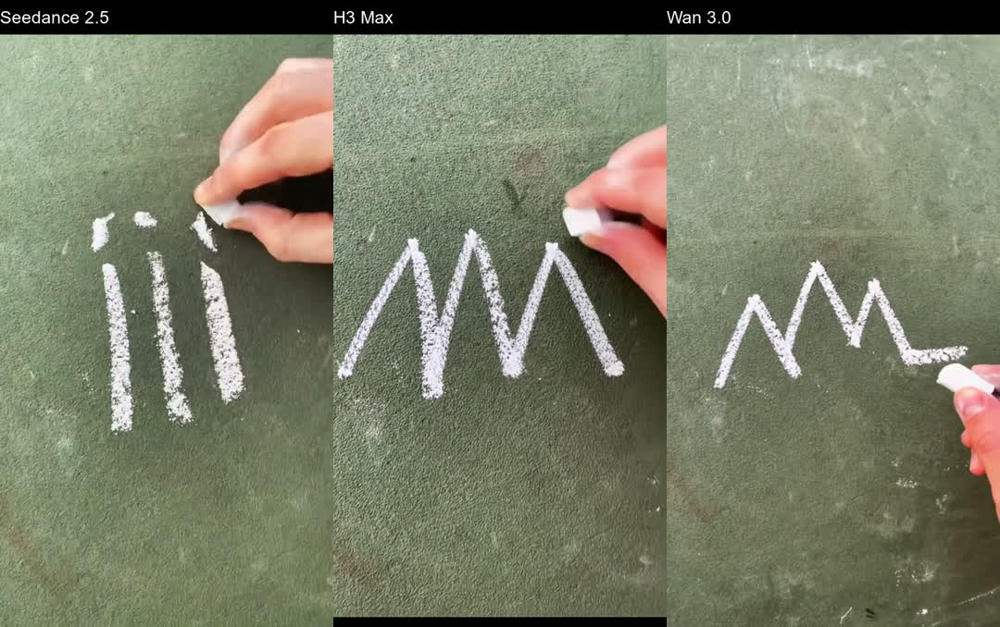

# Whistlegraph video models — October 7, 2026

[Watch the comparison with sound](comparison.mp4): Seedance 2.5 → H3 Max → Wan 3.0.



Each model received the same five-second excerpt of [“show us ur cult”](https://www.tiktok.com/@whistlegraph/video/7119595740988460330) (Whistlegraph, July 12, 2022), with its original sound. The prompt requests a new drawing: three mountain peaks, then a flat valley, with whistle pitch following the chalk tip. One five-second output per model.

| Model | Visual result | fal inference time |
| --- | --- | --- |
| [Seedance 2.5](seedance-2.5.mp4) | Reproduces the reference’s vertical marks and multiple hands instead of the requested mountains. | 807 s |
| [H3 Max](h3-max.mp4) | Three peaks; starts with an existing stroke and omits the flat ending. | 13 s |
| [Wan 3.0](wan-3.0.mp4) | Blank start, three peaks, flat ending, and a held finished drawing. Closest to the requested sequence. | 206 s |

**Wan wins the visual prompt-adherence comparison in this trial.** Review used 24 sampled frames per take, retained in `*-frames.jpg`; audio-to-stroke synchronization still needs listening review. All outputs contain audio, and the assembled comparison decoded without errors. The user’s initial reaction was “not bad.”

This is one take per model, not a general ranking. The earlier Seedance 2.0 renders were unavailable on this host, so this does not establish improvement over those exact takes. See the [earlier findings](../../marketing/whistlegraph-seedance/README.md).

Estimated cost was $4.91; the account balance decreased by **$4.87** during the test. This is an account-level observation, not an itemized invoice.

## Reproduction

`plan.json` preserves the exact endpoint-specific payloads, prompts, seed, resolutions and reference URL. `manifest.json` records request IDs, inference times and SHA-256 hashes. Original outputs, the local reference excerpt and raw result metadata are retained here. Seedance and Wan ran at 720p; H3 used native 768P. Prompt rewriting was disabled where exposed; Wan thinking was enabled. Equal seed numbers do not represent equivalent noise across models.

The runner uses the shared `pop/lib/fal.mjs` credential and upload helpers. Billing checks also require `FAL_ADMIN_KEY` in the local vault. No credentials are committed.

To make another paid trial, create a fresh directory, copy `reference.mp4` into it, then run:

```sh
node run.mjs prepare /absolute/path/to/new-run
# Inspect the new plan.json before submitting paid jobs.
node run.mjs submit /absolute/path/to/new-run
node run.mjs poll /absolute/path/to/new-run
```

Submission records are written before the network request. Ambiguous submissions are not retried automatically. Existing local output videos are skipped. The archived plan cannot be overwritten by `prepare`.

`python3 review.py` rebuilds labeled review clips and contact sheets from the local originals; it preserves an existing `comparison.mp4`. Requires ffmpeg/ffprobe through the repo’s macOS QoS shims, ImageMagick, and the macOS Arial font.

Pricing checked before submission: [Seedance](https://fal.ai/models/bytedance/seedance-2.5/reference-to-video), [H3 Max](https://fal.ai/models/minimax/h3-max/reference-to-video), [Wan](https://fal.ai/models/alibaba/wan-3.0/reference-to-video). Estimates include reference-video charges.
