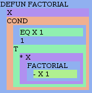
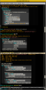

# Visualizing Lisp Without Parentheses

Research into alternative visual representations of S-expressions that reduce or eliminate explicit parentheses.

## Overview

The classic challenge with Lisp syntax is the "wall of parens" at the end of deeply nested expressions. Several approaches have been developed to visualize or edit Lisp code in ways that make the structure more apparent without relying solely on parentheses.

---

## Historical Origins

### Bill Clagett's Color Boxes (November 2004)

**Source**: [miscellaneous bill archive](https://web.archive.org/web/20041109234428/http://www.32768.com/bill/weblog/000660.shtml)

Bill Clagett wondered "what it'd look like if we wrote S-expressions by putting things in boxes instead of putting them in parentheses." He created CSS-laden HTML to transform Lisp code into nested colored boxes.


*The factorial function rendered as nested color boxes (154×156 px)*

```lisp
;; Original factorial implementation from Wikipedia's S-expression page
(DEFUN FACTORIAL
  (X)
  (COND
   ((EQ X 1)
     1)
   (T
     (* X
        (FACTORIAL
         (- X 1))))))
```

His conclusion: **"And people say all the parentheses look funny. I'll call this experiment an interesting failure."**

#### Key Insight
The box visualization replaces parens entirely but introduces its own cognitive load—JMP statistics software used similar box-based formula input and users found it "quite difficult to use."

---

### Michael Weber's mwe-color-box.el (November 2004)

**Source**: [Wayback Archive of mwe-color-box.el](https://web.archive.org/web/20160421234903/http://www.foldr.org/~michaelw/emacs/mwe-color-box.el)


*Emacs rendering of color boxes (66×128 px thumbnail)*

Michael Weber responded to Bill's blog post with an Emacs implementation. Key features:

- **View-only mode** (buffer made read-only during visualization)
- **Depth-based coloring** via 10 cycling faces
- **Rectangle overlays** extending to column boundaries
- **Optional paren hiding** (configurable via `mwe:color-box-hide-parens`)

#### Core Algorithm

```elisp
;; Tokenize s-expressions by depth
(defun mwe:sexp-tokenizer (&optional depth)
  (setq depth (or depth 0))
  (mwe:skip-whitespace)
  (cond ((looking-at "(")
         (let* ((point (prog1 (point) (forward-char)))
                (toks (mwe:slist-tokenizer (1+ depth)))
                (epoint (progn (end-of-sexp) (point))))
           (mwe:make-sexp-token point epoint 'sexp depth toks)))
        ((looking-at "['`]")
         ;; Handle quote/quasiquote
         ...)
        (t 
         ;; Atoms
         ...)))
```

#### Color Scheme Options

```elisp
;; Default: grayscale gradient (subtle)
(defface mwe:nesting-face-0 '((((class color)) (:background "gray2"))))
(defface mwe:nesting-face-1 '((((class color)) (:background "gray10"))))
;; ... through gray67

;; Alternative: "miscbill" rainbow colors
'(mwe:nesting-face-0 ((((class color)) (:background "#90b0f0"))))
'(mwe:nesting-face-1 ((((class color)) (:background "#b090f0"))))
'(mwe:nesting-face-2 ((((class color)) (:background "#f0b090"))))
;; ... cycling through pastel colors
```

---

## Modern Approaches

### Rainbow Delimiters

**Source**: [github.com/Fanael/rainbow-delimiters](https://github.com/Fanael/rainbow-delimiters)

Rather than replacing parens with boxes, rainbow-delimiters colors the **parentheses themselves** by nesting depth. This is the most widely adopted approach today.

- Colors parens, brackets, and braces by depth
- 9 depth levels with cycling
- Highly optimized for speed (no scrolling lag)
- Subtle default colors, customizable via themes
- 730+ GitHub stars

```elisp
;; Enable in programming modes
(add-hook 'prog-mode-hook #'rainbow-delimiters-mode)

;; Face naming convention
;; rainbow-delimiters-depth-N-face (N = 1-9)
;; rainbow-delimiters-unmatched-face
;; rainbow-delimiters-mismatched-face
```

### Rainbow Blocks (deprecated)

A fork of rainbow-delimiters that highlighted **entire blocks** rather than just the delimiters. The repository (istib/rainbow-blocks) is no longer available but represented a middle ground between Weber's full-rectangle approach and delimiter-only coloring.

---

## Structural/Indentation-Based Approaches

### Parinfer

**Source**: [shaunlebron.github.io/parinfer](https://shaunlebron.github.io/parinfer/)

Parinfer takes a fundamentally different approach: it uses **indentation to infer parentheses**, making them nearly invisible during editing.

#### Two Modes

1. **Indent Mode**: Full control of indentation → Parinfer corrects parens
2. **Paren Mode**: Full control of parens → Parinfer corrects indentation

#### The LEGO Analogy

> "Imagine each list as a LEGO block stacked over its parent. Checking the sides to see the layers below is like checking the parens at the end of a line."

#### Mathematical Foundation

Parinfer formalizes the relationship between parens and indentation:

```
I = (Indent Mode) function accepting code text and returning new text
P = (Paren Mode) function accepting code text and returning new text
R = (Reader) function accepting code text and returning its AST

For y = P(x):
  ⟹ R(x) = R(y)     ← Paren-Mode never changes AST
  ⟹ P(y) = y        ← Paren-Mode is idempotent
  ⟹ I(y) = y        ← Indent-Mode doesn't change Paren-Mode results
```

#### Editor Support
- VS Code (vscode-parinfer)
- Vim/Neovim (parinfer-rust)
- Emacs (parinfer-mode)
- Atom, Sublime, Light Table
- Built into Nightcode IDE

---

## Related Concepts

### Sweet Expressions / I-Expressions

Alternative Lisp syntaxes that infer parens from indentation (SRFI-49, readable.sourceforge.net). Unlike Parinfer, these are **syntax-level** changes rather than editor modes.

### Cirru

[github.com/Cirru](https://github.com/Cirru) - Uses indentation plus special operators (`$`, `$ []`, `$ {}`) to infer Clojure parens.

### Frame-Based Editing

[greenfoot.org/frames](http://www.greenfoot.org/frames/) - Uses visual blocks (like the LEGO metaphor) to represent code structure. Similar to Scratch's block-based programming.

### Structural Editors

- **Flense** (github.com/mkremins/flense) - Structural editor for Clojure
- **Plastic** (github.com/darwin/plastic) - Structural editing concepts

---

## Wire/Node-Based Approaches (Dataflow)

An entirely different paradigm: represent code as **nodes connected by wires** instead of nested text. Each node is a function, wires carry data between them.

### The Dataflow Family

**Origins**: William Robert Sutherland's 1966 MIT thesis ["Online Graphical Specification of Procedures"](https://dspace.mit.edu/handle/1721.1/13474) pioneered 2D pictorial programming. Key insights:

1. *"A pictorial program is a natural way of expressing parallel processes"*
2. *"Being able to attach data probes and to see a program run gives one a grasp of detail that is hard to obtain in any other way"*
3. *"The movement of data through a program may determine its operation"*

### Modern Node Graph Systems

| System | Domain | Notable Features |
|--------|--------|------------------|
| **Max/MSP** | Audio/Music | Real-time signal flow, IRCAM heritage |
| **Pure Data (Pd)** | Audio/Visual | Open-source Max alternative |
| **TouchDesigner** | Real-time visuals | GPU-accelerated, used in live shows |
| **Houdini** | VFX/Simulation | Procedural everything |
| **Blender Nodes** | 3D/Shaders | Geometry nodes, shader nodes, compositing |
| **Unreal Blueprints** | Game logic | Full game programming without code |
| **Node-RED** | IoT/Automation | Flow-based programming for hardware |
| **vvvv** | Real-time media | Spreads (automatic parallelism) |

### Key Concepts

```
┌─────────┐     ┌─────────┐     ┌─────────┐
│  Input  │────▶│   Add   │────▶│  Output │
│   (3)   │     │         │     │   (7)   │
└─────────┘  ┌─▶│         │     └─────────┘
             │  └─────────┘
┌─────────┐  │
│  Input  │──┘
│   (4)   │
└─────────┘
```

- **Nodes** = Functions (black boxes with inputs/outputs)
- **Wires** = Data flow (connections between nodes)
- **Ports** = Typed inputs/outputs on nodes
- **Groups** = Collapse subgraphs into single nodes (managing complexity)

### Relationship to S-expressions

S-expressions and node graphs represent the same underlying structure—**trees** (or DAGs):

```lisp
;; S-expression
(+ 3 (* 2 4))

;; Same as node graph:
;;   [3]─────┐
;;           ├──[+]──▶ result
;;   [2]──┬──┤
;;        │  │
;;   [4]──┴[*]
```

The difference is **visual grammar**:
- S-expressions use **nesting** (parentheses contain children)
- Node graphs use **spatial arrangement** (wires show relationships)

### Lisp-Specific Visual Systems

**OpenMusic** (IRCAM) - A visual programming language for music composition built on **Common Lisp Object System (CLOS)**. Patches are literally Lisp code with a visual interface.

---

## String/Bead Notations

A less common but intriguing approach: represent code as **beads on strings** where:
- Each bead is an atom or subexpression
- Strings thread through related elements
- Physical/spatial arrangement encodes structure

### Conceptual Model

```
    ┌─[defun]─┬─[factorial]─┬─[x]─┐
    │         │             │     │
    │         │             │     │
    └─────────┴─────────────┴─────┘
              │
    ┌─[if]────┼─[zerop]───[x]─┐
    │         │               │
    │         └───────────────┘
    │
    ┌─[1]
    │
    └─[*]───[x]───[factorial]───[-]───[x]───[1]
```

This is less developed than boxes or wires but appears in:
- **Bead-based educational tools** (physical programming manipulatives)
- **Some experimental structural editors**
- **Dependency visualization** (showing how expressions reference each other)

### Related: Expression Trees as Actual Trees

Traditional AST visualization draws expressions as hierarchical trees:

```
           (*)
          / | \
         x  │  (factorial)
            │       │
           (-)      │
          /   \     │
         x     1    │
               ┌────┘
               x
```

Tools like [AST Explorer](https://astexplorer.net/) show this for many languages.

---

## Block-Based / Snap-Together

The **Scratch/Blockly** paradigm: code as physical puzzle pieces that snap together.

### How It Works

- Each construct is a **shaped block**
- Blocks have **notches and tabs** that only fit compatible blocks
- **Impossible to create syntax errors** (blocks won't snap if wrong)
- **Color-coded by category** (loops, conditionals, I/O, etc.)

### Examples

| System | Target | Notes |
|--------|--------|-------|
| **Scratch** | Kids 8-16 | MIT Media Lab, enormous community |
| **Blockly** | Embeddable | Google, powers many tools |
| **Snap!** | Education | UC Berkeley, Scheme-like features |
| **MakeCode** | Hardware | Microsoft, for micro:bit, Minecraft |
| **App Inventor** | Mobile apps | MIT, Android apps |

### The Scratch-Lisp Connection

Scratch is influenced by **Logo** (a Lisp dialect). Snap! goes further:
- **First-class procedures** (lambda)
- **First-class lists** (cons cells!)
- Used to teach the same concepts as SICP

```
┌──────────────────────────────┐
│ define (factorial) (n)       │
│ ┌────────────────────────┐   │
│ │ if <(n) = (0)> then    │   │
│ │   report (1)           │   │
│ │ else                   │   │
│ │   report ((n) × (factorial│
│ │            ((n) - (1)))) │  │
│ └────────────────────────┘   │
└──────────────────────────────┘
```

---

## Comparison Matrix

| Approach | Syntax Errors? | Learnability | Scalability | Homoiconicity |
|----------|---------------|--------------|-------------|---------------|
| **S-expressions** | Possible | Medium | High | Yes |
| **Color boxes** | Possible | High | Low | Yes |
| **Rainbow parens** | Possible | High | High | Yes |
| **Parinfer** | Prevented | High | High | Yes |
| **Node graphs** | Mostly prevented | High | Medium* | No |
| **Block-based** | Prevented | Very High | Low | No |

*Node graphs get messy ("spaghetti") at scale; mitigated by group nodes.

---

## Relevance to KidLisp

KidLisp targets beginners, making parenthesis visualization particularly important. Potential implementations:

### Near-term Ideas

1. **Rainbow parens in editor** - Color parens by depth in kidlisp.com editor
2. **Indentation guides** - Vertical lines showing nesting depth
3. **Hover preview** - Highlight matching parens on hover/cursor
4. **Wire preview** - On hover, show which expressions feed into current one

### Experimental Ideas

1. **Block view mode** - Weber-style box visualization as read-only preview
2. **Parinfer integration** - Allow indentation-based editing
3. **LEGO preview** - 3D block visualization of code structure
4. **Canvas visualization** - Draw colored boxes behind code in the AC canvas
5. **Node graph export** - Generate Max/Pd-style patch from KidLisp code
6. **Bead string mode** - Physical metaphor with beads threaded on lines
7. **Snap! bridge** - Export/import between KidLisp and Snap! blocks

### Design Considerations

- **View vs Edit**: Weber's approach was read-only; editing with boxes is harder
- **Performance**: Rainbow-delimiters succeeded by being fast
- **Subtlety**: Overly aggressive coloring can be distracting
- **Learning**: Tools should help users understand parens, not just hide them
- **Multiple views**: Let users switch between text, boxes, and wires
- **Bidirectionality**: Changes in one view update the others

---

## References

| Resource | Year | Approach |
|----------|------|----------|
| [miscellaneous bill - Color Boxes](https://web.archive.org/web/20041109234428/http://www.32768.com/bill/weblog/000660.shtml) | 2004 | HTML/CSS nested boxes |
| [mwe-color-box.el](https://web.archive.org/web/20160421234903/http://www.foldr.org/~michaelw/emacs/mwe-color-box.el) | 2004 | Emacs rectangle overlays |
| [rainbow-delimiters](https://github.com/Fanael/rainbow-delimiters) | 2012+ | Delimiter-only coloring |
| [Parinfer](https://shaunlebron.github.io/parinfer/) | 2015+ | Indentation inference |
| [Wisdom and Wonder writeup](https://www.wisdomandwonder.com/programming/51/visualizing-lisp-without-parentheses) | 2008 | Blog post collecting resources |
| [Visual Programming Languages - Snapshots](http://blog.interfacevision.com/design/design-visual-progarmming-languages-snapshots/) | Ongoing | Eric Hosick's visual history |
| [Sutherland's MIT Thesis](https://dspace.mit.edu/handle/1721.1/13474) | 1966 | Origin of dataflow programming |
| [GRAIL System (RAND)](https://www.rand.org/content/dam/rand/pubs/research_memoranda/2005/RM5999.pdf) | 1969 | Flowchart-based graphical language |
| [Node Graph Architecture](https://en.wikipedia.org/wiki/Node_graph_architecture) | — | Wikipedia overview |
| [Scratch](https://scratch.mit.edu/) | 2007+ | Block-based programming |
| [Snap!](https://snap.berkeley.edu/) | 2011+ | Scheme-like blocks |
| [Max/MSP](https://cycling74.com/products/max) | 1988+ | Audio/visual dataflow |
| [Pure Data](https://puredata.info/) | 1996+ | Open-source Max alternative |
| [OpenMusic](https://openmusic-project.github.io/) | — | Visual Lisp for composition |
| [AST Explorer](https://astexplorer.net/) | — | Interactive AST visualization |

---

## Archived Assets

- `factorial-boxes.png` - Bill Clagett's original box visualization (154×156)
- `color-box-thumbnail.png` - Emacs mwe-color-box screenshot (66×128)

---

## Summary: The Visualization Spectrum

```
TEXT ◀────────────────────────────────────────────────▶ VISUAL

S-expr  Rainbow  Parinfer  Color    Beads/   Node     Blocks
(+ 1 2) parens   indent    boxes    strings  graphs   (Scratch)
        coloring inference

        └── Still text ──┘  └── Hybrid ──┘  └── Pure visual ──┘
```

Each approach trades off:
- **Expressiveness** vs **Learnability**
- **Flexibility** vs **Error prevention**  
- **Information density** vs **Clarity**
- **Text editor compatibility** vs **Custom tooling needs**

The sweet spot for KidLisp likely involves **multiple simultaneous views**: text with rainbow parens for writing, with optional box/wire previews for understanding structure.

---

*Last updated: December 2024*
