# Scores for Social Software — revision 02 video receipt

**Status:** review cut  
**Duration:** 02:21  
**Format:** 1080 × 1920 vertical, captions, narration, music bed  
**Article:** [The Keymap Is the Score](https://sosoft.arts.ucla.edu/keymaps-as-social-software/)  
**Review video:** [watch revision 02](https://drive.google.com/file/d/17jMTkVX7OCekLxKq8X1-4iRLrWzMA0E5/view)  
**Google Docs receipt:** [comment on the screenplay](https://docs.google.com/document/d/1SaHuqqetIFoDhfx3YT3aqoxYSBSh2VVHLhBjZAO3_u4/edit)  
**Final article source + edit log:** [open the companion Google Doc](https://docs.google.com/document/d/1hNzUm3SmsEBRtM3zWhcQqsYvsoRf4ZioFIQMFndlwXY/edit)

## How to review

Refer to a stable scene ID (for example, **SSF-04**) and either quote the words
to change or describe the visual moment. Put proposed wording under **Requested
changes**. These IDs persist across revisions even when timestamps move.

## What changed since revision 01

- **SSF-02:** corrected Æther Cavendish’s *Vigil Score* to the object visible in
  the film: a matte-black folded packet with a small circular silver seal.
- **SSF-04:** replaced the provisional “receipt-like sheets” description of
  Jordan Silver’s *Sonic Architecture* with the observed single-sheet layout,
  large numbers, printed columns, typewritten commands, and spiral diagram.
- **SSF-11:** replaced “every contribution asks the same question” with a close
  that preserves the distinct entry offered by every contribution.
- Re-timed all twelve scenes to the revised narration.
- Rebuilt the lower information panel with exact word-timed captions, current
  artist/work labels, a chapter timeline, and a readable system font.

---

## SSF-00 · Introduction · 00:00–00:18

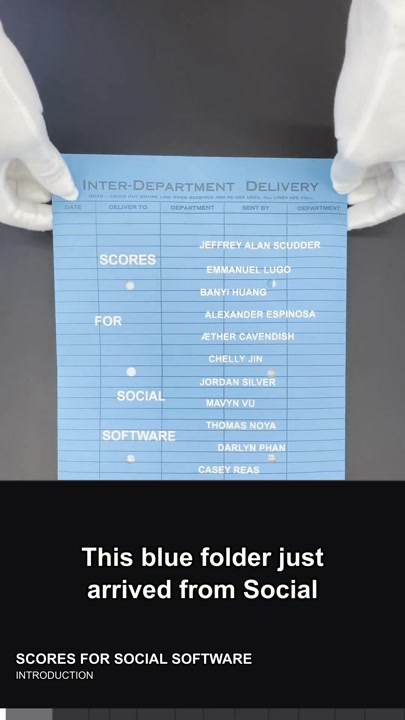

**Narration**  
This blue folder just arrived from Social Software at UCLA. Inside is *Scores
for Social Software*, a spring 2026 edition of sixty-four. The copy in my hands
is number fifty-one, assembled after ten weeks of making, testing, and
performing together.

**Requested changes**  
_Add comments here._

## SSF-01 · Jeffrey Alan Scudder — Notepat · 00:18–00:31

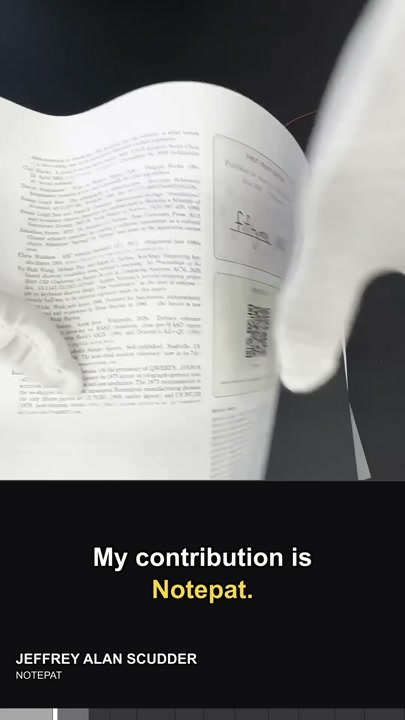

**Narration**  
My contribution is Notepat. A folded white user manual opens into a pointed
shape, combining an illustrated player, a QR code, instructions, and circular
keyboard diagrams.

**Requested changes**  
_Add comments here._

## SSF-02 · Æther Cavendish — Vigil Score · 00:31–00:38

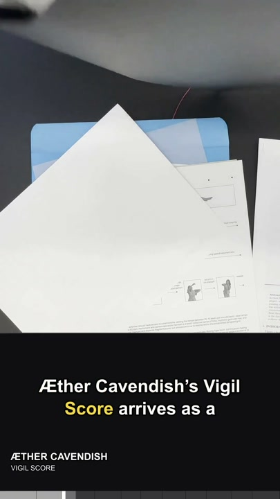

**Narration**  
Æther Cavendish’s *Vigil Score* arrives as a matte-black folded packet, closed
with a small circular silver seal.

**Requested changes**  
_Add comments here._

## SSF-03 · Chelly Jin — Software as a Choreography · 00:38–00:48

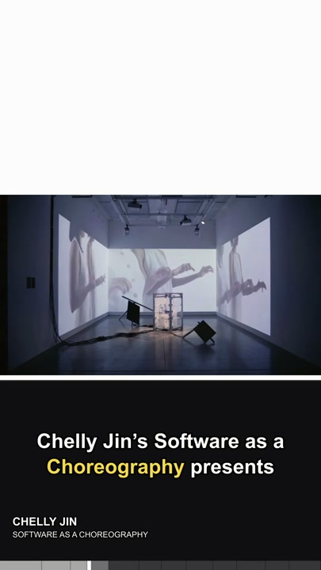

**Narration**  
Chelly Jin’s *Software as a Choreography* presents a grid of silhouetted hands
and arms, pairing each gesture with marks for timing and movement.

**Requested changes**  
_Add comments here._

## SSF-04 · Jordan Silver — Sonic Architecture · 00:48–01:01

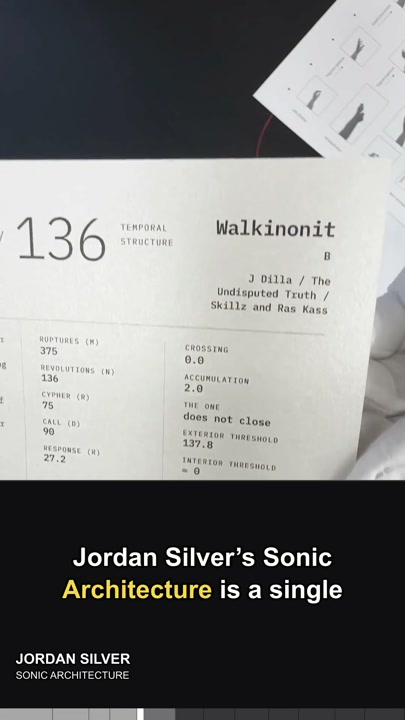

**Narration**  
Jordan Silver’s *Sonic Architecture* is a single sheet of printed columns,
large numbers, and typewritten commands, anchored by a looping spiral diagram
for inhabiting and measuring space through sound.

**Requested changes**  
_Add comments here._

## SSF-05 · Em Lugo — Cues for Losing Direction · 01:01–01:11

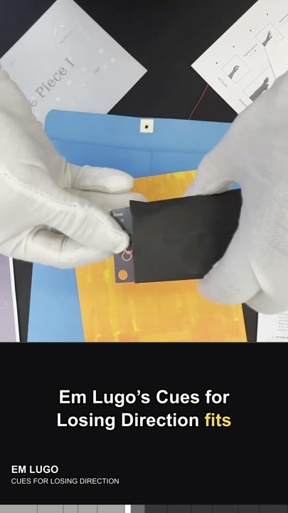

**Narration**  
Em Lugo’s *Cues for Losing Direction* fits on a small black card, its title set
in pale condensed type like a portable instruction carried in the hand.

**Requested changes**  
_Add comments here._

## SSF-06 · Darlyn Phan — Line Piece 1 · 01:11–01:22

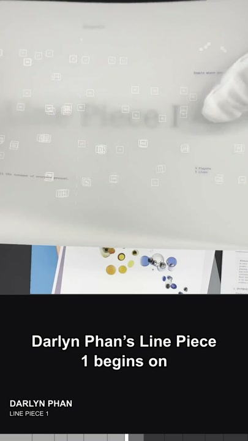

**Narration**  
Darlyn Phan’s *Line Piece 1* begins on translucent white paper. Its faint
rainbow cast and minimal title let the page behave like a line or veil.

**Requested changes**  
_Add comments here._

## SSF-07 · Thomas Noya — Biophonía · 01:22–01:34

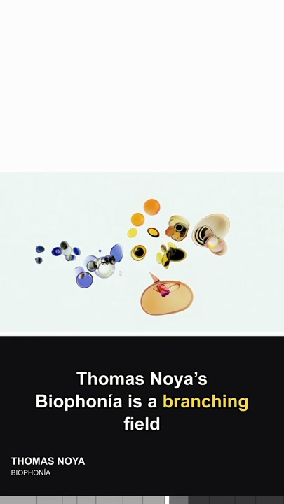

**Narration**  
Thomas Noya’s *Biophonía* is a branching field of blue, yellow, black, and beige
organic forms. In the video, these cell-like clusters drift and reorganize.

**Requested changes**  
_Add comments here._

## SSF-08 · Banyi Huang — A Cosmographic Score… · 01:34–01:44

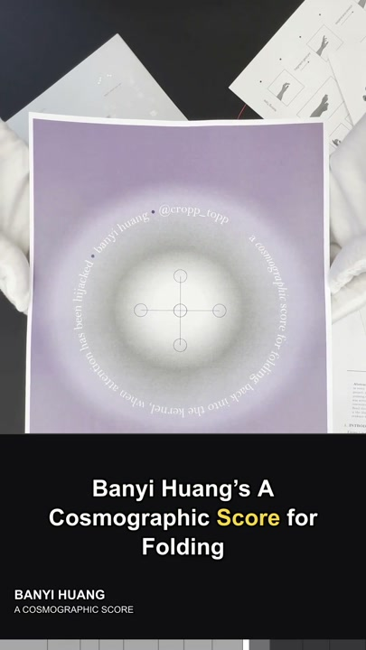

**Narration**  
Banyi Huang’s *A Cosmographic Score for Folding Back into the Kernel* centers a
luminous circle and a small diagram of connected nodes inside a lavender field.

**Requested changes**  
_Add comments here._

## SSF-09 · Alexander Espinosa — Music for World Computers · 01:44–01:57

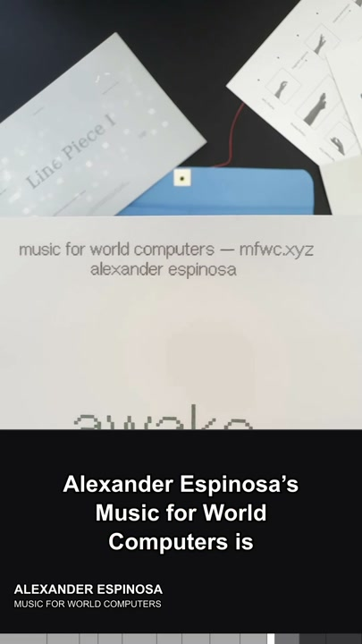

**Narration**  
Alexander Espinosa’s *Music for World Computers* is a white typographic score:
awake, expand, decrease, oxygen, forest, junk, cinnamon, hammer.

**Requested changes**  
_Add comments here._

## SSF-10 · Mavyn Vu — The Radio Is an Altar: Portal · 01:57–02:07

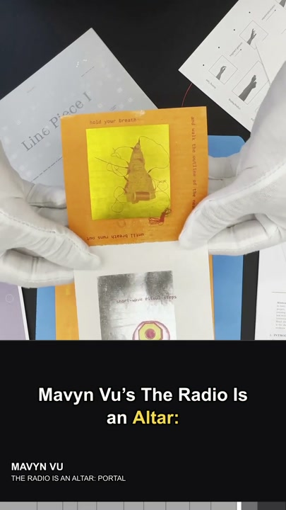

**Narration**  
Mavyn Vu’s *The Radio Is an Altar: Portal* combines translucent blue and white
score cards, a target-like radio image, small figures, and instructions arranged
around their edges.

**Requested changes**  
_Add comments here._

## SSF-11 · Closing · 02:07–02:21

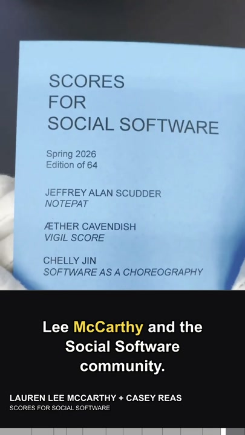

**Narration**  
Casey Reas facilitated the cycle, with Lauren Lee McCarthy and the Social
Software community. Together, the contributions open many paths through a
question: if software organizes behavior, what else can we ask it to organize?

**Requested changes**  
_Add comments here._

---

## Revision intake

For the next cut, copy accepted notes into
`receipt/revision-02/accepted-feedback.md` using the scene ID. The edit can then
change narration, visuals, or timing while retaining the same ID in revision
03. This is the receipt chain: **comment → accepted note → revised scene → new
receipt**.
