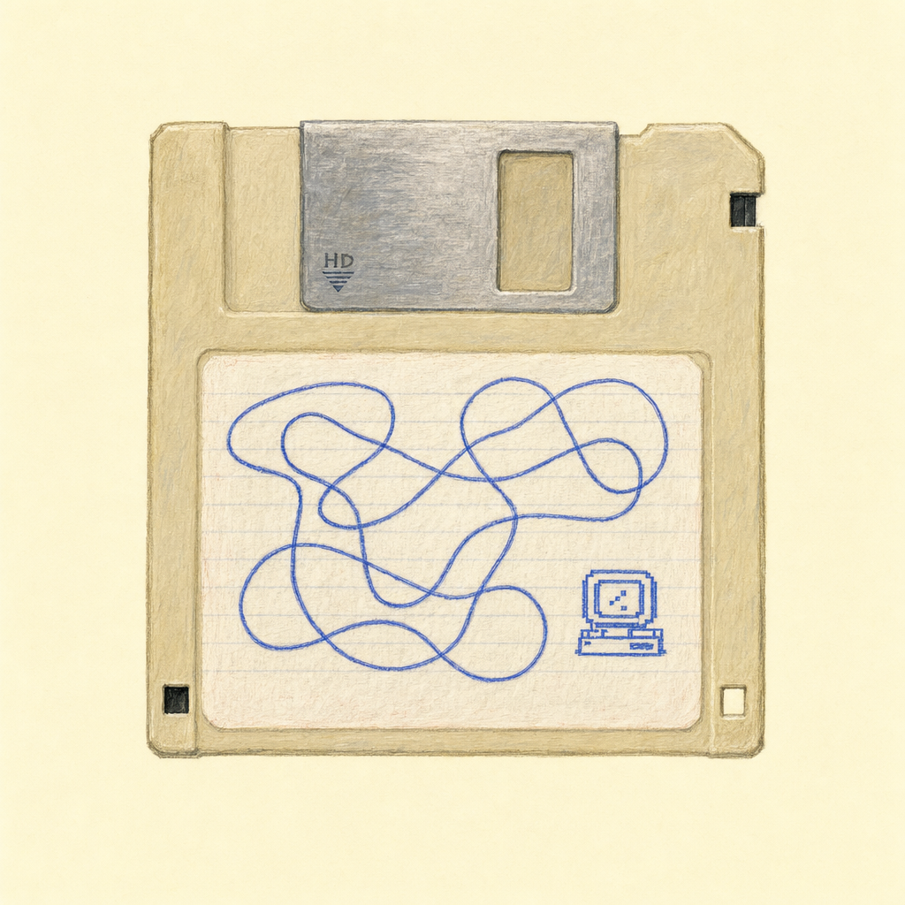
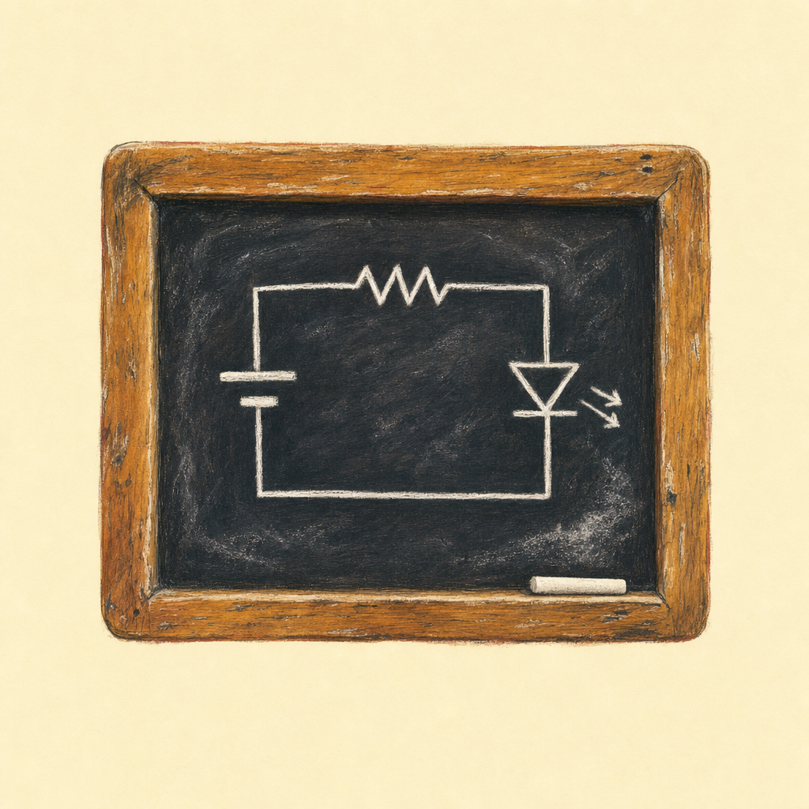
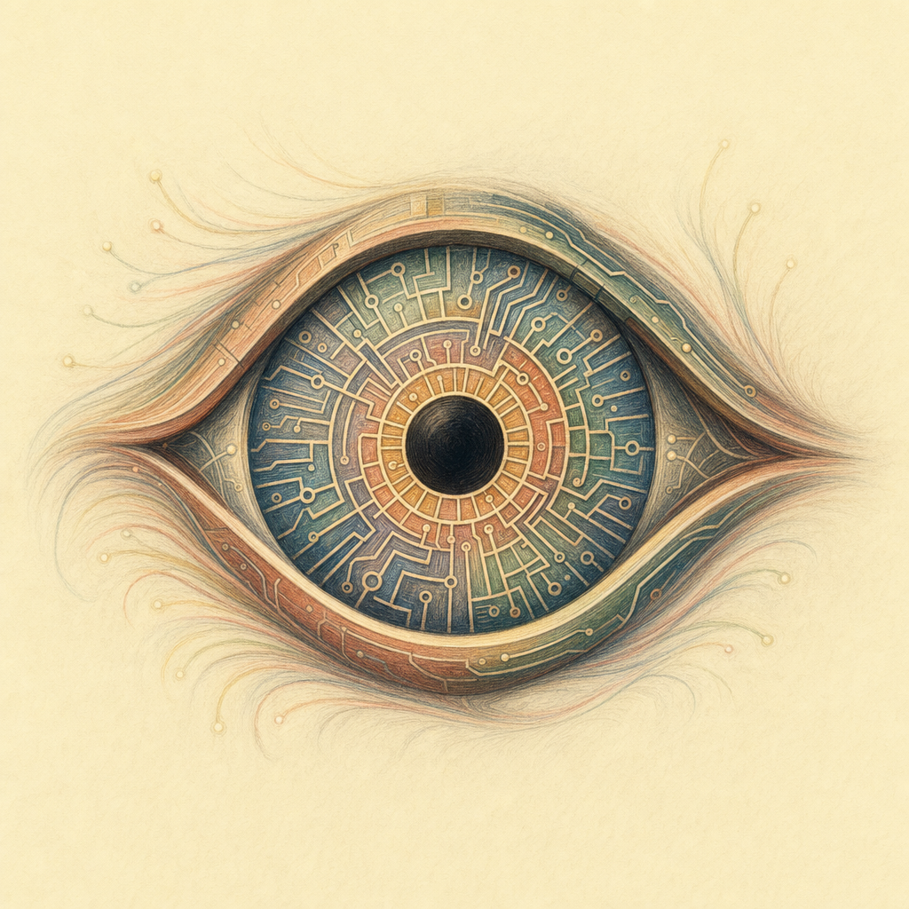
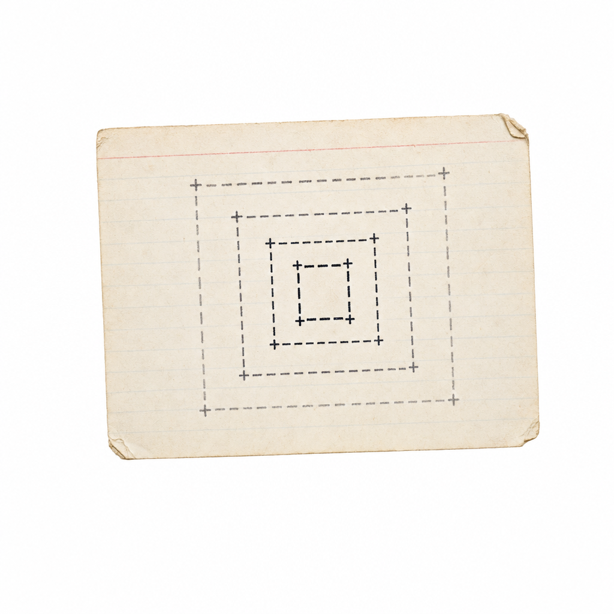
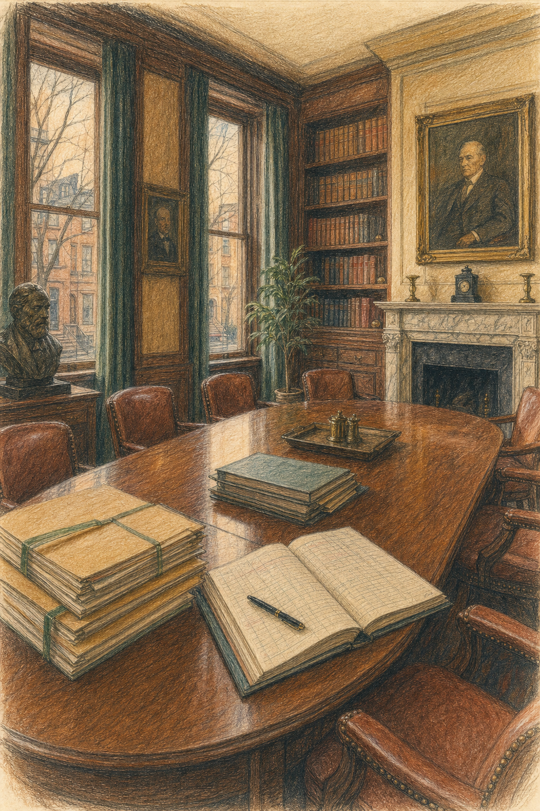
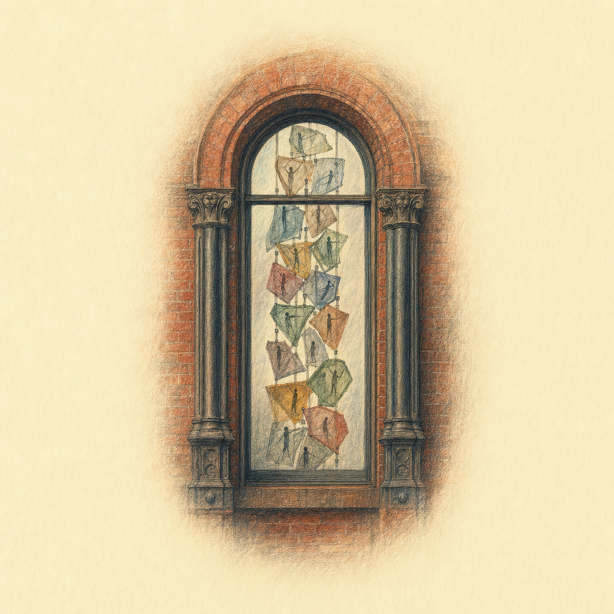
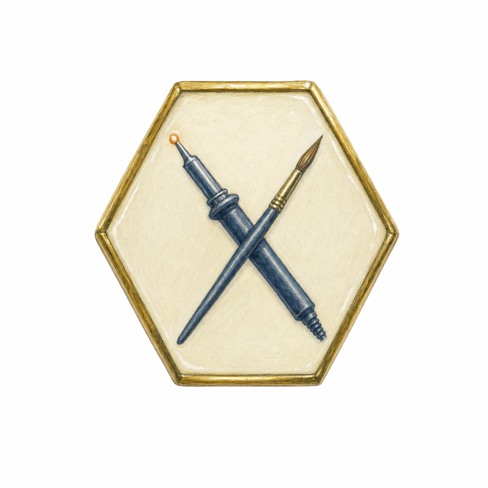
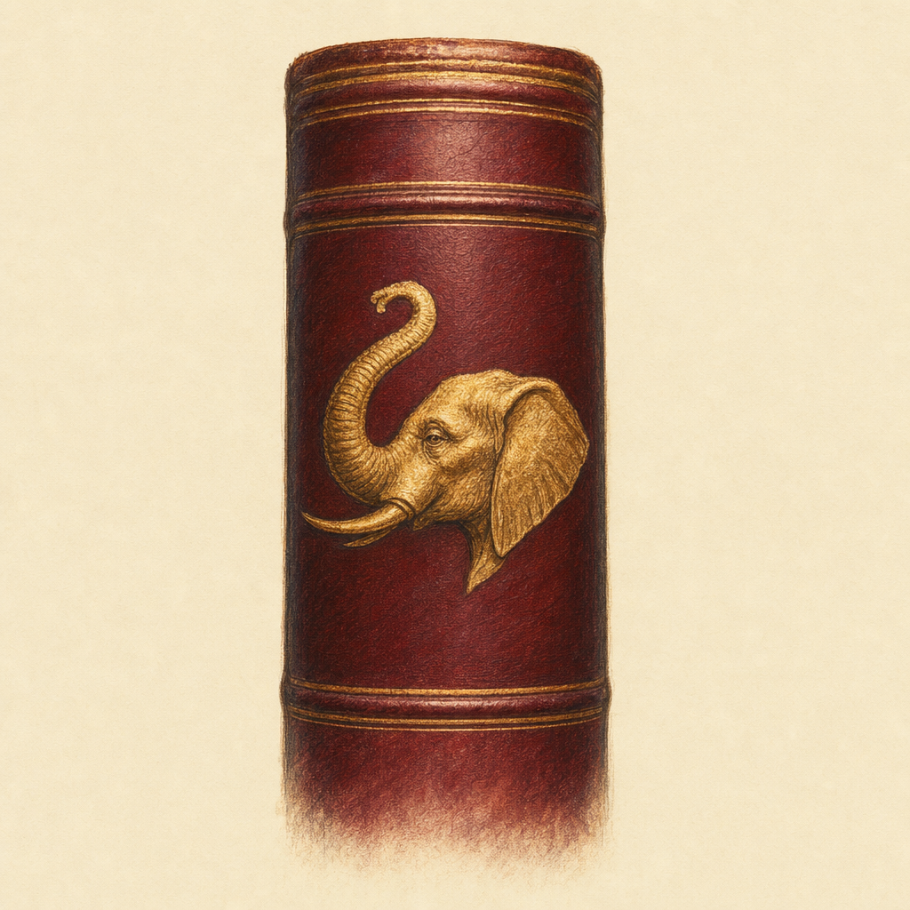
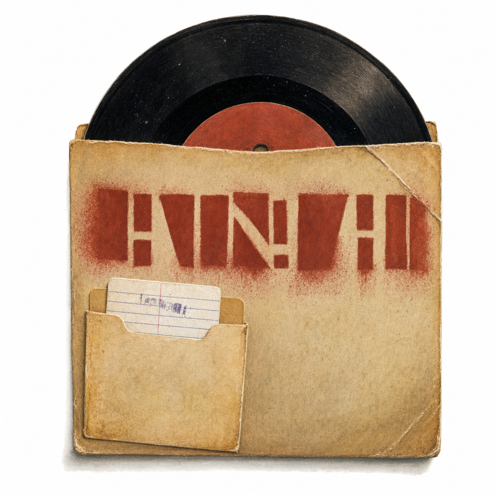

# Score for Papers

## Mill Mission

The papermill exists to make the thinking inside Aesthetic Computer visible and shareable. AC generates a constant stream of ideas, experiments, and design decisions — most of which live only in code, commits, and conversation. The mill's job is to catch that stream and press it into forms that can leave the building: papers, cards, references, scores.

The mill is not an academic obligation. It is a publishing infrastructure — a way to keep the research platter honest by forcing ideas through the pressure of writing them down for someone else. If a thread can survive being written as a paper, it was real. If it can survive being compressed to a card, it was essential.

## Attribution

All AC papers are bylined **@jeffrey** — this is enforced in `cli.mjs` (`AUTHOR_NAME = "@jeffrey"`, `AUTHOR_URI = "https://prompt.ac/@jeffrey"`). The only place a full legal name appears is the CV title. Do **not** byline AC papers (or AC pop essays) as "Studio Zollo"; that studio name is for @jeffrey's separate personal-art / non-AC attributions only. AC papers + AC pop = @jeffrey / aesthetic.computer.

## What This Is

Papers are one output of a research platter — a living collection of materials, references, experiments, and threads that accumulate over time. The platter is always growing. Papers are what gets carved off and shaped into a form that can travel: to a conference, to a reader, to a card.

Each paper starts from a question or observation inside the Aesthetic Computer project and tries to make it legible to someone outside the project. The goal is not to be exhaustive but to be honest about what the work is and why it matters.

## Process

```
platter (raw material: notes, code, conversations, references)
  → thread (a question or observation worth following)
    → draft (a paper that tries to answer or frame it)
      → formats (arXiv two-column, cards single-sheet, JOSS software paper, dossier)
        → targets (conferences, journals, submissions, mail art)
```

The platter feeds everything. Threads get pulled from it. Some threads become papers, some become code, some stay threads. Papers can be rendered in multiple formats — the same `.tex` source produces both a full arXiv-style PDF and a single-sheet index card via `cards-convert.mjs`.

## Swimlanes

The mill runs several parallel tracks. Each lane is a different shape of artifact, with its own posture, its own audience, and its own pipeline.

### 1. arXiv-format papers (`arxiv-*/`)

The main lane. Two-column LaTeX with AC custom fonts (`ywft-processing-bold`, `ywft-processing-light` + Latin Modern). Roughly **30 active titles** ranging from 3 to 8 pages. Subjects: KidLisp internals, AC native OS, network audits, latency, identity, sustainability — all derived from things actually built inside AC. Source lives next to the artifact: `arxiv-<slug>/<slug>.tex` + `references.bib` + per-paper `figures/`.

### 2. Dossiers (`arxiv-<org>/`, dossier subset)

A sub-lane of arXiv format with a different posture: **fact-surfacing, not argumentative**. The dossier records what is publicly recoverable about a digital-arts organization (or its funder) — financials, governance, programs, people, locations, named grants — and stops where the facts run out. Each dossier folder includes a structured `data/` directory (CSVs + a README of what's solid / soft / missing) that sits alongside the `.tex`. The dossier swimlane started **2026-05-02** with Rhizome and SFPC; current set of 17:

| Dossier | Posture | Status |
|---|---|---|
| Rhizome.org | 501(c)(3) recipient, IRS XML pipeline | first-pass |
| School for Poetic Computation | LLC, public github finance repo | first-pass |
| Eyebeam | 501(c)(3) recipient, IRS XML pipeline | first-pass |
| Recurse Center | for-profit, founder interviews + recruiting model | first-pass |
| Internet Archive | 501(c)(3) recipient + litigation track | first-pass |
| Mellon Foundation | **funder flip** — 990-PF + grants database | first-pass |
| Pioneer Works | 501(c)(3) recipient, founder-as-funder | first-pass |
| NEW INC | embedded in New Museum 990 | first-pass |
| Studio Museum in Harlem | 501(c)(3) recipient, capital campaign | first-pass |
| HathiTrust | UMich library service, no separate 990 | first-pass |
| The Kitchen | 501(c)(3) recipient, 50+ year arc | first-pass |
| Machine Project | 501(c)(3) recipient (until 2018), Echo Park | first-pass |
| Heavy Manners Library | small space, status-undisclosed | first-pass |
| Creative Time | 501(c)(3) public-art commissioner, IRS 990 pipeline | first-pass (deep — 50-yr legacy, sourced) |
| Creative Capital | 501(c)(3) artist-grant **funder**, 990 + grantee record | first-pass (sourced) |
| MicroVision (NASDAQ: MVIS) | **public-company flip** — SEC EDGAR + 11-yr family archive | first-pass |
| What's New CalArts!? | CalArts, dossier in news format | first-pass |

Every dossier also renders as a single-sheet **card** (`*-cards.tex` via [`cards-convert.mjs`](cards-convert.mjs)) and the lane is grouped in its own `dossiers;` section on the papers index, separate from the argumentative papers. The display order is fixed by `DOSSIER_DIRS` in [`cli.mjs`](cli.mjs). Each dossier carries an EIN-anchored IRS Form 990 financial spine (multi-year, via ProPublica Nonprofit Explorer), an org-archive/press history, and explicit inline flags for the remaining locatable gaps (board roster as filed on 990 Part VII, named-grant inventories, pre-extracted-era financials).

Candidates queued in [`papers/hitlist.md`](hitlist.md).

### 3. Essays (`essay-*/`)

The voice-first lane (added **2026-05-25**). Magazine-essay format in the tradition of *NYT Magazine*, *Harper's*, *New York Magazine*, and *Brooklyn Rail*: single-column layout with wide margins, refined serif body with extra leading, magazine title block (deck + display title + dek + byline), drop cap on the opening paragraph, ornamental section breaks (`§`), pull quotes, **discursive endnotes** instead of parenthetical citations, and a **Further Reading** coda instead of a bibliography. Style file: [`ac-paper-essay.sty`](ac-paper-essay.sty).

The essay lane sits between the argumentative arXiv papers and the personal-voice posts that never get written down — for thinking out loud at length when the question is not yet sharp enough for a paper but is sharper than a tweet. References are named in prose. The apparatus moves to the back of the room. Current set:

| Essay | Status |
|---|---|
| Aesthetic May '26 | first entry; companion mood-piece to `arxiv-futures` |

### 4. JOSS papers (`joss-*/`)

Condensed software papers for the [Journal of Open Source Software](https://joss.theoj.org/). Markdown with LaTeX includes. JOSS review process focuses on software quality, documentation, and community impact — distinct from academic-novelty review. Current: `joss-ac/`, `joss-kidlisp/`.

### 5. Cards (`*-cards.tex`, generated)

Single-sheet index-card layout reformatted from arXiv source via [`cards-convert.mjs`](cards-convert.mjs). Designed for printing, passing hand-to-hand, pinning on walls. The same `.tex` source produces both the full arXiv PDF and the card.

### 6. Conference-specific scaffolds (`<venue>-*/`)

Venue-specific submissions that don't fit arXiv format:
- `siggraph-asia-2026-tech/` — `acmtog` LaTeX class for SIGGRAPH Asia Technical Papers (double-blind)
- `cc-demo-2026/` — ACM Demo format for Creativity & Cognition
- `iccc-kidlisp/`, `els-kidlisp/` — ICCC and ELS submission packages
- `ars-electronica-2026/` — Prix Ars Electronica entry materials

### 7. Lectures (`lectures/`)

Lecture transcripts paired with commentary and references. Material that started as spoken-word and was captured for later citation.

### 8. Platters (sub-platters)

Smaller scoped collections. Each has its own `manifest.json` + `sync.mjs`:
- [`jeffrey-platter/`](jeffrey-platter/) — biographical materials, image corpus, archival sources for Jeffrey-as-subject
- [`jeffrey-lexicon/`](jeffrey-lexicon/) — frequency-attributed dictionary of words used by Jeffrey, sourced only from first-hand textual + transcribed material (textual analogue of `jeffrey-platter`'s photo index and the `jeffrey-pvc` voice clone)
- [`whistlegraph-platter/`](whistlegraph-platter/) — Whistlegraph-specific artifacts and references
- [`people-platter/`](people-platter/) — TODO; will hold AC-adjacent people biographies
- [`corporate-graphics-platter/`](corporate-graphics-platter/) — reference library of historic bank/corporate/seal/privacy marks (66, from Wikimedia Commons) collected to inform logo work; four sections (banks-finance, modernist-canon, seals-monograms, surveillance-consent) each with `manifest.md` + a `_sheet-*.png` contact sheet. Built via `fetch-logos.mjs` + `finalize.mjs`. Third-party trademarks — research/moodboard reference only.

### 9. CV (`cv/`)

Jeffrey's CV is built through the same pipeline (LaTeX → PDF → site deploy) and treated as a long-form paper for tooling purposes. Hidden from the public index.

### 10. Print editions (`first print edition`)

The physical lane (added **2026-06-12**). A paper from any other lane can be **cut as a numbered print edition** — a finite physical run, hand-numbered `__/N`, carrying a colophon plaque that records the git hash the edition was cut from and a QR to its canonical, still-updating permalink. The point is the lane's own thesis made material: the printed object is itself a *versioned virtual object* (per `arxiv-keymaps`), so cutting it to paper does not freeze it — the edition is one dated snapshot, and the canonical URL keeps moving.

Mechanics:
- **Version stamp.** Papers in this lane do `\InputIfFileExists{version}{}{...}`. [`cli.mjs`](cli.mjs) `stampVersion()` regenerates `version.tex` (`\paperhash`, `\paperrev`) from `git rev-parse --short HEAD` + the `metadata.json` revision counter on every build. The hash gets a `+` suffix on a dirty tree (`git describe --dirty` convention), so a clean oven build stamps a bare release hash. `version.tex` is **gitignored** — never commit it, or the oven's clean-tree regeneration would diff against a dirty value and loop.
- **Plaque.** An end-of-paper colophon (double-ruled border, `FIRST PRINT EDITION` header, publication line, `__/N` slot in a `pals`-mark particle field, the version line, and a canonical-URL QR with the "this object does not end here" note). Pinned to the bottom/right of the final references column.
- **Canonical QR** lives at `figures/qr/canonical.png`, pointing at `papers.aesthetic.computer/<siteName>.pdf`.

| Edition | Paper | Run | Cut for | Status |
|---|---|---|---|---|
| First print edition | Keymaps as Social Software (`arxiv-keymaps`) | 64 | *Scores for Social Software*, UCLA Social Software Cycle 2, June 2026 | **printed — run of 64 cut June 2026** |

### 11. Briefings (`briefing-*/`, vault-side)

The **addressed** lane (added **2026-07-11**). A briefing is written *for a named recipient*, about *a situation they are entering* — a room joined, a residency begun, a meeting scheduled. It is the only lane with an addressee on the cover, and that is the whole of what makes it a different thing:

| | dossier | profile | **briefing** |
|---|---|---|---|
| Subject | an institution | a person | **a situation** |
| Audience | the record | @jeffrey | **a named recipient** |
| Stance | outside observer | confidential researcher | **ally** |
| Ends in | *"what this is not"* | sources | **openings — things to do** |

Four properties define the form. It is **addressed** (the recipient is named on the cover). It is **occasioned** — there is a reason it exists *now*, and the occasion is stated rather than hidden (contrast the private profile, where the occasion is deliberately excluded). It is **corrective**: it says plainly where the recipient's current picture is wrong, because that is the most valuable thing an outside reader can supply. And it is **actionable** — it ends in *openings*, concrete moves, not in a shrug. A dossier stops when the facts stop; a briefing stops once it has said what to do with them.

Register: direct address, peer-to-peer, warm but sourced. Uncertainty is flagged **inline** (`\soft{uncertain}`) rather than smoothed over — a briefing marks its own soft ground, because the recipient is going to act on it.

Briefings are **private but not secret**: they live in `aesthetic-computer-vault/<client>/briefing-*/`, not because the recipient can't see them (it is *theirs*) but because they quote private correspondence and are client-scoped. No `CONFIDENTIAL` banner — the cover's *Prepared for X* line is the whole access-control story. Not published: no `PAPER_MAP` row, no `sync-platter.mjs`, no deploy.

| Briefing | For | Occasion | Status |
|---|---|---|---|
| Stochastic Labs | Sage Jenson (@mxsage) | Arrived at the Stochastic Labs Summer 2026 session (*Liveness + Agency*), 2026-07-11 | **rev 2** — rev 1 sent, recipient corrected a factual claim from the room, §5 rewritten |

**A rule the first briefing earned the hard way.** Rev 1 told its recipient that Adrian Freed "pointedly declines to claim" he invented the DAW — inferred from an institutional bio page he doesn't control and a 1985 paper that asserts no priority (which, read properly, is a paper about RS-232 protocol design; the silence was genre, not modesty). Sage, standing next to the man: *"adrian DOES say he invented the daw."* **Never build a behavioral instruction on an argument from silence.** A briefing's corrective clause is its sharpest edge and its biggest liability: the recipient is going to act on it, in a room you are not in, in front of people whose feelings are real. Correct only what you can source *positively*, and where the recipient has primary access and you have the internet, defer to them. The lane's `\soft{}` inline-uncertainty flag exists precisely for this and rev 1 failed to use it on the one claim that mattered.

## Tooling

The mill's code lives at the top of `papers/` and in [`bin/`](bin/). All scripts are runnable as `node papers/bin/<name>.mjs`.

### Top-level (build, deploy, index)

| Script | Purpose |
|---|---|
| [`cli.mjs`](cli.mjs) | Primary build CLI. `build`, `deploy`, `publish`, `status`, `log`. Multi-pass xelatex per paper × 4 languages. Auto-bumps `metadata.json` revisions on each build. |
| [`papermill.mjs`](papermill.mjs) | Older translation-build pipeline (still used for `--format cards`). |
| [`sync-platter.mjs`](sync-platter.mjs) | Refresh `system/public/papers.aesthetic.computer/platter.html` (the rendered index of reports / plans / studies / paper count). |
| [`cards-convert.mjs`](cards-convert.mjs) | Convert an arxiv `.tex` source into the single-sheet card layout. |
| [`metadata.json`](metadata.json) | Per-paper `created` date + `revisions` counter + `updated` ISO timestamp. Auto-bumped by `cli.mjs publish`. |

### `bin/` (dossier-cycle utilities, added 2026-05)

| Script | Purpose |
|---|---|
| [`bin/build-dossier.mjs`](bin/build-dossier.mjs) | Multi-pass xelatex + bibtex build for a single dossier or `--all`. Reports undefined citations. |
| [`bin/crunch.mjs`](bin/crunch.mjs) | Build a paper on the **oven** instead of locally — for a machine with no TeX, or a document that must stay private. Tars the directory, POSTs it to `/paper-crunch`, streams the log, writes the PDF. Never commits and never publishes: the crunched PDF comes back to you and goes nowhere near `papers.aesthetic.computer` (that is `cli.mjs publish`, which builds from `main`). House `.sty` + webfonts resolve inside the oven's sandbox. |
| [`bin/gen-cover.mjs`](bin/gen-cover.mjs) | Generate the colored-pencil vignette cover illustration for a dossier from `figures/cover-prompt.txt` via OpenAI gpt-image-2 (1024×1024 square, faded edges). |
| [`bin/gen-qrs.mjs`](bin/gen-qrs.mjs) | Generate per-paper QR-code PNG pointing to the deployed permalink at `papers.aesthetic.computer/<siteName>.pdf`. Uses `qrencode` CLI. |
| [`aesthetic-eye.mjs`](aesthetic-eye.mjs) | Render diagram crops from the final PDF and enforce a current visual-inference manifest with `design: pass|fail` for every diagram. See [`AESTHETIC-EYE.md`](AESTHETIC-EYE.md). |
| [`bin/migrate-cover.mjs`](bin/migrate-cover.mjs) | One-shot migration: rewrite an old-style cover block (4em pals + 15em hero) into the new vignette layout (pals top-left + QR top-right + TikZ-overlaid title floating over faded illustration). Idempotent. |
| [`bin/fix-people-tables.mjs`](bin/fix-people-tables.mjs) | One-shot: convert `tabularx{lXl}` people tables to `tabularx{lXX}` so the third column wraps and stops overflowing the column width. |

### Style files

| File | Purpose |
|---|---|
| [`ac-paper-layout.sty`](ac-paper-layout.sty) | Shared visual identity for arxiv papers: AC color palette, font commands, draft watermark, pals logo watermark, section formatting, header/footer. |
| [`ac-paper-cards.sty`](ac-paper-cards.sty) | Cards-format layout. |
| [`ac-paper-essay.sty`](ac-paper-essay.sty) | Essay-format layout: single-column magazine essay style with title block macros (`\essaydeck`, `\essaytitle`, `\essaysubtitle`, `\essaybyline`), `\dropcap`, `\sectionbreak` (silcrow ornament), `\begin{pullquote}`, `\enote{}` for endnotes, and `\begin{further}` / `\reading{}` for the Further Reading coda. |

## Formats

- **arXiv**: Two-column academic layout with AC custom fonts, syntax-highlighted code, development history, adoption metrics. For preprint submission and sharing.
- **Dossier**: arXiv-format twocolumn but with a vignette cover, AI-generated colored-pencil illustration as hero, QR top-right pointing to permalink, structured `data/` folder with raw CSVs alongside the `.tex`. Posture is fact-surfacing, not argumentative.
- **Cards**: Single-sheet index-card layout reformatted from arXiv source. Designed for printing, passing hand to hand, pinning on walls.
- **JOSS**: Condensed software papers for Journal of Open Source Software. Markdown with LaTeX includes. JOSS reviews focus on software quality, documentation, and community impact.

## Translations

Every paper exists in four languages: English, Danish, Spanish, and Chinese (and increasingly Japanese). Translations are generated and maintained alongside the English source. This is not decoration — it reflects a commitment to the work being accessible beyond the anglophone academic world.

The `cli.mjs build` pipeline runs xelatex × 4 languages per paper. `metadata.json` tracks revision counts per English build only (to avoid double-counting translations).

## Papers

Sorted by most recently edited/added.

| Paper | Format | PDF | Source |
|-------|--------|-----|--------|
| The nom Games: A Muncher Arcade for Aesthetic Computer (numbnom / engnom / mexinom / notenom; one shared engine + virtual synth controller) | arXiv (LaTeX, ~5pp first-pass) | `arxiv-nom/nom.pdf` | `arxiv-nom/nom.tex` |
| MicroVision: A Dossier (Genealogy, Products, People, Money, Dilution Mechanics, Takeover Theory, 1993–2026) | arXiv (LaTeX, dossier, 7pp first-pass) | `arxiv-microvision/microvision.pdf` | `arxiv-microvision/microvision.tex` |
| Comp Strats: Compositional Strategies in AC --- Aphorisms for a Shielded Media-Arts Practice | arXiv (LaTeX, ~7pp first-pass) | `arxiv-comp-strats/comp-strats.pdf` | `arxiv-comp-strats/comp-strats.tex` |
| A Fraserin' Art + Tech (methodology essay + prior-art survey, labor-folk register) | arXiv (LaTeX, 7pp first-pass) | `arxiv-fraserin/fraserin.pdf` | `arxiv-fraserin/fraserin.tex` |
| Pioneer Works: A Dossier (Genealogy, History, Programs, People, Money, Footprint, 2012–2026) | arXiv (LaTeX, dossier) | `arxiv-pioneer-works/pioneer-works.pdf` | `arxiv-pioneer-works/pioneer-works.tex` |
| Mellon Foundation: A Dossier (Genealogy, Programs, Giving, People, Politics, 1969–2026) | arXiv (LaTeX, dossier) | `arxiv-mellon/mellon.pdf` | `arxiv-mellon/mellon.tex` |
| Internet Archive: A Dossier (Genealogy, History, Programs, People, Money, Footprint, 1996–2026) | arXiv (LaTeX, dossier) | `arxiv-internet-archive/internet-archive.pdf` | `arxiv-internet-archive/internet-archive.tex` |
| Recurse Center: A Dossier (Structure, History, Programs, People, Money, Footprint, 2011–2026) | arXiv (LaTeX, dossier) | `arxiv-recurse/recurse.pdf` | `arxiv-recurse/recurse.tex` |
| Eyebeam: A Dossier (Genealogy, History, Programs, People, Money, Footprint, 1996–2026) | arXiv (LaTeX, dossier) | `arxiv-eyebeam/eyebeam.pdf` | `arxiv-eyebeam/eyebeam.tex` |
| School for Poetic Computation: A Dossier (Structure, History, Programs, People, Money, Footprint, 2013–2026) | arXiv (LaTeX, dossier) | `arxiv-sfpc/sfpc.pdf` | `arxiv-sfpc/sfpc.tex` |
| Rhizome.org: A Dossier (Genealogy, History, Programs, People, Money, Footprint, 1996–2026) | arXiv (LaTeX, dossier) | `arxiv-rhizome/rhizome.pdf` | `arxiv-rhizome/rhizome.tex` |
| Keymaps as Social Software: Versioned Virtual Objects via Social Contract | arXiv (LaTeX) | `arxiv-keymaps/keymaps.pdf` | `arxiv-keymaps/keymaps.tex` |
| The Pals Mark: A History of the Aesthetic Computer Logo | arXiv (LaTeX) | `arxiv-pals/pals.pdf` | `arxiv-pals/pals.tex` |
| Where the Microseconds Go (SIGGRAPH Asia 2026 Tech Papers port) | acmtog (LaTeX, scaffold) | (build pending) | `siggraph-asia-2026-tech/latency-source.tex` |
| Diagrams from Data: A Penrose Pipeline for AC Illustrations | arXiv (LaTeX) | `arxiv-penrose/penrose.pdf` | `arxiv-penrose/penrose.tex` |
| Where the Microseconds Go: Input and Audio Latency in AC Native OS | arXiv (LaTeX, 6pp) | `arxiv-latency/latency.pdf` | `arxiv-latency/latency.tex` |
| Aesthetic Computer Demo (C&C 2026) | ACM Demo (LaTeX) | `cc-demo-2026/demo.pdf` | `cc-demo-2026/demo.tex` |
| The URL Tradition | arXiv (LaTeX) | `arxiv-url-tradition/url-tradition.pdf` | `arxiv-url-tradition/url-tradition.tex` |
| The Potter and the Prompt | arXiv (LaTeX) | `arxiv-holden/holden.pdf` | `arxiv-holden/holden.tex` |
| Two Departments, One Building | arXiv (LaTeX) | `arxiv-ucla-arts/ucla-arts.pdf` | `arxiv-ucla-arts/ucla-arts.tex` |
| Handle Identity on the AT Protocol | arXiv (LaTeX) | `arxiv-identity/identity.pdf` | `arxiv-identity/identity.tex` |
| Aesthetic May '26 | Essay (LaTeX, magazine-style, ~5pp first-pass) | `essay-may-26/may-26.pdf` | `essay-may-26/may-26.tex` |
| Five Years from Now: What Aesthetic Computer Probably Becomes | arXiv (LaTeX) | `arxiv-futures/futures.pdf` | `arxiv-futures/futures.tex` |
| Get Closed Source Out of Schools | arXiv (LaTeX) | `arxiv-open-schools/open-schools.pdf` | `arxiv-open-schools/open-schools.tex` |
| CalArts, Callouts, and Papers | arXiv (LaTeX) | `arxiv-calarts/calarts.pdf` | `arxiv-calarts/calarts.tex` |
| What's New CalArts!? — A Dossier (why the president got booed off the stage; a letter, with sources; the 2026 commencement boo traced through 1972 / 2014 / the 2017–26 budget & labor crisis) | cards (LaTeX, hand-authored, **local working draft — not deployed**) | `arxiv-calarts-news/calarts-news-cards.pdf` | `arxiv-calarts-news/calarts-news-cards.tex` |
| Reading the Score: A Critical Analysis of SCORE.md | arXiv (LaTeX) | `arxiv-score-analysis/score-analysis.pdf` | `arxiv-score-analysis/score-analysis.tex` |
| KidLisp Cards: Programs That Fit on a Card | arXiv (LaTeX) | `arxiv-kidlisp-cards/kidlisp-cards.pdf` | `arxiv-kidlisp-cards/kidlisp-cards.tex` |
| Sucking on the Complex | arXiv (LaTeX) | `arxiv-complex/complex.pdf` | `arxiv-complex/complex.tex` |
| Playable Folk Songs | arXiv (LaTeX) | `arxiv-folk-songs/folk-songs.pdf` | `arxiv-folk-songs/folk-songs.tex` |
| Every Sound is a Painting: Sampling as Visual-Auditory Practice | arXiv (LaTeX) | `arxiv-sampling/sampling.pdf` | `arxiv-sampling/sampling.tex` |
| PLORKing the Planet: From Laptop Orchestra to Planetary Organ | arXiv (LaTeX, 8pp) | `arxiv-plork/plork.pdf` | `arxiv-plork/plork.tex` |
| From setup() to boot(): Processing at the Core of the Piece API | arXiv (LaTeX, 7pp) | `arxiv-api/api.pdf` | `arxiv-api/api.tex` |
| Network Audit: Who Uses Aesthetic Computer and What Do They Make? | arXiv (LaTeX, 4pp) | `arxiv-network-audit/network-audit.pdf` | `arxiv-network-audit/network-audit.tex` |
| KidLisp Language Reference: 118 Built-ins in 12 Categories | arXiv (LaTeX, 4pp) | `arxiv-kidlisp-reference/kidlisp-reference.pdf` | `arxiv-kidlisp-reference/kidlisp-reference.tex` |
| Whistlegraph: Drawing, Singing, and the Graphic Score as Viral Form | arXiv (LaTeX, 4pp) | `arxiv-whistlegraph/whistlegraph.pdf` | `arxiv-whistlegraph/whistlegraph.tex` |
| Dead Ends: Failed Experiments and Abandoned Approaches | arXiv (LaTeX, 4pp) | `arxiv-dead-ends/dead-ends.pdf` | `arxiv-dead-ends/dead-ends.tex` |
| Who Pays for Creative Tools? | arXiv (LaTeX, 5pp) | `arxiv-sustainability/sustainability.pdf` | `arxiv-sustainability/sustainability.tex` |
| Radical Computer Art: Goodiepalian Approaches | arXiv (LaTeX, 4pp) | `arxiv-goodiepal/goodiepal.pdf` | `arxiv-goodiepal/goodiepal.tex` |
| Repository Archaeology: Tracing AC Through Its Git History | arXiv (LaTeX, 3pp) | `arxiv-archaeology/archaeology.pdf` | `arxiv-archaeology/archaeology.tex` |
| Diversity and Inclusion in AC Paper Citations | arXiv (LaTeX, 4pp) | `arxiv-diversity/diversity.pdf` | `arxiv-diversity/diversity.tex` |
| KidLisp: A Minimal Lisp for Generative Art | arXiv (LaTeX, 6pp) | `arxiv-kidlisp/kidlisp.pdf` | `arxiv-kidlisp/kidlisp.tex` |
| notepat.com: From Keyboard Toy to System Front Door | arXiv (LaTeX, 5pp) | `arxiv-notepat/notepat.pdf` | `arxiv-notepat/notepat.tex` |
| AC Native OS '26 | arXiv (LaTeX, 5pp) | `arxiv-os/os.pdf` | `arxiv-os/os.tex` |
| Aesthetic Computer '26 | arXiv (LaTeX, 5pp) | `arxiv-ac/ac.pdf` | `arxiv-ac/ac.tex` |
| Pieces Not Programs: The Piece as a Unit of Creative Cognition | arXiv (LaTeX, 4pp) | `arxiv-pieces/pieces.pdf` | `arxiv-pieces/pieces.tex` |
| Aesthetic Computer '26 | JOSS (Markdown) | `joss-ac/paper.pdf` | `joss-ac/paper.md` |
| KidLisp '26 | JOSS (Markdown) | `joss-kidlisp/paper.pdf` | `joss-kidlisp/paper.md` |

## Cover-prompt doctrine

Every dossier cover illustration must be **sourced**, not blind-prompted. The colored-pencil vignette is generated from `figures/cover-prompt.txt` via [`bin/gen-cover.mjs`](bin/gen-cover.mjs), but the *contents* of that prompt are research-driven: each visual element must trace to a real photograph, building, founder portrait, signature product, brand identity, or environmental detail of the organization being dossiered. The point is that the resolved image carries information density, not generic associations.

For each dossier, `figures/` carries two files:
- `cover-prompt.txt` — the prompt fed to gpt-image-2, with rich specificity (the actual building's facade, the founder's recurring outfit, the org's signature object).
- `cover-sources.md` — the citation log. For every visual element in the prompt, a line of attribution: which photo, which interview, which physical object, which brand asset. Source URLs included. This is the dossier's audit trail for the cover.

This rule is non-optional: a cover is the dossier's most-shared artifact (it's the IG-screenshot vector), so its visual claims need to be defensible the same way the dossier's text claims are footnoted.

## Dossier cover gallery

Each dossier opens with a colored-pencil vignette illustration generated via [`bin/gen-cover.mjs`](bin/gen-cover.mjs). The covers share a visual identity: cream paper, single floating iconic form, faded edges. Click through to the dossier `.tex` to read the source, or scan the in-PDF QR code to fetch the deployed permalink.

| | | |
|---|---|---|
|  |  |  |
| **Rhizome.org** | **School for Poetic Computation** | **Eyebeam** |
|  |  |  |
| **Recurse Center** | **Internet Archive** | **Mellon Foundation** |
|  |  |  |
| **Pioneer Works** | **NEW INC** | **Studio Museum in Harlem** |
|  |  |  |
| **HathiTrust** | **The Kitchen** | **Machine Project** |
|  | | |
| **Heavy Manners Library** | | |

## Building

### Automatic (Oven Papermill)

PDFs are auto-built on the oven server whenever `papers/` changes are pushed to `main`.
The pipeline polls git every 60s, detects changes, and runs `node papers/cli.mjs publish`
(xelatex 3-pass for all papers × 4 languages + deploy + index update).

- **Monitor:** `GET oven.aesthetic.computer/papers-build`
- **Manual trigger:** `POST oven.aesthetic.computer/papers-build` (requires admin key)
- **SSE logs:** `GET oven.aesthetic.computer/papers-build/:jobId/stream`
- **Source:** `oven/papers-builder.mjs`, `oven/papers-git-poller.mjs`

### Manual (Local)

```bash
# Full pipeline: build all → deploy → update index → verify
node papers/cli.mjs publish

# Build only English PDFs
node papers/cli.mjs build en

# Build cards format
node papers/papermill.mjs build --format cards

# Check status of all papers
node papers/cli.mjs status

# Individual paper (manual 3-pass build)
cd papers/arxiv-ac && xelatex ac.tex && bibtex ac && xelatex ac.tex && xelatex ac.tex
```

### Dossier-specific (Local)

```bash
# Build all 13 dossiers (multi-pass xelatex + bibtex with citation report)
node papers/bin/build-dossier.mjs --all

# Build a single dossier
node papers/bin/build-dossier.mjs arxiv-rhizome

# Generate the colored-pencil vignette cover from cover-prompt.txt
node papers/bin/gen-cover.mjs arxiv-rhizome --force

# Generate ALL dossier covers (slow — calls OpenAI gpt-image-2 for each)
node papers/bin/gen-cover.mjs --all --force

# Generate per-paper QR code pointing to the deployed permalink
node papers/bin/gen-qrs.mjs --all
node papers/bin/gen-qrs.mjs --all --langs    # also generate da/es/zh/ja variants
```

### After publish: refresh the platter

```bash
node papers/sync-platter.mjs
```

## Subdomain

Published at `papers.aesthetic.computer` and `papers.prompt.ac`.

## Targets

Upcoming conferences and journals to submit to.

### Still Open — Deadlines Ahead

| Venue | Type | Deadline | Conference Date | Status |
|-------|------|----------|-----------------|--------|
| [ACM C&C 2026](https://cc.acm.org/2026/demos/) | Demos | Apr 16, 2026 | Jul 13–16, London | **DEADLINE PASSED** — verify submission per `SUBMISSIONS.md` |
| [ICCC 2026](https://computationalcreativity.net/iccc26/short-papers/) | Short Papers | Apr 24, 2026 (23:59 AoE) | Jun 29–Jul 3, Coimbra | **DEADLINE PASSED** — verify submission per `SUBMISSIONS.md` |
| [ICCC 2026](https://computationalcreativity.net/iccc26/) | Early Career Symposium | May 15, 2026 | Jun 29–Jul 3, Coimbra | BRIEF ready (`iccc-early-career-2026/`) — use if SIGGRAPH tech-paper form was not filed |
| [SIGGRAPH Asia 2026](https://asia.siggraph.org/2026/submissions/technical-papers/) | Technical Papers (full) | **May 5 form / May 12 paper / May 13 upload** | Dec 1–4, Kuala Lumpur | SCAFFOLD + simplified brief ready (`siggraph-asia-2026-tech/`) — continue only if May 5 form was filed |
| [SIGGRAPH Asia 2026](https://asia.siggraph.org/2026/submissions/) | Art Papers | Jun 8, 2026 | Dec 1–4, Kuala Lumpur | NEW |
| [SIGGRAPH Asia 2026](https://asia.siggraph.org/2026/submissions/) | Art Gallery / Emerging Tech / XR | Jun 18, 2026 | Dec 1–4, Kuala Lumpur | NEW |
| [SIGGRAPH Asia 2026](https://asia.siggraph.org/2026/submissions/) | Posters | Jul 31, 2026 | Dec 1–4, Kuala Lumpur | NEW |
| [SIGGRAPH Asia 2026](https://asia.siggraph.org/2026/submissions/) | Real-Time Live! | Aug 7, 2026 | Dec 1–4, Kuala Lumpur | NEW |
| [ArtsIT 2026](https://artsit.eai-conferences.org/2026/) | Full Papers | Jun 1, 2026 | Dec 2–4, Bratislava | NEW |
| [JOSS](https://joss.theoj.org/) | Software Paper | Rolling | Rolling | Anytime |

### Deadlines Passed (Track for Next Year)

NIME (Feb 12), xCoAx (Feb 15), ACM CHI, SIGGRAPH main, Prix Ars Electronica (Mar 9), S+T+ARTS, ISEA (Nov 2025), Creative Capital (Apr 2), Scores for Social Software (Mar 31) — all missed for 2026. Track 2027 calls.

## Funding Sources

| Source | Type | Amount |
|--------|------|--------|
| [Gary Marsden Travel Awards](https://sigchi.org/resources/gary-marsden-travel-awards/) | Travel grant | Flights, lodging, meals, registration |
| [Creative Capital Award](https://creative-capital.org/) | Project grant | Up to $50,000 |
| [Foundation for Contemporary Arts](https://www.foundationforcontemporaryarts.org/) | Emergency Grant | Varies |
| [Prix Ars Electronica](https://ars.electronica.art/prix/en/) | Prize | €10,000 (Golden Nica) |

## Author

@jeffrey — ORCID: [0009-0007-4460-4913](https://orcid.org/0009-0007-4460-4913)
