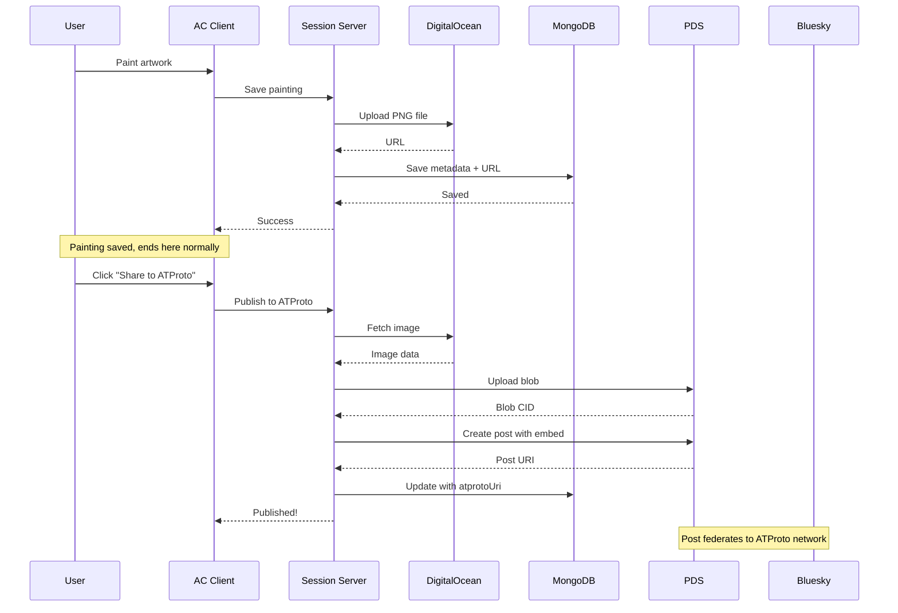
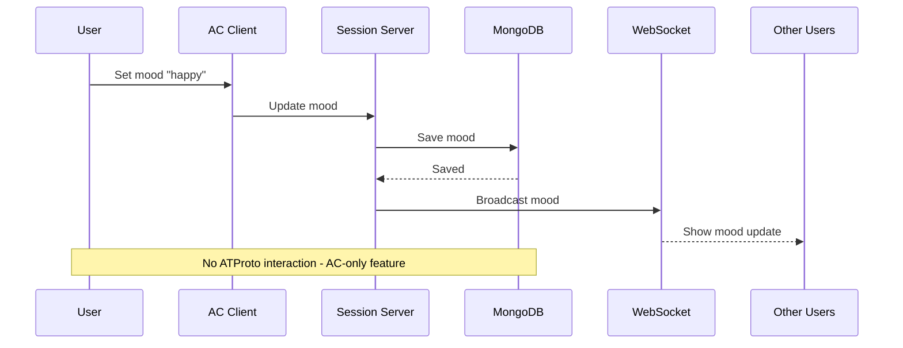
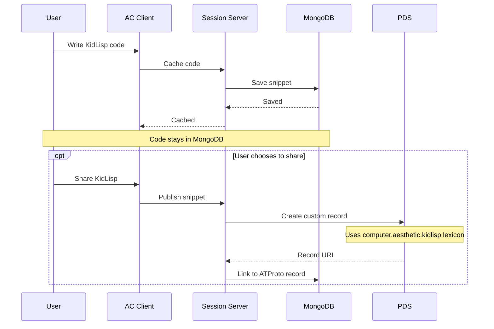

# ATProto Data Architecture for Aesthetic Computer

**Last Updated:** October 6, 2025

---

## TL;DR

- ✅ **PDS = Identity & Auth only** (replaces Auth0)
- ✅ **MongoDB = ALL AC content** (paintings, moods, KidLisp, chat)
- ✅ **DigitalOcean Spaces = ALL AC media** (no change)
- ✅ **Publishing to ATProto = Optional copies** (doesn't move data)

---

## The Hybrid Architecture

### What Changes

| Component | Before ATProto | After ATProto |
|-----------|---------------|---------------|
| **Authentication** | Auth0 OAuth | PDS OAuth |
| **User ID** | `auth0\|123` | `did:plc:abc123` |
| **Handle system** | MongoDB only | MongoDB maps DID ↔ handle |
| **Profile data** | MongoDB only | MongoDB + synced to PDS |

### What DOESN'T Change

| Component | Storage | Notes |
|-----------|---------|-------|
| **Paintings** | DigitalOcean Spaces + MongoDB | Unchanged |
| **Moods** | MongoDB | Unchanged |
| **KidLisp code** | MongoDB | Unchanged |
| **Chat messages** | MongoDB | Unchanged |
| **Pieces/projects** | MongoDB | Unchanged |
| **User preferences** | MongoDB | Unchanged |
| **Activity logs** | MongoDB | Unchanged |
| **Assets** | DigitalOcean Spaces | Unchanged |

---

## Data Storage Responsibilities

### 1. PDS (PostgreSQL) - Identity Layer

**Stores ONLY:**
- User DIDs (Decentralized Identifiers)
- ATProto authentication tokens
- ATProto-standard profile (displayName, avatar, bio)
- ATProto repository metadata
- Optional: Posts published to ATProto network
- Optional: Social graph (follows/followers) if using ATProto

**Size:** Very small (~10-100 MB for thousands of users)

**Example:**
```sql
-- PDS PostgreSQL schema (simplified)
users:
  did (PK)
  handle
  email
  password_hash
  created_at

repos:
  did (FK)
  collection
  rkey
  record (JSONB)
  cid
```

### 2. MongoDB - Application Data Layer

**Stores EVERYTHING AC-specific:**
- User handle mappings
- Paintings metadata
- Moods
- KidLisp snippets
- Chat messages
- Pieces/projects
- User preferences
- Activity logs
- All AC-specific features

**Size:** Large (~GBs, current usage)

**Example:**
```javascript
// MongoDB @handles collection
{
  _id: "did:plc:abc123",  // ← Primary key changed from auth0|123
  handle: "jeffrey",
  atprotoHandle: "jeffrey.aesthetic.computer",
  email: "jeffrey@example.com",
  authProvider: "atproto",
  legacyAuth0Sub: "auth0|123",  // For migration
  created: ISODate("2023-01-01"),
  // ... all other AC-specific user data
}

// MongoDB paintings collection (UNCHANGED structure)
{
  _id: ObjectId("..."),
  user: "did:plc:abc123",  // ← Only change: DID reference
  filename: "my-painting.png",
  url: "https://assets.aesthetic.computer/paintings/jeffrey/my-painting.png",
  created: ISODate("2025-10-06"),
  atprotoUri: "at://did:plc:abc123/app.bsky.feed.post/3k2j...",  // Optional
  // ... all other fields unchanged
}

// MongoDB moods collection (UNCHANGED)
{
  _id: ObjectId("..."),
  user: "did:plc:abc123",
  mood: "happy",
  when: ISODate()
}

// MongoDB kidlisp_cache collection (UNCHANGED)
{
  _id: ObjectId("..."),
  user: "did:plc:abc123",
  code: "(defn hello [] (print \"Hello world\"))",
  hash: "sha256:...",
  when: ISODate()
}
```

### 3. DigitalOcean Spaces - Media Storage

**Stores:**
- All painting image files
- All asset files
- All user-uploaded media
- Static assets (fonts, icons, etc.)

**Size:** Largest (~GBs of image/media files)

**Structure (UNCHANGED):**
```
assets.aesthetic.computer/
├── paintings/
│   ├── jeffrey/
│   │   ├── my-painting-2025.png
│   │   └── abstract-work.png
│   └── alice/
│       └── digital-art.png
├── assets/
│   ├── fonts/
│   └── icons/
└── pieces/
    └── user-projects/
```

### 4. PDS Blob Storage (NEW, Optional)

**Stores:**
- Copies of media shared to ATProto network
- Only when user explicitly publishes content

**Size:** Small (~MB, only shared content)

**Example:**
```
# User shares painting to ATProto:
1. Original stays in DO Spaces: paintings/jeffrey/art.png
2. Copy uploaded to PDS blobs: blobs/bafyrei.../art.png
3. ATProto post references blob
4. Bluesky users see the image
5. AC still serves from DO Spaces
```

---

## Data Flow Examples

### Example 1: User Creates Painting



### Example 2: User Sets Mood



### Example 3: User Writes KidLisp



---

## Migration Impact

### What Happens to Existing Data

#### Paintings
- ✅ Files stay in DigitalOcean Spaces (no migration)
- ✅ MongoDB metadata stays (only user field changes from auth0|123 to DID)
- ✅ URLs unchanged
- ✅ No downtime or data transfer needed

#### Moods
- ✅ All records stay in MongoDB
- ✅ Only user field updated (auth0|123 → DID)
- ✅ No data migration needed

#### KidLisp Snippets
- ✅ All code stays in MongoDB
- ✅ Only user field updated
- ✅ Cache remains valid

#### Chat Messages
- ✅ All messages stay in MongoDB
- ✅ No changes to message structure
- ✅ WebSocket continues to work

### Migration Script Example

```javascript
// Minimal migration - only update user references
async function migrateUserData(auth0Sub, newDID) {
  const db = await connectMongoDB()
  
  // Update all collections with user references
  await db.collection('paintings').updateMany(
    { user: auth0Sub },
    { $set: { user: newDID } }
  )
  
  await db.collection('moods').updateMany(
    { user: auth0Sub },
    { $set: { user: newDID } }
  )
  
  await db.collection('kidlisp_cache').updateMany(
    { user: auth0Sub },
    { $set: { user: newDID } }
  )
  
  await db.collection('chat-system').updateMany(
    { user: auth0Sub },
    { $set: { user: newDID } }
  )
  
  // Update @handles collection
  await db.collection('@handles').updateOne(
    { _id: auth0Sub },
    { 
      $set: { 
        migratedDID: newDID,
        authProvider: 'atproto'
      }
    }
  )
  
  // Create new primary document with DID
  await db.collection('@handles').insertOne({
    _id: newDID,
    handle: user.handle,
    atprotoHandle: `${user.handle}.aesthetic.computer`,
    legacyAuth0Sub: auth0Sub,
    // ... copy other fields
  })
}
```

---

## Content Publishing Policies

### When to Publish to ATProto

**User-controlled decisions:**
- User explicitly clicks "Share to ATProto"
- User enables "Auto-publish to ATProto" in settings
- User posts to "public" visibility

**What gets published:**
- ✅ Posts/messages marked as public
- ✅ Paintings user chooses to share
- ✅ KidLisp snippets marked as shareable
- ✅ Profile updates (synced automatically)

**What NEVER gets published:**
- ❌ Private chat messages
- ❌ Moods (AC-internal feature)
- ❌ Draft/private paintings
- ❌ Personal preferences/settings
- ❌ Activity logs

### ATProto Record Types

```javascript
// Standard Bluesky post
{
  $type: 'app.bsky.feed.post',
  text: 'Check out my new painting!',
  embed: {
    $type: 'app.bsky.embed.images',
    images: [{ image: blob, alt: 'My artwork' }]
  },
  createdAt: '2025-10-06T12:00:00Z'
}

// Custom AC lexicon for paintings (optional)
{
  $type: 'computer.aesthetic.painting',
  title: 'Abstract Dreams',
  description: 'Digital painting created in AC',
  media: { blob: '...', mimeType: 'image/png' },
  originalUrl: 'https://assets.aesthetic.computer/paintings/...',
  tools: ['brush', 'stamp'],
  createdAt: '2025-10-06T12:00:00Z'
}

// Custom AC lexicon for KidLisp
{
  $type: 'computer.aesthetic.kidlisp',
  code: '(defn hello [] (print "Hello world"))',
  description: 'Simple greeting function',
  language: 'kidlisp',
  createdAt: '2025-10-06T12:00:00Z'
}
```

---

## Storage Costs Breakdown

### Current (Before ATProto)

| Service | Purpose | Cost/Month |
|---------|---------|------------|
| DigitalOcean Spaces | Paintings, assets | $5-20 |
| MongoDB Atlas | All data | $0-50 |
| Auth0 | Authentication | $25-240 |
| **Total** | | **$30-310** |

### After ATProto Integration

| Service | Purpose | Cost/Month | Notes |
|---------|---------|------------|-------|
| DigitalOcean Spaces | Paintings, assets | $5-20 | No change |
| MongoDB Atlas | All AC data | $0-50 | No change |
| GCP Compute (PDS) | Identity & auth | $15-20 | Replaces Auth0 |
| PostgreSQL | ATProto repos | $0-15 | Small dataset |
| PDS Blob Storage | Shared content | $1-10 | Only published items |
| **Total** | | **$21-115** | |

**Net Savings:** $9-195/month

---

## Backup & Disaster Recovery

### Backup Strategy

**MongoDB (Primary AC data):**
- Daily automated backups (existing)
- No changes to backup strategy
- All AC-specific content protected

**DigitalOcean Spaces (Media files):**
- S3-compatible backup (existing)
- No changes needed
- All painting files protected

**PDS PostgreSQL (Identity data):**
- New: Daily PostgreSQL dumps
- Smaller dataset, easier to backup
- Can restore from MongoDB mapping if needed

**Disaster Recovery Scenarios:**

| Scenario | Impact | Recovery |
|----------|--------|----------|
| PDS server dies | Users can't login | Restore PDS from backup, 15 min downtime |
| MongoDB dies | All AC data lost | Restore from backup, MongoDB replica set |
| DO Spaces dies | Paintings unavailable | Restore from backup, CDN cache helps |
| PDS + MongoDB die | Total failure | Restore both from backups, users re-auth |

**Key insight:** If PDS fails but MongoDB survives, you still have all AC data and can rebuild PDS from MongoDB user mappings.

---

## Decision Tree: Where Does Data Go?

```
Is this user identity/authentication?
├─ Yes → PDS (PostgreSQL)
└─ No → Is this ATProto-standard content (posts, follows)?
    ├─ Yes, AND user chose to publish → PDS (PostgreSQL)
    └─ No → Is this AC-specific content?
        ├─ Yes → MongoDB
        └─ Is this a media file?
            ├─ Yes → DigitalOcean Spaces
            └─ Yes, AND shared to ATProto → Also copy to PDS blobs
```

---

## Summary

**The Golden Rule:** 

> PDS handles **identity & federation**.  
> MongoDB handles **everything else**.  
> DigitalOcean handles **all media**.  
> Publishing to ATProto **creates copies**, never moves data.

**Migration Impact:**
- Minimal: Only user ID references change in MongoDB
- No data transfer needed for paintings/moods/kidlisp
- All files stay in DigitalOcean Spaces
- Existing URLs continue to work

**Cost Impact:**
- Eliminate Auth0 ($25-240/month)
- Add PDS hosting ($15-35/month)
- Net savings: $9-195/month

**User Impact:**
- Better: ATProto identity works everywhere
- Better: Can share to Bluesky/ATProto network
- Same: All AC features work exactly as before
- Same: All existing content accessible
