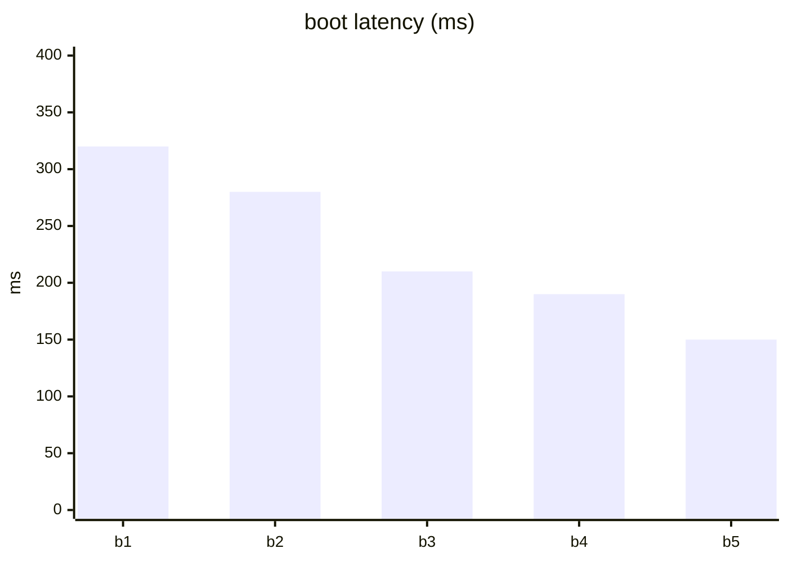

# Inline graphics — a pattern language (no committed files)

Graphics that render on **github.com** from **text alone** — nothing committed but
this `.md`. No SVG, no PNG, no STL. Companion to `HAND.md` and `papers/VOICE.md`.

> [!NOTE]
> This page is the live render test. On github.com every block should paint; a
> ❌ below marks a form GitHub's MathJax **rejected** ("unable to render").

---

## The inline palette

| Method | Draws | Cost |
|---|---|---|
| ` ```mermaid ` | diagrams **and charts** (15+ types) | text |
| `$…$` / ` ```math ` | formulas — **and bitmaps/paths** (the hacks below) | text |
| ` ```geojson ` | interactive maps | text |
| prose primitives | tables, task lists, `<details>`, alerts, footnotes | text |

---

## Pattern 1 — Mermaid diagram


## Pattern 2 — Mermaid charts (inline data-viz)



## Pattern 3 — Math, the real thing

$\Delta\varphi = 2\pi f / f_s$

```math
\varphi_{n+1} = (\varphi_n + \tfrac{2\pi f}{f_s}) \bmod 2\pi
```

## Pattern 4 — GeoJSON map

```geojson
{ "type": "FeatureCollection", "features": [
  { "type": "Feature", "properties": { "name": "LACMA" },
    "geometry": { "type": "Point", "coordinates": [-118.3592, 34.0639] } } ] }
```

---

## Drawing with math — what actually renders on GitHub

We probe each primitive in isolation so the support matrix is empirical, not
assumed. (GitHub's MathJax autoloads the `color` extension.)

**Probe A — `\textcolor` + `\rule` (a colored pixel):**

$\textcolor{#9bd64a}{\rule{40px}{16px}}$

**Probe B — `\color` two-arg form:**

$\color{#9bd64a}{\rule{40px}{16px}}$

**Probe C — `\rlap` + `\hspace` (zero-width overlap + x-offset):**

$\rlap{\textcolor{#9bd64a}{\rule{16px}{16px}}}\hspace{30px}\textcolor{#5fae3a}{\rule{16px}{16px}}$

**Probe D — `\raise` (y-offset):**

$\raise 14px {\textcolor{#e8ff8a}{\rule{16px}{16px}}}\ \textcolor{#9bd64a}{\rule{16px}{16px}}$

**Probe E — plain `array` of rules (no `@{}`):**

```math
\begin{array}{cc}
\textcolor{#ff4d6d}{\rule{12px}{12px}} & \phantom{\rule{12px}{12px}} \\
\phantom{\rule{12px}{12px}} & \textcolor{#ff4d6d}{\rule{12px}{12px}}
\end{array}
```

**Probe F — `array` with `@{}` tight columns + negative row gap → ❌ "unable to
render expression" on GitHub.** This is what broke the first heart; `@{}` and
`\\[-Npt]` aren't supported. Conclusion: **don't use arrays for bitmaps** — use
the `\rlap` canvas below, which needs no array at all.

---

## The `\rlap` canvas — draw arbitrary paths inline

`\rlap` typesets with **zero width** (cursor doesn't advance), so a flat sequence
of `\rlap{\hspace{x}\raise y{dot}}` places dots at absolute (x, y). A trailing
`\phantom{\rule{W}{H}}` claims the canvas box. Emit one dot per filled sample and
you trace **any path** — sparse art costs far fewer rules than a full grid.

**Limit:** `\rule` is axis-aligned and MathJax has no rotation, so curves
stair-step (you're rasterizing, not stroking) and there's no antialiasing.

Generated by `node path-to-math.mjs smiley` (124 dots) — a smiley, drawn in math:

```math
\rlap{\hspace{142px}\raise 78px {\textcolor{#e8ff8a}{\rule{5px}{5px}}}}
\rlap{\hspace{141px}\raise 73px {\textcolor{#e8ff8a}{\rule{5px}{5px}}}}
\rlap{\hspace{141px}\raise 69px {\textcolor{#e8ff8a}{\rule{5px}{5px}}}}
\rlap{\hspace{140px}\raise 65px {\textcolor{#e8ff8a}{\rule{5px}{5px}}}}
\rlap{\hspace{139px}\raise 61px {\textcolor{#e8ff8a}{\rule{5px}{5px}}}}
\rlap{\hspace{138px}\raise 57px {\textcolor{#e8ff8a}{\rule{5px}{5px}}}}
\rlap{\hspace{137px}\raise 53px {\textcolor{#e8ff8a}{\rule{5px}{5px}}}}
\rlap{\hspace{135px}\raise 49px {\textcolor{#e8ff8a}{\rule{5px}{5px}}}}
\rlap{\hspace{133px}\raise 46px {\textcolor{#e8ff8a}{\rule{5px}{5px}}}}
\rlap{\hspace{131px}\raise 42px {\textcolor{#e8ff8a}{\rule{5px}{5px}}}}
\rlap{\hspace{128px}\raise 39px {\textcolor{#e8ff8a}{\rule{5px}{5px}}}}
\rlap{\hspace{126px}\raise 35px {\textcolor{#e8ff8a}{\rule{5px}{5px}}}}
\rlap{\hspace{123px}\raise 32px {\textcolor{#e8ff8a}{\rule{5px}{5px}}}}
\rlap{\hspace{120px}\raise 29px {\textcolor{#e8ff8a}{\rule{5px}{5px}}}}
\rlap{\hspace{116px}\raise 27px {\textcolor{#e8ff8a}{\rule{5px}{5px}}}}
\rlap{\hspace{113px}\raise 24px {\textcolor{#e8ff8a}{\rule{5px}{5px}}}}
\rlap{\hspace{110px}\raise 22px {\textcolor{#e8ff8a}{\rule{5px}{5px}}}}
\rlap{\hspace{106px}\raise 20px {\textcolor{#e8ff8a}{\rule{5px}{5px}}}}
\rlap{\hspace{102px}\raise 18px {\textcolor{#e8ff8a}{\rule{5px}{5px}}}}
\rlap{\hspace{98px}\raise 17px {\textcolor{#e8ff8a}{\rule{5px}{5px}}}}
\rlap{\hspace{94px}\raise 16px {\textcolor{#e8ff8a}{\rule{5px}{5px}}}}
\rlap{\hspace{90px}\raise 15px {\textcolor{#e8ff8a}{\rule{5px}{5px}}}}
\rlap{\hspace{86px}\raise 14px {\textcolor{#e8ff8a}{\rule{5px}{5px}}}}
\rlap{\hspace{82px}\raise 14px {\textcolor{#e8ff8a}{\rule{5px}{5px}}}}
\rlap{\hspace{78px}\raise 14px {\textcolor{#e8ff8a}{\rule{5px}{5px}}}}
\rlap{\hspace{73px}\raise 14px {\textcolor{#e8ff8a}{\rule{5px}{5px}}}}
\rlap{\hspace{69px}\raise 14px {\textcolor{#e8ff8a}{\rule{5px}{5px}}}}
\rlap{\hspace{65px}\raise 15px {\textcolor{#e8ff8a}{\rule{5px}{5px}}}}
\rlap{\hspace{61px}\raise 16px {\textcolor{#e8ff8a}{\rule{5px}{5px}}}}
\rlap{\hspace{57px}\raise 17px {\textcolor{#e8ff8a}{\rule{5px}{5px}}}}
\rlap{\hspace{53px}\raise 18px {\textcolor{#e8ff8a}{\rule{5px}{5px}}}}
\rlap{\hspace{49px}\raise 20px {\textcolor{#e8ff8a}{\rule{5px}{5px}}}}
\rlap{\hspace{46px}\raise 22px {\textcolor{#e8ff8a}{\rule{5px}{5px}}}}
\rlap{\hspace{42px}\raise 24px {\textcolor{#e8ff8a}{\rule{5px}{5px}}}}
\rlap{\hspace{39px}\raise 27px {\textcolor{#e8ff8a}{\rule{5px}{5px}}}}
\rlap{\hspace{35px}\raise 29px {\textcolor{#e8ff8a}{\rule{5px}{5px}}}}
\rlap{\hspace{32px}\raise 32px {\textcolor{#e8ff8a}{\rule{5px}{5px}}}}
\rlap{\hspace{29px}\raise 35px {\textcolor{#e8ff8a}{\rule{5px}{5px}}}}
\rlap{\hspace{27px}\raise 39px {\textcolor{#e8ff8a}{\rule{5px}{5px}}}}
\rlap{\hspace{24px}\raise 42px {\textcolor{#e8ff8a}{\rule{5px}{5px}}}}
\rlap{\hspace{22px}\raise 46px {\textcolor{#e8ff8a}{\rule{5px}{5px}}}}
\rlap{\hspace{20px}\raise 49px {\textcolor{#e8ff8a}{\rule{5px}{5px}}}}
\rlap{\hspace{18px}\raise 53px {\textcolor{#e8ff8a}{\rule{5px}{5px}}}}
\rlap{\hspace{17px}\raise 57px {\textcolor{#e8ff8a}{\rule{5px}{5px}}}}
\rlap{\hspace{16px}\raise 61px {\textcolor{#e8ff8a}{\rule{5px}{5px}}}}
\rlap{\hspace{15px}\raise 65px {\textcolor{#e8ff8a}{\rule{5px}{5px}}}}
\rlap{\hspace{14px}\raise 69px {\textcolor{#e8ff8a}{\rule{5px}{5px}}}}
\rlap{\hspace{14px}\raise 73px {\textcolor{#e8ff8a}{\rule{5px}{5px}}}}
\rlap{\hspace{14px}\raise 77px {\textcolor{#e8ff8a}{\rule{5px}{5px}}}}
\rlap{\hspace{14px}\raise 82px {\textcolor{#e8ff8a}{\rule{5px}{5px}}}}
\rlap{\hspace{14px}\raise 86px {\textcolor{#e8ff8a}{\rule{5px}{5px}}}}
\rlap{\hspace{15px}\raise 90px {\textcolor{#e8ff8a}{\rule{5px}{5px}}}}
\rlap{\hspace{16px}\raise 94px {\textcolor{#e8ff8a}{\rule{5px}{5px}}}}
\rlap{\hspace{17px}\raise 98px {\textcolor{#e8ff8a}{\rule{5px}{5px}}}}
\rlap{\hspace{18px}\raise 102px {\textcolor{#e8ff8a}{\rule{5px}{5px}}}}
\rlap{\hspace{20px}\raise 106px {\textcolor{#e8ff8a}{\rule{5px}{5px}}}}
\rlap{\hspace{22px}\raise 110px {\textcolor{#e8ff8a}{\rule{5px}{5px}}}}
\rlap{\hspace{24px}\raise 113px {\textcolor{#e8ff8a}{\rule{5px}{5px}}}}
\rlap{\hspace{27px}\raise 116px {\textcolor{#e8ff8a}{\rule{5px}{5px}}}}
\rlap{\hspace{29px}\raise 120px {\textcolor{#e8ff8a}{\rule{5px}{5px}}}}
\rlap{\hspace{32px}\raise 123px {\textcolor{#e8ff8a}{\rule{5px}{5px}}}}
\rlap{\hspace{35px}\raise 126px {\textcolor{#e8ff8a}{\rule{5px}{5px}}}}
\rlap{\hspace{39px}\raise 128px {\textcolor{#e8ff8a}{\rule{5px}{5px}}}}
\rlap{\hspace{42px}\raise 131px {\textcolor{#e8ff8a}{\rule{5px}{5px}}}}
\rlap{\hspace{45px}\raise 133px {\textcolor{#e8ff8a}{\rule{5px}{5px}}}}
\rlap{\hspace{49px}\raise 135px {\textcolor{#e8ff8a}{\rule{5px}{5px}}}}
\rlap{\hspace{53px}\raise 137px {\textcolor{#e8ff8a}{\rule{5px}{5px}}}}
\rlap{\hspace{57px}\raise 138px {\textcolor{#e8ff8a}{\rule{5px}{5px}}}}
\rlap{\hspace{61px}\raise 139px {\textcolor{#e8ff8a}{\rule{5px}{5px}}}}
\rlap{\hspace{65px}\raise 140px {\textcolor{#e8ff8a}{\rule{5px}{5px}}}}
\rlap{\hspace{69px}\raise 141px {\textcolor{#e8ff8a}{\rule{5px}{5px}}}}
\rlap{\hspace{73px}\raise 141px {\textcolor{#e8ff8a}{\rule{5px}{5px}}}}
\rlap{\hspace{77px}\raise 142px {\textcolor{#e8ff8a}{\rule{5px}{5px}}}}
\rlap{\hspace{82px}\raise 141px {\textcolor{#e8ff8a}{\rule{5px}{5px}}}}
\rlap{\hspace{86px}\raise 141px {\textcolor{#e8ff8a}{\rule{5px}{5px}}}}
\rlap{\hspace{90px}\raise 140px {\textcolor{#e8ff8a}{\rule{5px}{5px}}}}
\rlap{\hspace{94px}\raise 139px {\textcolor{#e8ff8a}{\rule{5px}{5px}}}}
\rlap{\hspace{98px}\raise 138px {\textcolor{#e8ff8a}{\rule{5px}{5px}}}}
\rlap{\hspace{102px}\raise 137px {\textcolor{#e8ff8a}{\rule{5px}{5px}}}}
\rlap{\hspace{106px}\raise 135px {\textcolor{#e8ff8a}{\rule{5px}{5px}}}}
\rlap{\hspace{110px}\raise 133px {\textcolor{#e8ff8a}{\rule{5px}{5px}}}}
\rlap{\hspace{113px}\raise 131px {\textcolor{#e8ff8a}{\rule{5px}{5px}}}}
\rlap{\hspace{116px}\raise 128px {\textcolor{#e8ff8a}{\rule{5px}{5px}}}}
\rlap{\hspace{120px}\raise 126px {\textcolor{#e8ff8a}{\rule{5px}{5px}}}}
\rlap{\hspace{123px}\raise 123px {\textcolor{#e8ff8a}{\rule{5px}{5px}}}}
\rlap{\hspace{126px}\raise 120px {\textcolor{#e8ff8a}{\rule{5px}{5px}}}}
\rlap{\hspace{128px}\raise 116px {\textcolor{#e8ff8a}{\rule{5px}{5px}}}}
\rlap{\hspace{131px}\raise 113px {\textcolor{#e8ff8a}{\rule{5px}{5px}}}}
\rlap{\hspace{133px}\raise 110px {\textcolor{#e8ff8a}{\rule{5px}{5px}}}}
\rlap{\hspace{135px}\raise 106px {\textcolor{#e8ff8a}{\rule{5px}{5px}}}}
\rlap{\hspace{137px}\raise 102px {\textcolor{#e8ff8a}{\rule{5px}{5px}}}}
\rlap{\hspace{138px}\raise 98px {\textcolor{#e8ff8a}{\rule{5px}{5px}}}}
\rlap{\hspace{139px}\raise 94px {\textcolor{#e8ff8a}{\rule{5px}{5px}}}}
\rlap{\hspace{140px}\raise 90px {\textcolor{#e8ff8a}{\rule{5px}{5px}}}}
\rlap{\hspace{141px}\raise 86px {\textcolor{#e8ff8a}{\rule{5px}{5px}}}}
\rlap{\hspace{141px}\raise 82px {\textcolor{#e8ff8a}{\rule{5px}{5px}}}}
\rlap{\hspace{54px}\raise 94px {\textcolor{#e8ff8a}{\rule{5px}{5px}}}}
\rlap{\hspace{56px}\raise 94px {\textcolor{#e8ff8a}{\rule{5px}{5px}}}}
\rlap{\hspace{102px}\raise 94px {\textcolor{#e8ff8a}{\rule{5px}{5px}}}}
\rlap{\hspace{100px}\raise 94px {\textcolor{#e8ff8a}{\rule{5px}{5px}}}}
\rlap{\hspace{102px}\raise 45px {\textcolor{#e8ff8a}{\rule{5px}{5px}}}}
\rlap{\hspace{100px}\raise 44px {\textcolor{#e8ff8a}{\rule{5px}{5px}}}}
\rlap{\hspace{98px}\raise 42px {\textcolor{#e8ff8a}{\rule{5px}{5px}}}}
\rlap{\hspace{96px}\raise 41px {\textcolor{#e8ff8a}{\rule{5px}{5px}}}}
\rlap{\hspace{94px}\raise 40px {\textcolor{#e8ff8a}{\rule{5px}{5px}}}}
\rlap{\hspace{92px}\raise 39px {\textcolor{#e8ff8a}{\rule{5px}{5px}}}}
\rlap{\hspace{90px}\raise 38px {\textcolor{#e8ff8a}{\rule{5px}{5px}}}}
\rlap{\hspace{88px}\raise 37px {\textcolor{#e8ff8a}{\rule{5px}{5px}}}}
\rlap{\hspace{86px}\raise 36px {\textcolor{#e8ff8a}{\rule{5px}{5px}}}}
\rlap{\hspace{83px}\raise 36px {\textcolor{#e8ff8a}{\rule{5px}{5px}}}}
\rlap{\hspace{81px}\raise 36px {\textcolor{#e8ff8a}{\rule{5px}{5px}}}}
\rlap{\hspace{79px}\raise 36px {\textcolor{#e8ff8a}{\rule{5px}{5px}}}}
\rlap{\hspace{76px}\raise 36px {\textcolor{#e8ff8a}{\rule{5px}{5px}}}}
\rlap{\hspace{74px}\raise 36px {\textcolor{#e8ff8a}{\rule{5px}{5px}}}}
\rlap{\hspace{72px}\raise 36px {\textcolor{#e8ff8a}{\rule{5px}{5px}}}}
\rlap{\hspace{69px}\raise 36px {\textcolor{#e8ff8a}{\rule{5px}{5px}}}}
\rlap{\hspace{67px}\raise 37px {\textcolor{#e8ff8a}{\rule{5px}{5px}}}}
\rlap{\hspace{65px}\raise 38px {\textcolor{#e8ff8a}{\rule{5px}{5px}}}}
\rlap{\hspace{63px}\raise 39px {\textcolor{#e8ff8a}{\rule{5px}{5px}}}}
\rlap{\hspace{61px}\raise 40px {\textcolor{#e8ff8a}{\rule{5px}{5px}}}}
\rlap{\hspace{59px}\raise 41px {\textcolor{#e8ff8a}{\rule{5px}{5px}}}}
\rlap{\hspace{57px}\raise 42px {\textcolor{#e8ff8a}{\rule{5px}{5px}}}}
\rlap{\hspace{55px}\raise 44px {\textcolor{#e8ff8a}{\rule{5px}{5px}}}}
\rlap{\hspace{53px}\raise 45px {\textcolor{#e8ff8a}{\rule{5px}{5px}}}}
\phantom{\rule{160px}{160px}}
```

Swap the shape function in `path-to-math.mjs` for anything parametric —
`node path-to-math.mjs flower` emits a flower (petals + core + stem + leaf). The
*output* is pure inline math; the generator is just a convenience for plotting the
points.

---

## Decision tree (inline-only)


## Papers-platter caveat

None of this reaches `papers/` xelatex PDFs — it's a **github.com** feature. In a
paper the equivalents are native: TikZ, real LaTeX math, `pgfplots`.
