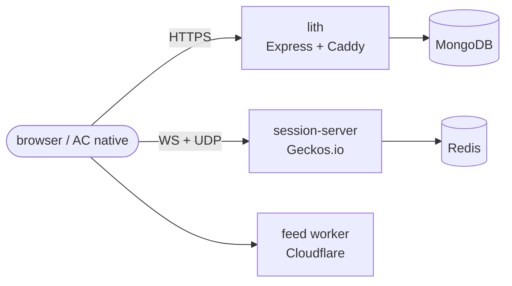
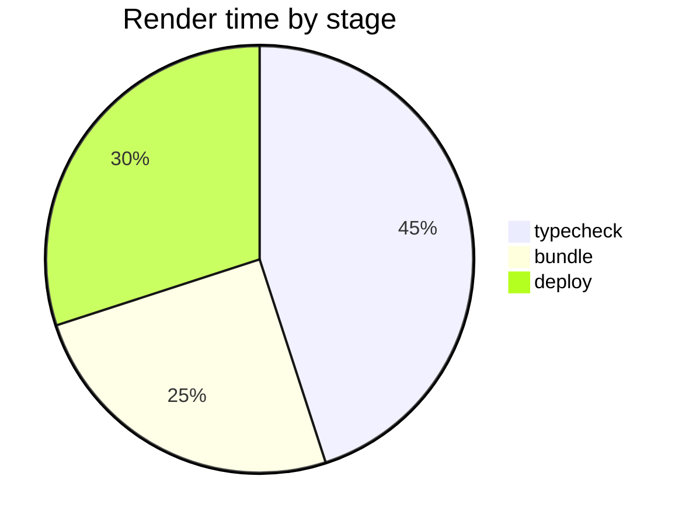
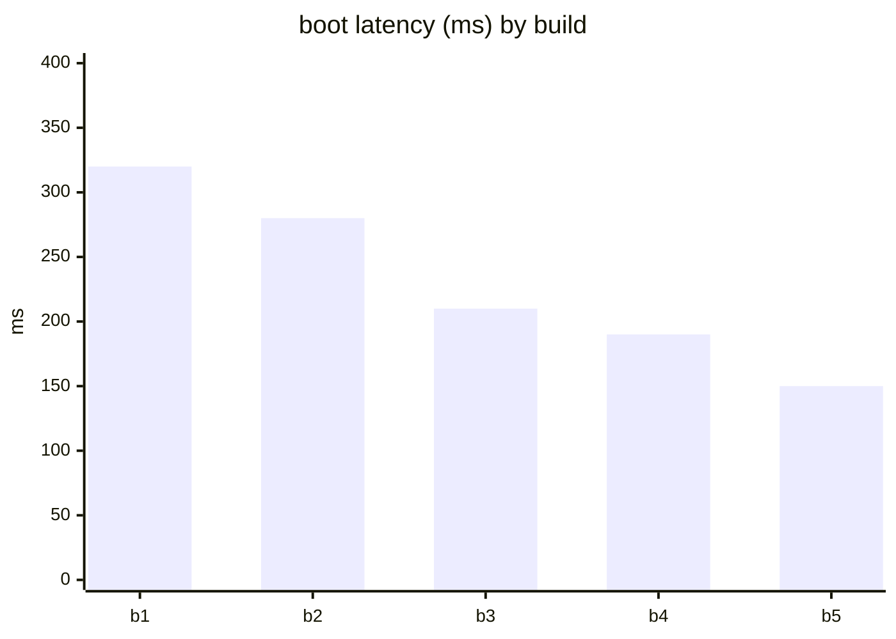
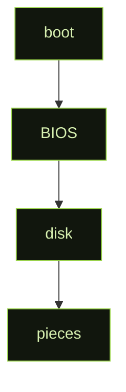
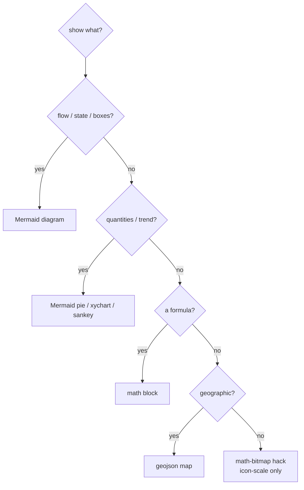

# Inline graphics — a pattern language (no committed files)

Graphics that render on **github.com** from **text alone** — nothing committed but
this `.md`. No SVG, no PNG, no STL: if it isn't a fence or `$math$`, it's not here.

Companion to `HAND.md` (code style) and `papers/VOICE.md` (prose). The craft guide
for *visual* explanation that lives entirely in the diff.

> [!NOTE]
> This page is the live render test. On github.com every block paints; in a plain
> editor you see raw fences — that's expected, GitHub renders them server-side.

---

## The inline palette (and its hard limit)

Text-only, this is everything you get:

| Method | Draws | Cost |
|---|---|---|
| ` ```mermaid ` | diagrams **and charts** (15+ types) | text |
| `$…$` / ` ```math ` | formulas — **and arbitrary bitmaps** (see the hack) | text |
| ` ```geojson ` / ` ```topojson ` | interactive maps | text |
| prose primitives | tables, task lists, `<details>`, alerts, footnotes | text |

> [!IMPORTANT]
> **Hard limit:** inline-only **cannot** embed photos, 3D, or high-res raster —
> those need a committed file. The math-bitmap hack below is the closest you get
> to "draw anything," and it's practical only at small (icon/sparkline) sizes.

---

## Pattern 1 — Mermaid for diagrams

**When:** boxes/arrows/flow/state. Label nodes with real names (`disk.mjs`,
`session-server`) — a diagram that names the code is navigable.



## Pattern 2 — Mermaid for charts (data-viz, still text)

Mermaid isn't only diagrams — `pie`, `xychart-beta`, `sankey-beta`, `quadrantChart`
give you **inline data-viz** with no plotting library and no image file.





## Pattern 3 — Mermaid styling = your palette inline

`classDef` colors nodes — the AC chartreuse-on-black look without leaving text.



## Pattern 4 — Math for the actual math

Per-sample phase step for long sine (matches fedac, avoids drift):
$\Delta\varphi = 2\pi f / f_s$.

```math
\varphi_{n+1} = (\varphi_n + \tfrac{2\pi f}{f_s}) \bmod 2\pi, \qquad y_n = \sin(\varphi_n)
```

## Pattern 5 — GeoJSON map

```geojson
{ "type": "FeatureCollection", "features": [
  { "type": "Feature", "properties": { "name": "LACMA" },
    "geometry": { "type": "Point", "coordinates": [-118.3592, 34.0639] } },
  { "type": "Feature", "properties": { "name": "CalArts" },
    "geometry": { "type": "Point", "coordinates": [-118.5690, 34.3884] } }
] }
```

---

## Pattern 6 — The math-bitmap hack: "draw anything" inline

The escape hatch when you refuse committed files. GitHub's MathJax autoloads the
`color`/`bbox` extensions, so **`\rule` = a filled rectangle = a pixel**, and an
`array` lays pixels on a grid. This is genuinely arbitrary 2D — at icon scale.

### 6a — Color swatch / bar (the atom)

A colored block is just `\textcolor{#hex}{\rule{w}{h}}`:

```math
\textcolor{#9bd64a}{\rule{40px}{16px}}\;\textcolor{#e8ff8a}{\rule{40px}{16px}}\;\textcolor{#5fae3a}{\rule{40px}{16px}}
```

### 6b — "Taller": struts and bars

Height is whatever you ask. A sparkline = bars of differing height on one line;
an invisible strut `\rule{0pt}{H}` forces vertical extent:

```math
\textcolor{#9bd64a}{\rule{10px}{12px}}\,\textcolor{#9bd64a}{\rule{10px}{28px}}\,\textcolor{#9bd64a}{\rule{10px}{20px}}\,\textcolor{#9bd64a}{\rule{10px}{44px}}\,\textcolor{#9bd64a}{\rule{10px}{32px}}\,\textcolor{#9bd64a}{\rule{10px}{60px}}
```

### 6c — A bitmap (pixel art)

Each cell is a pixel; `@{}` kills column gaps, `\\[-Npt]` closes rows; transparent
pixels are `\phantom{\rule{..}{..}}`. A heart in AC pink:

```math
\begin{array}{@{}c@{}c@{}c@{}c@{}c@{}c@{}c@{}c@{}}
\phantom{\rule{12px}{12px}} & \textcolor{#ff4d6d}{\rule{12px}{12px}} & \textcolor{#ff4d6d}{\rule{12px}{12px}} & \phantom{\rule{12px}{12px}} & \phantom{\rule{12px}{12px}} & \textcolor{#ff4d6d}{\rule{12px}{12px}} & \textcolor{#ff4d6d}{\rule{12px}{12px}} & \phantom{\rule{12px}{12px}} \\[-3pt]
\textcolor{#ff4d6d}{\rule{12px}{12px}} & \textcolor{#ff4d6d}{\rule{12px}{12px}} & \textcolor{#ff4d6d}{\rule{12px}{12px}} & \textcolor{#ff4d6d}{\rule{12px}{12px}} & \textcolor{#ff4d6d}{\rule{12px}{12px}} & \textcolor{#ff4d6d}{\rule{12px}{12px}} & \textcolor{#ff4d6d}{\rule{12px}{12px}} & \textcolor{#ff4d6d}{\rule{12px}{12px}} \\[-3pt]
\textcolor{#ff4d6d}{\rule{12px}{12px}} & \textcolor{#ff4d6d}{\rule{12px}{12px}} & \textcolor{#ff4d6d}{\rule{12px}{12px}} & \textcolor{#ff4d6d}{\rule{12px}{12px}} & \textcolor{#ff4d6d}{\rule{12px}{12px}} & \textcolor{#ff4d6d}{\rule{12px}{12px}} & \textcolor{#ff4d6d}{\rule{12px}{12px}} & \textcolor{#ff4d6d}{\rule{12px}{12px}} \\[-3pt]
\phantom{\rule{12px}{12px}} & \textcolor{#ff4d6d}{\rule{12px}{12px}} & \textcolor{#ff4d6d}{\rule{12px}{12px}} & \textcolor{#ff4d6d}{\rule{12px}{12px}} & \textcolor{#ff4d6d}{\rule{12px}{12px}} & \textcolor{#ff4d6d}{\rule{12px}{12px}} & \textcolor{#ff4d6d}{\rule{12px}{12px}} & \phantom{\rule{12px}{12px}} \\[-3pt]
\phantom{\rule{12px}{12px}} & \phantom{\rule{12px}{12px}} & \textcolor{#ff4d6d}{\rule{12px}{12px}} & \textcolor{#ff4d6d}{\rule{12px}{12px}} & \textcolor{#ff4d6d}{\rule{12px}{12px}} & \textcolor{#ff4d6d}{\rule{12px}{12px}} & \phantom{\rule{12px}{12px}} & \phantom{\rule{12px}{12px}} \\[-3pt]
\phantom{\rule{12px}{12px}} & \phantom{\rule{12px}{12px}} & \phantom{\rule{12px}{12px}} & \textcolor{#ff4d6d}{\rule{12px}{12px}} & \textcolor{#ff4d6d}{\rule{12px}{12px}} & \phantom{\rule{12px}{12px}} & \phantom{\rule{12px}{12px}} & \phantom{\rule{12px}{12px}}
\end{array}
```

### 6d — Overlap / custom positioning

`\rlap` draws without advancing, so you can stack; `\raise`/`\hspace` offset.
Two overlapping blocks (composite, not grid):

```math
\rlap{\textcolor{#9bd64a}{\rule{50px}{50px}}}\raise14px{\hspace{18px}\textcolor{#e8ff8a}{\rule{50px}{50px}}}
```

> [!CAUTION]
> The math-bitmap is a **hack**: source grows as W×H rules, spacing needs tuning
> per renderer, and there's no antialiasing. Use it for glyphs, swatches, progress
> bars, and sparklines — reach for Mermaid charts before hand-rolling a bitmap.

---

## Decision tree (inline-only)



## Papers-platter caveat

None of this reaches the `papers/` xelatex PDFs — GitHub Mermaid/MathJax is a
**github.com** feature. In a paper, the same ideas are native: TikZ for diagrams,
real LaTeX math, `pgfplots` for charts. This pattern language is for the GitHub
surface (PRs, RFCs, issues, READMEs).
