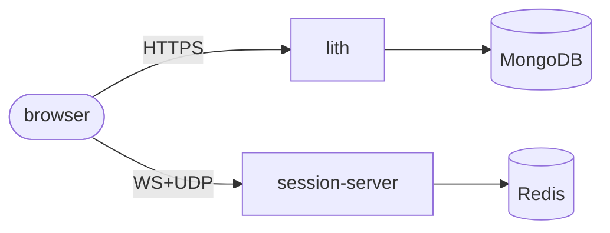
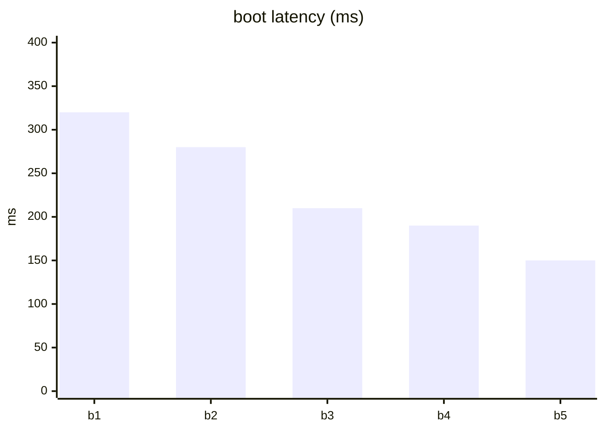
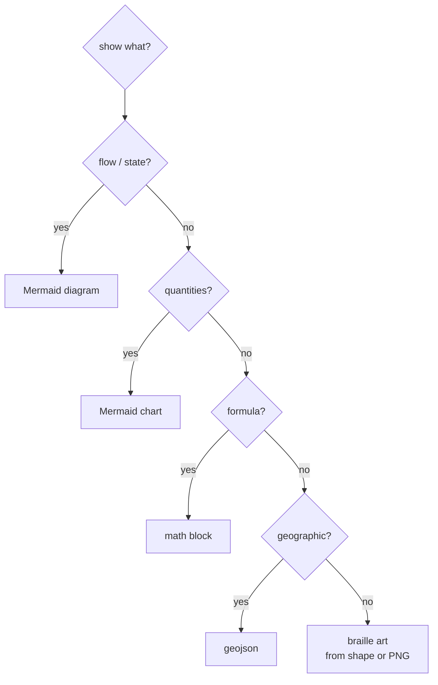

# Inline graphics — a pattern language (no committed files)

Graphics that render on **github.com** from **text alone** — nothing committed but
this `.md`. No SVG, no PNG, no STL. Companion to `HAND.md` and `papers/VOICE.md`.

> [!NOTE]
> This page is the live render test. On github.com every block below paints.

---

## The inline palette

| Method | Draws | Cost |
|---|---|---|
| ` ```mermaid ` | diagrams **and charts** (15+ types) | text |
| `$…$` / ` ```math ` | formulas + colored symbols | text |
| ` ```geojson ` | interactive maps | text |
| **braille / block art in a code fence** | **arbitrary low-res raster** | text |
| prose primitives | tables, task lists, `<details>`, alerts, footnotes | text |

---

## Pattern 1 — Mermaid diagram



## Pattern 2 — Mermaid charts (inline data-viz)



## Pattern 3 — Math, the real thing

$\Delta\varphi = 2\pi f / f_s$

```math
\varphi_{n+1} = (\varphi_n + \tfrac{2\pi f}{f_s}) \bmod 2\pi
```

## Pattern 4 — GeoJSON map

```geojson
{ "type": "FeatureCollection", "features": [
  { "type": "Feature", "properties": { "name": "LACMA" },
    "geometry": { "type": "Point", "coordinates": [-118.3592, 34.0639] } } ] }
```

---

## "Draw anything" inline — the verdict, then the one method that works

I tried to draw bitmaps/paths with the math block (`\rule` + `\textcolor`, then a
`\rlap` positioning canvas). **It does not work on GitHub**, and not for lack of
tuning — it's a hard limitation:

| Attempt | Why it fails on GitHub |
|---|---|
| `\rule` pixels/paths | `\rule` is a **text-mode** TeX command; MathJax implements only math-mode macros, so it's undefined → "unable to render" |
| `\colorbox` grid | **broken on GitHub since May 2023**, not restored |
| `array` with `@{}` / `\\[-Npt]` | unsupported array spec → parse error |
| `\bbox` / `\color` | work, but only color *behind real content* — not a free canvas |

The colored-square `\rule` examples all over the web are **native-LaTeX → image**
tools (readme2tex etc.) that commit a PNG — exactly what "inline-only" rules out.

**What actually draws arbitrary art inline: Unicode braille in a code fence.**
Each braille glyph (U+2800–28FF) packs a **2×4 dot grid**, so a code-generated
field of glyphs is a low-res raster that renders everywhere monospace text does —
no MathJax, no file.

Smiley (`node art-to-braille.mjs smiley`):

```
⠀⠀⠀⠀⠀⠀⠀⠀⠀⠀⠀⠀⠀⠀⠀⠀⠀⠀⢀⣀⣀⣀⠀⠀⠀⠀⠀⠀⠀⠀⠀⠀⠀⠀⠀⠀⠀⠀⠀⠀
⠀⠀⠀⠀⠀⠀⠀⠀⠀⠀⠀⣀⣤⣴⣶⣾⣿⣿⠿⠿⠿⠿⢿⣿⣿⣶⣶⣤⣄⡀⠀⠀⠀⠀⠀⠀⠀⠀⠀⠀
⠀⠀⠀⠀⠀⠀⠀⢀⣠⣶⣿⡿⠟⠋⠉⠁⠀⠀⠀⠀⠀⠀⠀⠀⠀⠉⠉⠛⠿⣿⣷⣦⣀⠀⠀⠀⠀⠀⠀⠀
⠀⠀⠀⠀⠀⢀⣴⣿⡿⠛⠁⠀⠀⠀⠀⠀⠀⠀⠀⠀⠀⠀⠀⠀⠀⠀⠀⠀⠀⠀⠙⠻⣿⣷⣄⠀⠀⠀⠀⠀
⠀⠀⠀⠀⣰⣿⡿⠋⠀⠀⠀⠀⠀⠀⠀⠀⠀⠀⠀⠀⠀⠀⠀⠀⠀⠀⠀⠀⠀⠀⠀⠀⠈⠻⣿⣷⡀⠀⠀⠀
⠀⠀⠀⣼⣿⡟⠁⠀⠀⠀⠀⢰⣿⣿⣷⠀⠀⠀⠀⠀⠀⠀⠀⠀⠀⢰⣿⣿⣷⠀⠀⠀⠀⠀⠙⣿⣿⡄⠀⠀
⠀⠀⢰⣿⣿⠁⠀⠀⠀⠀⠀⠈⠛⠛⠋⠀⠀⠀⠀⠀⠀⠀⠀⠀⠀⠈⠛⠛⠋⠀⠀⠀⠀⠀⠀⢹⣿⣷⠀⠀
⠀⠀⣿⣿⡇⠀⠀⠀⠀⠀⠀⠀⠀⠀⠀⠀⠀⠀⠀⠀⠀⠀⠀⠀⠀⠀⠀⠀⠀⠀⠀⠀⠀⠀⠀⠀⣿⣿⡇⠀
⠀⠀⣿⣿⡇⠀⠀⠀⠀⠀⠀⠀⠀⠀⠀⠀⠀⠀⠀⠀⠀⠀⠀⠀⠀⠀⠀⠀⠀⠀⠀⠀⠀⠀⠀⠀⣿⣿⡇⠀
⠀⠀⢹⣿⣷⠀⠀⠀⠀⠀⢿⣿⣇⠀⠀⠀⠀⠀⠀⠀⠀⠀⠀⠀⠀⠀⠀⢀⣿⣿⠇⠀⠀⠀⠀⢰⣿⣿⠁⠀
⠀⠀⠀⢿⣿⣇⠀⠀⠀⠀⠘⢿⣿⣆⠀⠀⠀⠀⠀⠀⠀⠀⠀⠀⠀⠀⢀⣾⣿⠟⠀⠀⠀⠀⢀⣿⣿⠇⠀⠀
⠀⠀⠀⠈⢻⣿⣧⡀⠀⠀⠀⠈⠻⣿⣷⣦⣄⡀⠀⠀⠀⠀⠀⣀⣤⣶⣿⡿⠋⠀⠀⠀⠀⣠⣿⣿⠋⠀⠀⠀
⠀⠀⠀⠀⠀⠙⢿⣿⣦⣀⠀⠀⠀⠀⠉⠛⠿⢿⣿⣿⣿⣿⣿⠿⠟⠋⠁⠀⠀⠀⢀⣠⣾⣿⠟⠁⠀⠀⠀⠀
⠀⠀⠀⠀⠀⠀⠀⠙⠻⣿⣷⣦⣄⡀⠀⠀⠀⠀⠀⠀⠀⠀⠀⠀⠀⠀⠀⣀⣤⣶⣿⡿⠛⠁⠀⠀⠀⠀⠀⠀
⠀⠀⠀⠀⠀⠀⠀⠀⠀⠀⠉⠛⠿⢿⣿⣷⣶⣶⣤⣤⣤⣤⣴⣶⣶⣿⣿⠿⠟⠋⠁⠀⠀⠀⠀⠀⠀⠀⠀⠀
⠀⠀⠀⠀⠀⠀⠀⠀⠀⠀⠀⠀⠀⠀⠀⠈⠉⠉⠙⠛⠛⠛⠉⠉⠉⠀⠀⠀⠀⠀⠀⠀⠀⠀⠀⠀⠀⠀⠀⠀
```

Flower (`node art-to-braille.mjs flower`):

```
⠀⠀⠀⠀⠀⠀⠀⠀⠀⠀⠀⠀⠀⠀⠀⠀⠀⠀⠀⠀⠀⠀⠀⠀⠀⠀⠀⠀⠀⠀⠀⠀⠀⠀⠀⠀⠀⠀⠀⠀
⠀⠀⠀⠀⠀⠀⠀⠀⠀⢀⣤⣴⣦⣤⣀⠀⠀⠀⠀⠀⠀⠀⠀⠀⠀⢀⣠⣤⣶⣤⣄⠀⠀⠀⠀⠀⠀⠀⠀⠀
⠀⠀⠀⠀⠀⠀⠀⠀⠀⢼⣿⣿⣿⣿⣿⣷⣦⠀⠀⠀⠀⠀⠀⢠⣶⣿⣿⣿⣿⣿⣿⠄⠀⠀⠀⠀⠀⠀⠀⠀
⠀⠀⠀⠀⠀⠀⠀⠀⠀⠸⣿⣿⣿⣿⣿⣿⣿⣷⡄⠀⠀⠀⣴⣿⣿⣿⣿⣿⣿⣿⡿⠀⠀⠀⠀⠀⠀⠀⠀⠀
⠀⠀⠀⠀⠀⠀⠀⠀⠀⠀⠹⣿⣿⣿⣿⣿⣿⣿⣿⡄⠀⣼⣿⣿⣿⣿⣿⣿⣿⡿⠁⠀⠀⠀⠀⠀⠀⠀⠀⠀
⠀⠀⠀⠀⠀⠀⠀⠀⠀⠀⠀⠈⠻⣿⣿⣿⣿⣿⣿⣷⢰⣿⣿⣿⣿⣿⣿⡿⠋⠀⠀⠀⠀⠀⠀⠀⠀⠀⠀⠀
⠀⠀⠀⢀⣀⣀⣤⣤⣤⣤⣤⣀⣀⡈⠻⢿⣿⣿⣿⣿⣸⣿⣿⣿⣿⠿⠋⣀⣀⣠⣤⣤⣤⣤⣄⣀⣀⠀⠀⠀
⠀⣠⣾⣿⣿⣿⣿⣿⣿⣿⣿⣿⣿⣿⣿⣷⣿⣿⣿⣿⣿⣿⣿⣿⣷⣿⣿⣿⣿⣿⣿⣿⣿⣿⣿⣿⣿⣿⣦⡀
⠀⠻⣿⣿⣿⣿⣿⣿⣿⣿⣿⣿⣿⣿⣿⣿⣿⣿⣿⣿⣿⣿⣿⣿⣿⣿⣿⣿⣿⣿⣿⣿⣿⣿⣿⣿⣿⣿⡿⠃
⠀⠀⠈⠙⠛⠛⠿⠿⠿⠿⠿⠛⠛⠋⣩⣵⣿⣿⣿⣿⢻⣿⣿⣿⣷⣭⡉⠛⠛⠻⠿⠿⠿⠿⠟⠛⠛⠉⠀⠀
⠀⠀⠀⠀⠀⠀⠀⠀⠀⠀⠀⠀⣠⣾⣿⣿⣿⣿⣿⣿⢸⣿⣿⣿⣿⣿⣿⣦⡀⠀⠀⠀⠀⠀⠀⠀⠀⠀⠀⠀
⠀⠀⠀⠀⠀⠀⠀⠀⠀⠀⢠⣾⣿⣿⣿⣿⣿⣿⣿⠇⠀⢿⣿⣿⣿⣿⣿⣿⣿⣦⠀⠀⠀⠀⠀⠀⠀⠀⠀⠀
⠀⠀⠀⠀⠀⠀⠀⠀⠀⢠⣿⣿⣿⣿⣿⣿⣿⣿⠏⠀⠀⠈⢿⣿⣿⣿⣿⣿⣿⣿⣧⠀⠀⠀⠀⠀⠀⠀⠀⠀
⠀⠀⠀⠀⠀⠀⠀⠀⠀⢼⣿⣿⣿⣿⣿⣿⡿⠁⠀⠀⠀⠀⠀⠹⣿⣿⣿⣿⣿⣿⣿⠄⠀⠀⠀⠀⠀⠀⠀⠀
⠀⠀⠀⠀⠀⠀⠀⠀⠀⠘⠿⢿⡿⠿⠛⠁⠀⠀⠀⠀⠀⠀⠀⠀⠀⠙⠻⠿⣿⠿⠟⠀⠀⠀⠀⠀⠀⠀⠀⠀
⠀⠀⠀⠀⠀⠀⠀⠀⠀⠀⠀⠀⠀⠀⠀⠀⠀⠀⠀⠀⠀⠀⠀⠀⠀⠀⠀⠀⠀⠀⠀⠀⠀⠀⠀⠀⠀⠀⠀⠀
```

### Draw *literally* anything: PNG → braille

`art-to-braille.mjs image pic.png` normalizes any image with `sips`, decodes it
with Node's built-in `zlib` (no image library), thresholds luminance, and packs
the dots. So any picture becomes inline braille art — arbitrary raster, pure text.

```bash
node art-to-braille.mjs smiley
node art-to-braille.mjs flower
node art-to-braille.mjs image path/to/pic.png 50 [--invert]
```

**Limits:** low resolution (2×4 dots/char), 1-bit (no grayscale/color), and it
relies on a monospace font + the reader's braille glyph coverage. Great for icons,
logos, mascots, diagrams-as-art; not for photos.

---

## Decision tree (inline-only)



## Papers-platter caveat

None of this reaches `papers/` xelatex PDFs — it's a **github.com** feature. In a
paper the equivalents are native: TikZ, real LaTeX math, `pgfplots`, and real
`\includegraphics` for raster.
