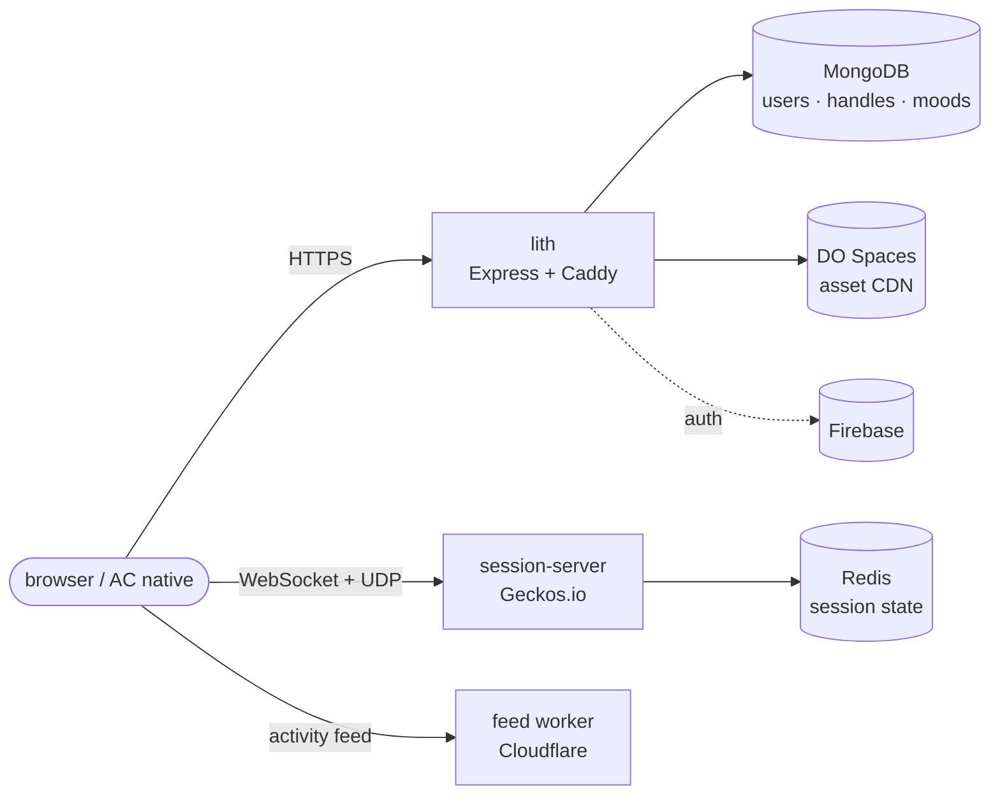
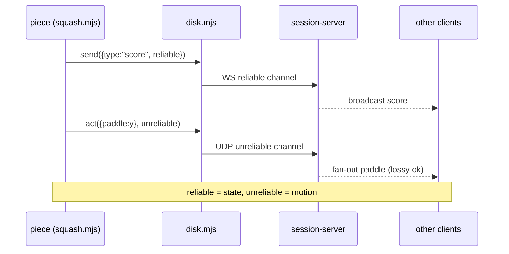
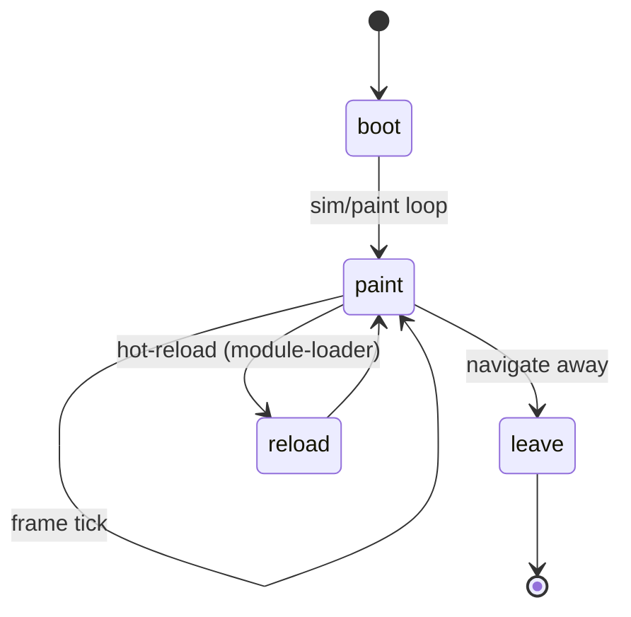
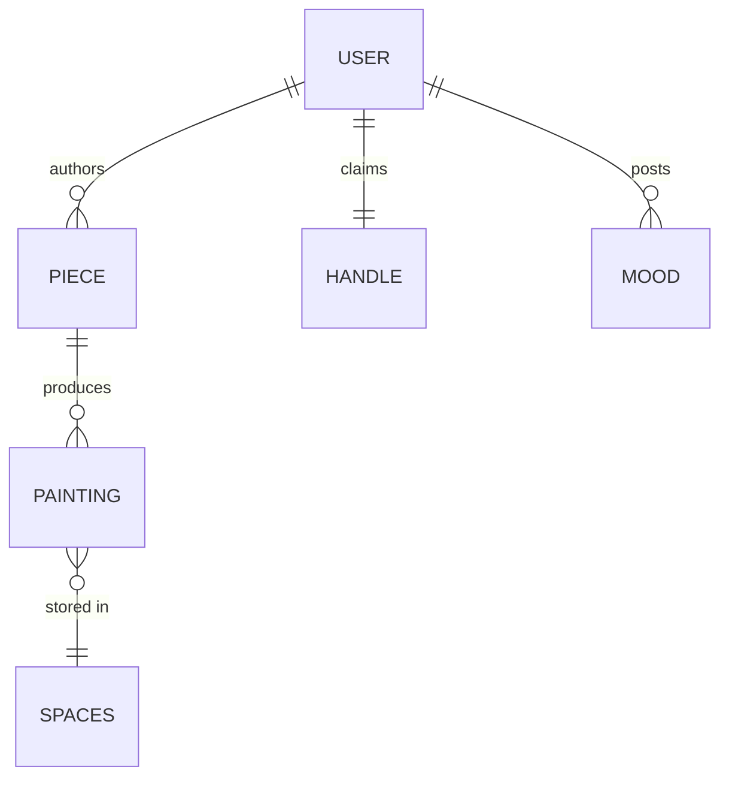
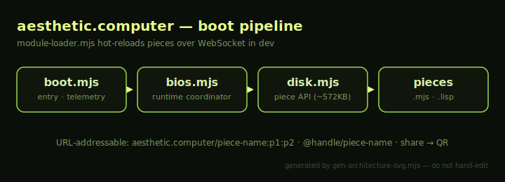
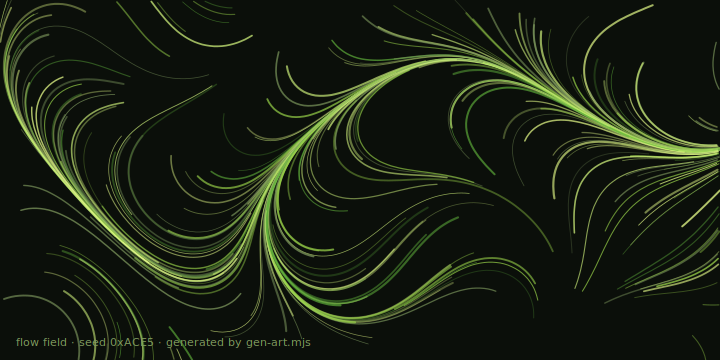

# Markdown Graphics — a pattern language

Diagrams, math, and maps that render on **github.com** straight from text — no
uploaded screenshots, no binary drag-and-drop. Everything here lives in the diff,
reviews as code, and regenerates deterministically.

Companion to `HAND.md` (code style) and `papers/VOICE.md` (prose). This file is
the craft guide for *visual* explanation inside PRs, issues, and repo docs.

> [!NOTE]
> This page is also the live render test. Open it on github.com (or in this PR's
> description) and every block below paints. In a plain editor you'll see the raw
> fences — that's expected; Mermaid/math render server-side at GitHub.

---

## The sanitizer boundary (read this first)

GitHub runs all markdown through a sanitizer. Knowing what survives is the whole game:

| Renders from text | Stripped / inert |
|---|---|
| ` ```mermaid ` diagrams | inline `<svg>…</svg>` |
| `$math$` and ` ```math ` | `data:` URI images |
| ` ```geojson ` / ` ```topojson ` maps | `<script>`, `<style>`, iframes |
| ` ```stl ` 3D models | most raw HTML attrs/CSS |
| tables, task lists, `<details>`, footnotes, `> [!NOTE]` alerts | arbitrary embeds |
| committed `.svg`/`.png` referenced **by path** | — |

**The one rule that trips everyone:** a vector diagram can't be pasted inline —
it must be a *committed file* referenced by relative path. See Pattern 7.

### Where each surface renders

| Surface | Mermaid / math / maps | Committed image by path |
|---|---|---|
| PR description & comments | ✅ | ✅ |
| Issues | ✅ | ✅ |
| Repo `.md` files (e.g. this one) | ✅ | ✅ |
| Gists | ❌ (Mermaid off) | ✅ |
| `papers/` PDF (xelatex) | ❌ — use TikZ/native | ✅ (as `\includegraphics`) |

The papers platter is a **separate target**: GitHub-flavored Mermaid does *not*
reach the xelatex PDFs. For a paper, generate the figure to a committed asset (the
Pattern 7 route) and `\includegraphics` it, or draw it in TikZ. The text-renders
patterns below are for the *GitHub* surface — PRs, RFCs, issues, READMEs.

---

## Pattern 1 — Flowchart for system topology

**When:** mapping which service talks to which. AC's runtime spans lith (Express +
Caddy monolith), the Jamsocket session server, and the Cloudflare feed worker.



## Pattern 2 — Sequence for a call/response flow

**When:** showing ordered message-passing over time. Canonical fit: the
multiplayer dual-channel (`disks/squash.mjs`) — reliable `send` vs unreliable `act`.



## Pattern 3 — State machine for a lifecycle

**When:** a thing has modes and transitions. Fits piece lifecycle, or the room
residency / idle-kick logic from the fuser room-lifecycle RFC.



## Pattern 4 — ER / class for data shape

**When:** documenting how records relate. AC's stores: Mongo (users/handles/chat),
Redis (sessions), Spaces (assets).



## Pattern 5 — Math for the actual math

**When:** a formula is the clearest statement. Example from the codebase: long
tracks advance a sine by **phase increment** per sample (not `sin(τ·f·t)`), which
matches fedac and avoids precision drift over long durations.

Inline: the per-sample phase step is $\Delta\varphi = 2\pi f / f_s$.

```math
\varphi_{n+1} = (\varphi_n + \tfrac{2\pi f}{f_s}) \bmod 2\pi,
\qquad y_n = \sin(\varphi_n)
```

## Pattern 6 — GeoJSON map

**When:** anything geographic. AC tracks a location history (`/api/location`,
~28.5k points). A `geojson` fence renders an interactive Leaflet map on GitHub.

```geojson
{
  "type": "FeatureCollection",
  "features": [
    { "type": "Feature", "properties": { "name": "LACMA" },
      "geometry": { "type": "Point", "coordinates": [-118.3592, 34.0639] } },
    { "type": "Feature", "properties": { "name": "CalArts" },
      "geometry": { "type": "Point", "coordinates": [-118.5690, 34.3884] } }
  ]
}
```

## Pattern 7 — Committed, code-generated SVG

**When:** you need a bespoke vector that Mermaid can't express, or art-directed
to the AC palette. Inline SVG is stripped — so *generate* the file with code,
commit it, and reference it by path. The generator is the source of truth.

```bash
node gen-architecture-svg.mjs > architecture.svg   # regenerate, never hand-edit
```



This is the "just code" route end to end: `gen-architecture-svg.mjs` (no deps)
emits the diagram; the diff carries both the generator and its output. Same
discipline the papers/oven pipeline uses for QR + figure assets.

## Pattern 8 — Prose-structure primitives

**Task list** (renders as live checkboxes, tracks progress in a PR):

- [x] resolve #589 / #591 conflicts
- [ ] land the pattern language
- [ ] promote to a permanent home

**Collapsible** (keep RFCs scannable — hide the long bits):

<details>
<summary>Why dual-channel instead of one reliable channel?</summary>

Motion (paddle position) is high-frequency and self-correcting — a dropped UDP
packet is overwritten by the next one in ~16ms. Forcing it through the reliable
channel head-of-line-blocks real state (scores), so AC splits them.

</details>

**Alerts / callouts** (`> [!NOTE|TIP|IMPORTANT|WARNING|CAUTION]`):

> [!TIP]
> Diagram *with* the code, in the same PR — a reviewer reads the picture before
> the diff and the picture can't drift, because it's versioned beside it.

**Footnotes**[^1] keep citations out of the prose flow.

[^1]: Footnotes render at the bottom on github.com and link back to the marker.

---

## Draw *anything* — the decision tree + the escape hatch

The patterns above each have a sweet spot. To pick fast:

```mermaid
flowchart TD
  start{What do you need<br/>to show?} --> d{boxes / arrows /<br/>flow / state?}
  d -->|yes| mermaid[Mermaid<br/>pure text, easiest]
  d -->|no| m{a formula?}
  m -->|yes| math["$math$ / ```math```"]
  m -->|no| g{geographic?}
  g -->|yes| geo["```geojson``` map"]
  g -->|no| three{3D mesh?}
  three -->|yes| stl[committed .stl<br/>→ 3D viewer]
  three -->|no| any[ESCAPE HATCH:<br/>code-generated SVG]
```

**The escape hatch is the committed SVG (Pattern 7), and it can draw literally
anything.** SVG is a full programmable canvas — arbitrary paths, gradients,
filters, text, *and* base64-embedded raster (`<image href="data:image/png;base64,…">`
**inside** the committed file is fine; only `data:` in *markdown* is stripped, not
inside an SVG). It can even animate (SMIL/CSS inside the file plays in ``
context). So the rule is:

> If Mermaid/math/geojson/STL fit → use them (text beats binary).
> Otherwise generate an SVG with code and commit it. There is no fourth case.

Here's an SVG drawing something Mermaid never could — a seeded generative flow
field (235 strokes), emitted by `gen-art.mjs`:



That's arbitrary art, fully in the diff, regenerable with `node gen-art.mjs`.
A raster photo would embed the same way (`<image>` inside the SVG, or just commit
a `.png` and ``).

### 3D: committed STL

GitHub renders a committed `.stl` with an interactive **3D viewer** (rotate/zoom)
in the file view. It doesn't embed via `![]` — you **link** it and the viewer opens:

[🧊 cube.stl — open the 3D viewer](./cube.stl) · generated by `node gen-cube-stl.mjs`

Any mesh you can compute, you can spin on github.com.

### Method-by-method, ranked for "draw anything"

| Method | Arbitrary visuals? | Cost | Use when |
|---|---|---|---|
| Mermaid | diagrams only | lowest (text) | flow/sequence/state/ER |
| Math | equations only | lowest (text) | a formula is the point |
| GeoJSON | maps only | low (text) | geographic data |
| **Committed SVG (code-gen)** | **yes — anything 2D + raster + anim** | medium (a generator) | everything else 2D |
| Committed STL (code-gen) | yes — any 3D mesh | medium (a generator) | 3D |
| Committed PNG/GIF | yes — any raster/anim | medium (must produce it) | photos, captured frames |

The through-line: **text-renders when the shape is a known kind; generate-and-commit
when it isn't.** Both stay in the diff and review as code — which is the whole point.

## AC house style for diagrams

- **Voice:** label nodes with real file/service names (`disk.mjs`, `session-server`),
  not abstractions. A diagram that names the code is navigable; a diagram of boxes
  labeled "Service A" is decoration. (See `HAND.md` — knowability over cleverness.)
- **Palette** (for generated SVG/PNG): the AC terminal look — chartreuse/citrus
  accent on near-black. The generator here encodes it; reuse those hex values.
- **One diagram, one idea.** Topology *or* sequence *or* state — don't cram a
  lifecycle into a topology graph. Multiple small Mermaid blocks beat one dense one.
- **Regenerable beats hand-drawn.** If a script can emit it, ship the script.

## Files in this demo

| File | Role |
|---|---|
| `README.md` | this pattern language + live render test |
| `gen-architecture-svg.mjs` | dependency-free SVG generator (Pattern 7 source) |
| `architecture.svg` | generated output, committed, referenced by path |
| `gen-art.mjs` | generative flow-field generator ("draw anything" proof) |
| `art.svg` | generated arbitrary art, committed |
| `gen-cube-stl.mjs` | code-generated 3D mesh |
| `cube.stl` | generated STL, opens GitHub's 3D viewer |

---

### Regenerate everything

```bash
node gen-architecture-svg.mjs > architecture.svg
node gen-art.mjs              > art.svg
node gen-cube-stl.mjs         > cube.stl
```
